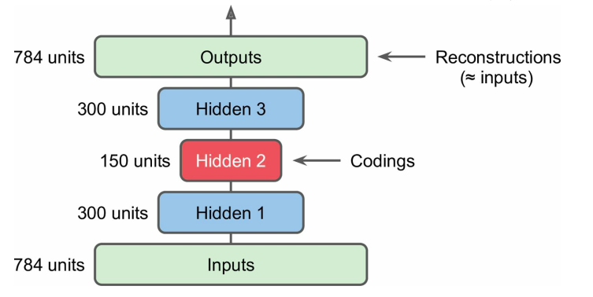
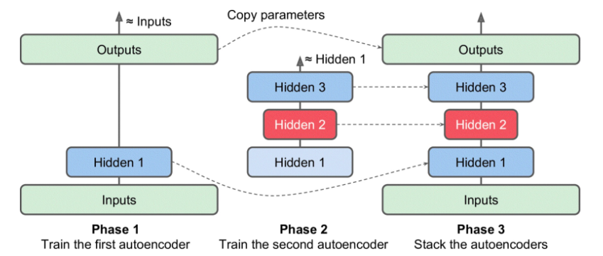
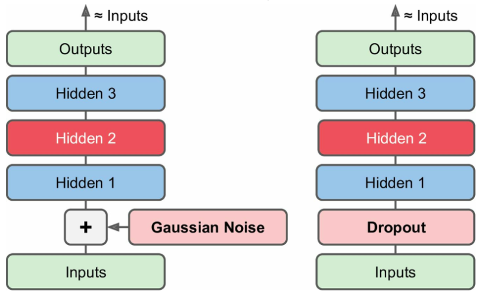
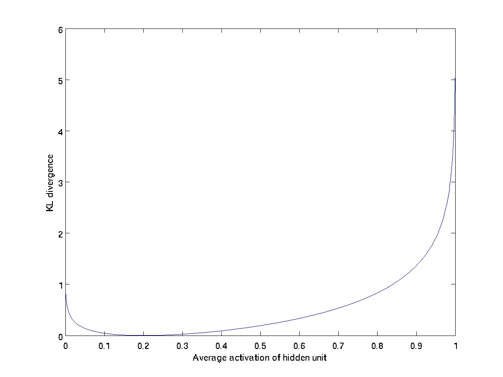
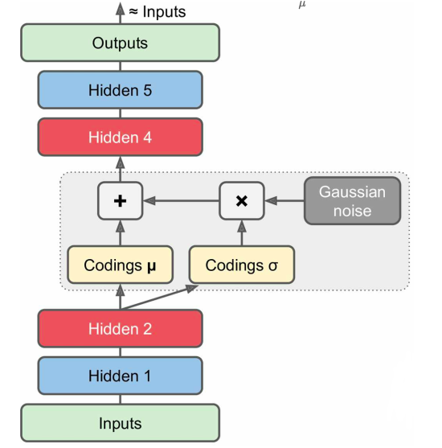

[TOC]

# autoencoder

## autoencoder的作用

### 预训练

虽然说现在的CNN都不需要使用预训练或者是逐层预训练，或者说现在的训练的目的和当初的预训练的原因变了，但是目的都是为了提升CNN的性能。

* 历史（2006年开始的逐层预训练），历史中的预训练是因为深层网络无法训练，所以使用逐层预训练的方法来初始化权重。现在已经不会使用了。
* 现在（从2012的ImageNet比赛开始），现在预训练是指在比较大的数据集上进行训练，如ImageNet，然后再在自己的数据集上进行微调，从而能够提高CNN在自己数据集上的精度。

为什么需要预训练？

为什么需要逐层预训练？

在神经网络中，权重就代表了我们如何做特征转换，也就是如何将我们的数据转为另外一种representation。在很久很久之前，可能神经网络不知道怎么初始化？所以使用逐层预训练的方法来初始化权重，既然我们不知道哪种权重比较好，那么一个可能的想法就是，我只希望我的权重能够保存原来数据的特征就好了。

所以，我们可以使用auto-eocoder来进行训练，训练结束之后，前面的部分就可以作为特征权重。

ideal : __pre-trained weights__ towards __information preserving__ encoder

> 作者：Jolly
>
> 有了BN之后，还有必要用stacked autoencoder来对深度网络进行预训练了吗？为什么？ - Jolly的回答 - 知乎
> https://www.zhihu.com/question/276749541/answer/389726653
>
> 
>
> 1）自编码器在实际应用中用的很少，2012年人们发现在卷积神经网络中使用自编码器做逐层预训练可以训练深度网络，但很快人们发现良好的初始化策略在训练深度网络上要比费劲的逐层预训练有效得多，2014年出现的Batch Normalization技术使得更深的网络也可以被有效训练，到了2015年底，通过使用残差学习（ResNet）我们基本上可以训练任意深度的神经网络。
>
> 自编码器吸引了一大批研究和关注的主要原因之一是很长时间一段以来它被认为是解决无监督学习的可能方案，即大家觉得自编码器可以在没有标签的时候学习到数据的有用表达。再说一次，自编码器并不是一个真正的无监督学习的算法，而是一个自监督的算法。自监督学习是监督学习的一个实例，其标签产生自输入数据。要获得一个自监督的模型，你需要想出一个靠谱的目标跟一个损失函数，问题来了，仅仅把目标设定为重构输入可能不是正确的选项。基本上，要求模型在像素级上精确重构输入不是机器学习的兴趣所在，学习到高级的抽象特征才是。事实上，当你的主要任务是分类、定位之类的任务时，那些对这类任务而言的最好的特征基本上都是重构输入时的最差的那种特征。  （转自Keras中文版）
>
> 2）数据量少了可以用data augmentation 想搞多少数据搞多少数据！

## 参考

[无监督逐层预训练目前是否还广泛应用于CNN的训练](https://blog.csdn.net/lien0906/article/details/79218988)

[有了BN之后，还有必要用stacked autoencoder来对深度网络进行*预训练*了吗？*为什么*？](https://www.zhihu.com/question/276749541/answer/389726653)

# stack autoencoder

逐层训练然后将各层堆叠起来，要比直接训练一个堆叠好的自编码器要快得多；
比如训练一个三层的自编码器：

1. 只保留第一隐藏层进行训练
2. 叠加第二、第三隐藏层进行训练（*这里第一隐藏层和第三隐藏层的权重不共享？*）
3. 各层训练完毕，叠加起来得到一个完整的自编码器

[Stacked autoencoder理论简析](https://blog.csdn.net/xunileida/article/details/82716895)

# denoising autoencoder

autoencoder的目的是：
$$
g(x) \approx x
$$

而denoising autoencoder做的则是令
$$
g(\hat{x}) \approx x
$$
其中$\hat{x}$和$x$有些微的不同。所以说，denoising autoencoder希望做的事情是，输入有噪声的数据，而其输出则是没有噪声的数据，从而达到去噪的目的。

~~而且，在神经网络的训练中，向图像添加噪声被作为一种数据增强的的技巧。那么问题就来了，神经网络过拟合是因为数据中存在噪声，那么向图像中添加噪声为什么能够防止过拟合呢？~~

降噪自编码器通过**对输入加入高斯噪声**或者**在输入之后紧接一个dropout层**，可以有效的避免输入噪声对模型的影响；

# sparse autoencoder

n为输入层的维度，p为隐层（encoder）的维度。

- n>p，即隐层维度小于输入数据维度。也就是说从x→h的变换是一种降维的操作，网络试图以更小的维度去描述原始数据而尽量不损失数据信息。实际上，当每两层之间的变换均为线性，且监督训练的误差是二次型误差时，该网络等价于PCA！没反应过来的童鞋可以反思下PCA是在做什么事情。

- n<p，即隐层维度大于输入数据维度。这又有什么用呢？其实不好说，但比如我们同时约束h的表达尽量稀疏（有大量维度为0，未被激活），此时的编码器便是大名鼎鼎的“稀疏自编码器”。可为什么稀疏的表达就是好的？这就说来话长了，有人试图从人脑机理对比，即人类神经系统在某一刺激下，大部分神经元是被抑制的。个人觉得，从特征的角度来看更直观些，稀疏的表达意味着系统在尝试去特征选择，找出大量维度中真正重要的若干维。

当n < p时，就是我们所说的稀疏自编码，不过稀疏自编码除了这个性质外，还有一个稀疏表达的约束。

我们使用$a_j$表示encoder第$j$个神经元的输出值（激活值）。那么该神经元的平均激活值（在整个训练集上取平均）如下：
$$
\hat{\rho}  =  \frac{1}{m} \sum_{i=1}^{m} a_j(x^{(i)})
$$

> 由于现在都使用SGD优化，所以就是对一个batch的激活值取平均了。为了获取比较准确的平均数量，batch的大小一定不能太小。

为什么平均激活值较小，就可以认为是稀疏的呢？这里可能有两种情况：

* 每个训练样本，在该神经元上的激活值都很小，那么平均之后当然也很小。
* 每个训练样本，有的样本在该神经元上的激活值大，而有的样本则在该神经元上的激活值很小很小，这导致加起来取平均之后，该神经元的平均激活值是小的。

我认为是后者，因为对卷积进行可视化时，我们知道了每个卷积核（神经元）都在提取自己想要的模式。若图像有中该卷积核所期望的模式，那么该卷积核对输入的激活值大；若没有，则激活值小。

其中，我们可以取稀疏性参数为$\rho$（是一个比较小的值，例如$\rho=0.05$），并且期望神经网络训练过后能够满足：
$$
\hat{\rho}=\rho
$$
为了实现这一限制，我们需要在原始的神经网络优化目标函数中加入稀疏性限制这一项，作为一项额外的惩罚因子。encoder的第$j$个神经元的惩罚如下：
$$
KL(p || \hat{p_j}) = \rho \log \frac{\rho}{\hat{\rho}_j} +  (1 - \rho) \log \frac{1 - \rho}{1 - \hat{\rho}_j}
$$
第$j$神经元的平均激活值为$\rho$，我们可以看做其有$\rho$的概率被激活（值为1），$1-p$的概率不被激活（值为0），那么其平均激活值就为：
$$
\rho \cdot 1 + (1 - \rho) \cdot 0 = \rho
$$
所以，上面的KL散度就是两个二项分布的伯努利随机变量之间的相对熵（KL散度省略了常数项）。

> 算是学到了，神经元的输出能够满足一个分布，这是能够理解的。但是，这里的分布怎么说呢，感觉怪怪的。或者，换个角度来理解，不从平均激活值的角度理解，而从稀疏性的角度理解。对于第$j$个神经元，有$\rho$的样本被激活，有$1-\rho$的样本不被激活，这就是稀疏表达。

在下图中，我们设定 $\rho = 0.2$， 并且画出了相对熵值 $KL(\rho || \hat{\rho}_j)$ 随着 $\hat{\rho}_j$的变化而变化。可以看出，KL散度在$\hat{\rho}_j = \rho$时，达到它的最小值0，而当$\hat{\rho}_j$靠近0或者1时，相对熵变得非常大。

> 激活值在$[0, 1]$之间，可能其在encoder输出时使用的激活函数为Sigmoid。

更近一步，由于encoder有$s$个神经元，所以总的稀疏性的惩罚项为：
$$
\sum_{j=1}^s KL(\rho || \hat{\rho}_j)
$$
从而，总体的代价函数变为：
$$
J_{sparse} = J_{reconstruction} + \beta \sum_{j=1}^s KL(\rho || \hat{\rho}_j)
$$
总体的代价函数由重构损失+稀疏性惩罚得到，其中超参数$\beta$用来控制稀疏性惩罚因子的权重。

# variational autoencoder

# 其它自编码

- Contractive autoencoder(CAE)
  论文：[Contractive Auto-Encoders: Explicit Invariance During Feature Extraction(2011)](http://www.icml-2011.org/papers/455_icmlpaper.pdf)
  关于输入的编码上的导数比较小，使得两个相似的输入得到相似的编码
- Stacked convolutioncal autoencoders
  论文：[Stacked Convolutional Auto-Encoders for Hierarchical Feature Extraction(2011)](http://people.idsia.ch/~ciresan/data/icann2011.pdf)
  通过用卷积层来重构图像的方式来提取图像特征
- Generative stochastic network(GSN)
  论文：[GSNs: Generative Stochastic Networks(2015)](https://arxiv.org/pdf/1503.05571v2.pdf)
  降噪自编码器的一般化，能够生成数据
- Winner-take-all(WTA) autoencoder
  论文：[Winner-Take-All Autoencoders(2015)](https://arxiv.org/pdf/1409.2752v2.pdf)
  训练过程中，计算时只保留激活程度前k%的神经元的激活程度，其余都置为0；
  这将稀疏化编码，类似的WTA方法也可以应用于生成稀疏化的卷积自编码器；
- Adversarial autoencoders
  论文：[Adversarial Autoencoders(2016)](https://arxiv.org/pdf/1511.05644v2.pdf)
  分为两个网络，一个训练来重构输入的数据，与此同时另外一个训练来找到前者重构效果不好的输入数据；
  以此来迫使前者学习出鲁棒性比较好的编码方式

## 参考

[自编码器](https://hey-yahei.cn/2018/04/25/autoencoder/index.html)

[《深度学习》学习笔记（一）：稀疏自编码器（Sparse Autoencoder）](https://blog.csdn.net/u010278305/article/details/46881443)

[为什么稀疏自编码器很少见到多层的？ - 科言君的回答 - 知乎](https://www.zhihu.com/question/41490383/answer/103006793)

[Sparse-Autoencoders, github code](https://github.com/Abhipanda4/Sparse-Autoencoders)