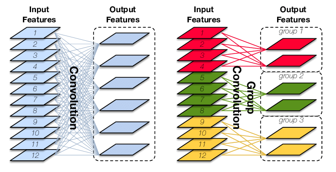

[TOC]

# Group Convolution

下左图是普通卷积，右图是分组卷积。

__普通卷积__:

输入特征图的尺寸为$ C \times H \times W$，卷积核有$N$个，每个卷积核的大小为$K \times K$，那么$N$个卷积核的总参数量为：$N \times C \times K \times K$。

假设输出特征图大小不变，那么计算量为$N \times H \times W  \times C \times K \times K$

__分组卷积__：

输入特征图的尺寸为$ C \times H \times W$，输出特征图的数量为$N$个。如果分为了$G$个组，那么每个组的输入是$\frac{C}{G}$，每个组的输出是$\frac{N}{G}$，也即每个组有$\frac{N}{G}$个卷积核，并且总共也是有$N$个卷积核，只不过每个卷积核的参数量减少（稀疏连接）为$\frac{C}{G} \times H \times W$，那么$N$个卷积核的总参数量为：$N \times \frac{C}{G} \times H \times W$.

假设输出特征图大小不变，那么计算量为$N \times H \times W \times \frac{C}{G} \times K \times K$。

也就是说，分成$G$组，那么该卷积层的参数量和计算量都减少为原来的$\frac{1}{G}$。

> 分组卷积，要求输入特征图的通道数和输出特征图的通道数都能被G整除，也即$\frac{C}{G}$和$\frac{N}{G}$能够整除。

特征的，当$C=G =N$时，相当于Depthwise convolution。

__优点__：

* 减少参数量
* 减少计算量

__缺点__:

输出特征图的某个通道只依赖与输入特征图的某些通道，这阻碍了通道信息的流通，不同组之间的特征图信息没有交流。

__解决方案__：

* 1x1卷积操作
* channel shuffle（from ShuffleNet）

## 参考

[Group Convolution分组卷积，以及Depthwise Convolution和Global Depthwise Convolution](https://www.cnblogs.com/shine-lee/p/10243114.html)