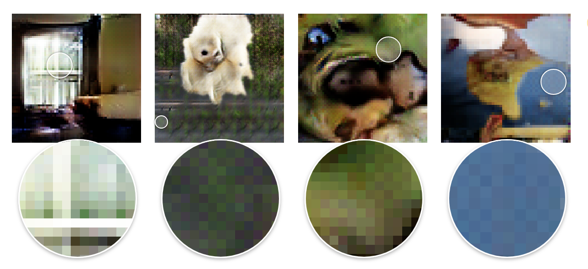
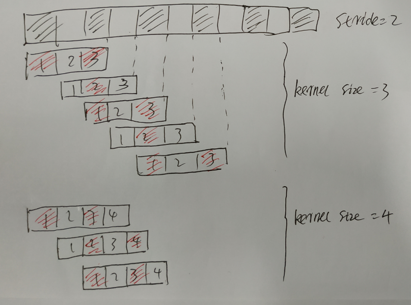

[TOC]

# Transpose Convolution

下面是一个卷积操作
$$
\left[ \begin{array}{ccc}
x_{11} & x_{12} & x_{13} & x_{14} \\
x_{21} & x_{22} & x_{23} & x_{24} \\
x_{31} & x_{32} & x_{33} & x_{34} \\
x_{41} & x_{42} & x_{43} & x_{44} \\
\end{array} \right] * 
\left [  \begin{array}{ccc}
w_{11} & w_{12} & w_{13} \\
w_{21} & w_{22} & w_{23} \\
w_{31} & w_{32} & w_{33} \\
\end{array}\right]
=
\left[
\begin{array}{cc}
y_{11} & y_{12} \\
y_{21} & y_{22} \\
\end{array}
\right]
$$
其可以写成矩阵乘法的形式，首先将卷积权重矩阵写成下面的形式：
$$
\left[
\begin{array}{cccccccccccccccccccc}
w_{11} & w_{12} &  w_{13} & 0 & w_{21} & w_{22} & w_{23} & 0 & w_{31} & w_{32} & w_{33} & 0& 0& 0& 0& 0 \\
0 & w_{11} & w_{12} &  w_{13} & 0 & w_{21} & w_{22} & w_{23} & 0 & w_{31} & w_{32} & w_{33} & 0& 0& 0& 0 \\
0& 0& 0& 0 & w_{11} & w_{12} &  w_{13} & 0 & w_{21} & w_{22} & w_{23} & 0 & w_{31} & w_{32} & w_{33} & 0 \\
0& 0& 0& 0 &0 & w_{11} & w_{12} &  w_{13} & 0 & w_{21} & w_{22} & w_{23} & 0 & w_{31} & w_{32} & w_{33}\\
\end{array} \right]
$$
而原来的输入的特征图可以写成下面的形式：
$$
\left[
\begin{array}{c}
x_{11} \\ x_{12} \\ x_{13} \\ x_{14} \\
x_{21} \\ x_{22} \\ x_{23} \\ x_{24} \\
x_{31} \\ x_{32} \\ x_{33} \\ x_{34} \\
x_{41} \\ x_{42} \\ x_{43} \\ x_{44} \\
\end{array}
\right]
$$

从而将卷积操作写成下面的矩阵乘法操作：
$$
\left[
\begin{array}{cccccccccccccccccccc}
w_{11} & w_{12} &  w_{13} & 0 & w_{21} & w_{22} & w_{23} & 0 & w_{31} & w_{32} & w_{33} & 0& 0& 0& 0& 0 \\
0 & w_{11} & w_{12} &  w_{13} & 0 & w_{21} & w_{22} & w_{23} & 0 & w_{31} & w_{32} & w_{33} & 0& 0& 0& 0 \\
0& 0& 0& 0 & w_{11} & w_{12} &  w_{13} & 0 & w_{21} & w_{22} & w_{23} & 0 & w_{31} & w_{32} & w_{33} & 0 \\
0& 0& 0& 0 &0 & w_{11} & w_{12} &  w_{13} & 0 & w_{21} & w_{22} & w_{23} & 0 & w_{31} & w_{32} & w_{33}\\
\end{array} \right]
\left[
\begin{array}{c}
x_{11} \\ x_{12} \\ x_{13} \\ x_{14} \\
x_{21} \\ x_{22} \\ x_{23} \\ x_{24} \\
x_{31} \\ x_{32} \\ x_{33} \\ x_{34} \\
x_{41} \\ x_{42} \\ x_{43} \\ x_{44} \\
\end{array}
\right]
$$
所以卷积操作可以表示为：
$$
y = Cx
$$
输入是4x4的特征图，经过卷积操作之后，得到2x2的特征图。如果我们要从2x2的特征图得到4x4的特征图，应该做些什么操作呢？或者说在这个例子中，反向传播时，梯度是如何通过2x2的特征图传播到4x4的特征图的。

$$
\begin{align}
\nonumber \frac{\partial L}{\partial x} &= \frac{\partial L}{\partial y} \cdot \frac{\partial y}{\partial x} \\
\nonumber  &= \frac{\partial L}{\partial y} \cdot \frac{\partial Cx}{\partial x} \\
\nonumber  &= C^T \cdot \frac{\partial L}{\partial y}  \\
\end{align}
$$
所以，将卷积操作写成矩阵的形式后：

- 其正向传播时，乘以一个矩阵$C$；
- 其反向传播时，乘以一个矩阵$C^T$。

而转置卷积则是：

- 其正向传播时，乘以一个矩阵$C^T$；
- 其反向传播时，乘以一个矩阵$C$。

需要注意的是转置卷积的权重并不是使用原来卷积矩阵的权重，__这也就是为什么反卷积这个名字不好的原因__，因为__反卷积__很容易被认为是通过在输出上进行操作而恢复输入的操作，那么此时直接取原卷积矩阵的转置作为反卷积矩阵即可。但是实际上转置卷积并不是恢复原来的内容，其__目的是上采样__，也就说恢复更加精细的内容。所以，转置卷积只是卷积矩阵的大小（nxm）和正常卷积矩阵（ｍxn）的大小是正好相反的，而其权重同样是通过学习得到的。

最后请注意，始终可以使用直接卷积来模拟转置卷积。 缺点是它通常涉及向输入添加许多列和行的零，导致实现效率低得多

那么是如何填充0的呢，可以参考这里[A guide to convolution arithmetic for deeplearning](https://arxiv.org/pdf/1603.07285.pdf)

When we look very closely at images generated by neural networks, we often see a strange checkerboard pattern of artifacts. It’s more obvious in some cases than others, but a large fraction of recent models exhibit this behavior.

## Checkboard pattern

由神经网络生成的图像（如果神经网络中有反卷积）通常具有棋牌效应。

可以从放大图中看到，像素和像素之间的过渡不是__渐变__的，而是__跳跃__的，这就是__棋盘效应__。这在原图中的感觉就是图像不是很清晰。

卷积核的size不能够整除stride时，那么反卷积时，就会产生棋盘效应。

以一维的反卷积操作为例子，反卷积操作能够通过对特征图进行补0，从而变成普通的卷积操作。为什么呢？不知到。反正stride=2就是将特征图每隔一个元素插入一个0。需要注意，这个stride不是反卷积的stride（反卷积的stride一定是1），而是得到该大小的特征图的卷积核的stride。

如下图：

* 当kernel size=3时，卷积核的size不能够整除stride，产生了棋盘效应。
* 当kernel size=4时，卷积核的size能够整除stride，没有产生棋盘效应。

可以观察到，kernel size=3时，在进行卷积操作时，有时用到了2个不为0的特征图元素，有时却只用到了1个不为0的特征图元素。而kernel size=4时，一直都用到了2个不为0的特征图元素。

所以，产生棋盘效应的原因在于，反卷积时所用到的元素个数不一致。表现在输出特征图上就是相邻元素的值忽大忽小，这就是棋盘效应了。

### 消除棋盘效应

那么如何消除棋盘效应呢？

* 期望神经网络能够学习到防止这种棋盘效应的卷积核，如上图，如果卷积核的2号元素的值的大小是1号元素和3号元素之和，那么就能够防止棋盘效应了。__不过一般是学不到的__。
* 使用最近邻插值或者是双线性插值进行上采样，然后再用普通的卷积核进行卷积。

## 参考

[深度理解反卷积操作](https://www.jianshu.com/p/fb50fe44a1a3)

[【图解】卷积和反卷积过程Convolution&Deconvolution](https://zhuanlan.zhihu.com/p/52407509)

[反卷积和上采样+卷积的区别？](https://www.zhihu.com/question/328891283)

[Deconvolution and Checkerboard Artifacts](https://distill.pub/2016/deconv-checkerboard/)

[Is the deconvolution layer the same as a convolutional layer?](https://arxiv.org/pdf/1609.07009.pdf)