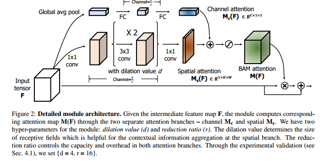

[TOC]

# BAM: Bottleneck Attention Module

[BAM: Bottleneck Attention Module](http://xxx.itp.ac.cn/abs/1807.06514)

[official code][https://github.com/Jongchan/attention-module]

## 网络结构

SENet只有Channel attention，所以这篇论文在SENet的基础上加上了Spatial attention。

* Channel attention和SENet一模一样，最后得到的是一个$C \times 1 \times 1$的通道权重向量，也就说同一个通道的所有元素共享一个权重；
* Spatial attention的结构为`1x1卷积->3x3卷积->3x3卷积->1x1卷积`，使用1x1的卷积核将特征$C \times H \times W$将维到$\frac{C}{r} \times H \times W$，然后使用两个3x3的带孔卷积核提取特征（用参数d描述），最后使用1x1的卷积核将特征$\frac{C}{r} \times H \times W$降维度到$1 \times H \times W$，从而得到特征图中每个元素的权重，特征图的每个通道共享这个权重矩阵。

Channel attention得到的通道权重的维度为$C  \times  1 \times 1$，而Spatial attention得到的空间权重的维度为$ 1 \times H \times W$，那么该如何合并这两个权重呢？

其实不论是特征图先乘以Channel attention再乘以Spatial attention，还是特征图先乘以Spatial attention再乘以Channel attention，其结果是一样的。所以可以按着这两者的乘法性质将其合并起来。$C\times 1 \times 1$ with $1 \times H \times W$ to $C \times H \times W$，也就说让Spatial attention乘以Channel attention的每个元素，从而得到一个$C \times H \times W$的权重矩阵，但是此时权重矩阵没有归一化，使用让其通过 Sigmoid函数将权重映射到$(0,1)$之间。

>  Channel attention和Spatial attention结合起来之后，就得到了Pointwise attention了，也即特征图的每个元素都有一个不同的权重。__所以说，这是实现Pointwise attention的一种可分离形式。__

## 参考

[Convolutional Block Attention Module](https://zhuanlan.zhihu.com/p/60610697)