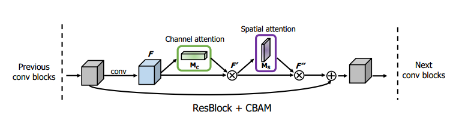
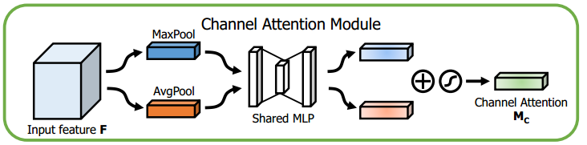
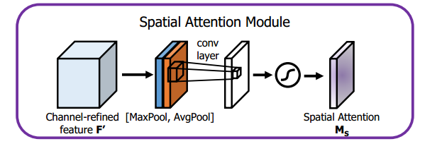

[TOC]

# CBAM: Convolutional Block Attention Module

[CBAM: Convolutional Block Attention Module](http://xxx.itp.ac.cn/abs/1807.06521)

[official code][https://github.com/Jongchan/attention-module]

## 网络结构

和BAM的不同之处在于，BAM使用并联方式来计算Channel attention和Spatial attention，而CBAM使用串联方式计算Channel attention和Spatial attention。

BAM的公式如下，其采用并联的机制，Channel attention和Spatial attention都是从原始的输入$F$提取而来。
$$
\sigma(M_c(F) \otimes M_s(F)) \otimes F
$$
CMBA的公式如下，其采用串联的机制，先从原始的输入计算$F$计算得到Channel attention $M_c(F)$，两者两者加权得到新的特征图$F'$。然后从新的特征图$F'$上计算得到Spatial attention $M_s(F')$，两者加权得到最后的特征图$F''$。
$$
F' = M_c(F) \otimes F
$$

$$
F'' = M_s(F') \otimes F'
$$

### Channel attention

CBAM的channel attention与SENet的略有不同，不过思想也是一致的。
$$
M_c(F) = \sigma(MLP(AvgPool(F)) + MLP(MaxPool(F))) 
$$

$$
M_c(F) = \sigma(W_1 \cdot ReLU(W_0 \cdot F_{avg}^{c}) + W_1 \cdot ReLU(W_0 \cdot F_{max}^{c}))
$$

SENet中是将特征图经过AvgPool之后，通过MLP得到之后特征的通道权重，该论文中也对比了是使用MaxPool还是AvgPool，结果表明是AvgPool好，所该论文中最终用的是AvgPool。

这篇论文倒好，两个Pooling都用上了，分别通过MLP之后加起来，然后通过Sigmoid激活函数，从而得到最终的通道权重，也许这样性能更好吧，使用不同的Pooling方式来捕或全局的特征。

### Spatial attention

$$
M_s(F) = \sigma(f^{7 \times 7}([AvgPool(F), MaxPool(F)]))
$$

$$
M_s(F) = \sigma(f^{7 \times 7}([F_{avg}^{s}, F_{max}^s]))
$$

与BAM不同，BAM是使用1x1的卷积核进行降维，然后使用两个3x3的带孔卷积核进行特征提取，最后接1x1的卷积核将通道的维度降到1，从而得到维度为$1 \times H \times W$的Spatial attention。

而CBAM则是分别使用AvgPool和MaxPool这两种不同的池化方式来进行降维，得到一个维度为$2 \times H \times W$的特征图，然后接一个7x7的大卷积核来提取特征，从而得到维度为$1 \times H \times W$的Spatial attention。之所以要降维，是因为不允许使用太大的计算量来计算attention，否则就会加大网络的计算量，从而使得注意力机制得不偿失。并且，注意力机制都作为一个可嵌入的模块，这就要求该模块的不能加大整体网络的计算量太大，否则就不是你想嵌入就能嵌入。

## 参考

[【论文复现】CBAM: Convolutional Block Attention Module](https://www.jianshu.com/p/3e33ab049b4e)

[Convolutional Block Attention Module](https://zhuanlan.zhihu.com/p/60610697)

[几篇较新的计算机视觉Self-Attention - Fisher Yu余梓彤的文章 - 知乎](https://zhuanlan.zhihu.com/p/44031466)