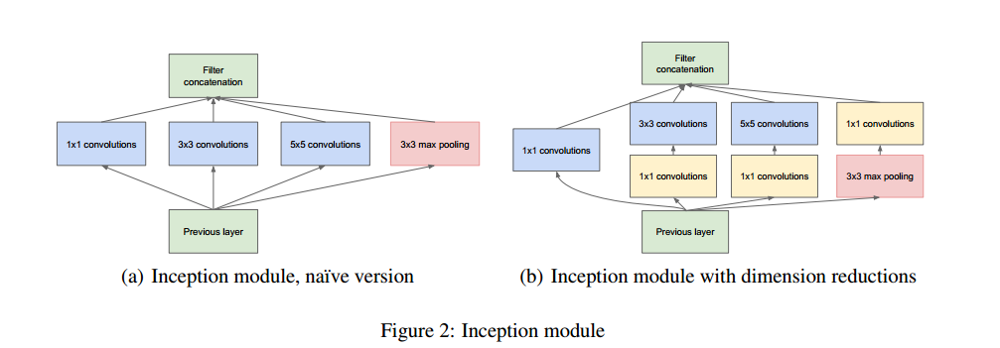
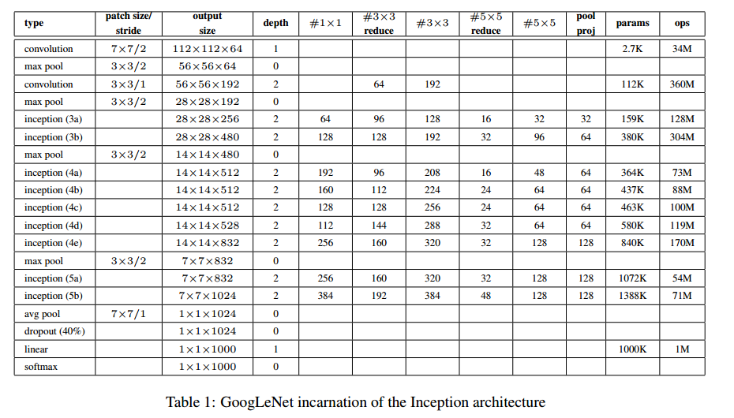

# Inception-v1

__paper__ : [link](http://xxx.itp.ac.cn/abs/1409.4842)

Inception的作用就是替代了人工确定卷积层中过滤器的类型或者是否创建卷积层和池化层，让网络自己学习它具体需要什么参数。
让不同大小的卷积层自己去学习最有用的特征

有别于VGG等传统的网络通过堆叠简单的3*3卷积实现特征提取，Inception模块通过组合1*1，3*3，5*5和pooling等结构，用更少的参数和更少的计算开销可以学习到更丰富的特征表示。

## Inception Module

创新点就是提出了Inception Module， 然后整个网络差不多就是Inception Module堆叠而成的。但是了在网络最开始还是使用卷积核池化层，到了后面才使用Inception Module。这是为什么呢？

Inception Modeule的设计结构如下图所示，没看懂论文中他说的设计理念。

左边的是naive版本的Inception Module，通过在同一层中使用不同的卷积核，在增大了网络宽度的同时，也用这些卷积核来提取不同尺度的特征，最后再将这些不同尺度的特征拼接在一起，姑且这么理解吧（因为如果是理解成提取多尺度的特征的话，那么最大只使用了5x5的卷积核呢？）。又因为pooling层在神经网络中很有用，所以又在该模块中加了pooling层，不过该pooling层的大小为3x3，但是stride=1，所以该pooling层并没有降低特征图的大小。

至于为什么使用1x1/3x3/5x5大小的卷积核，论文中说是为了避免patch-alignment issues，这么做更多的是基于便利性，方便对齐，如果设定stride=1，那么只要分别设定padding=0,1,2就能得到维度相同的特征，而后可以直接拼接，而非必要性。

由于神经网络不断进行卷积，那么特征图就会越来越小，为了不让信息损失，那么只有增加特征图的和数量了，也即增大卷积核的数量。所以网络的越高层，卷积核的数量应该越多。

但是卷积核数量增多，就会造成性能瓶颈。所以在进行3x3和5x5的卷积操作之前，作者先使用1x1的卷积核对特征图进行降维（降低了卷积核通道的数量），然后使用3x3和5x5的卷积核进行卷积，并且恢复维度或者增大维度。

>我的问题是既然能够降维度，那么存在信息损失吗？既然都降维了，为什么还要升维呢？
>
>
>使用1x1的卷积核进行降维，应该是对计算量上的一种妥协吧，虽然说1x1的卷积好在降维的同时实现了跨通道的信息整合，但是通道数毕竟是减少了，应该是存在信息的损失。
>
>那么之后使用3x3和5x5的卷积核时，为什么又要升维呢？这个应该参考之前的思考：由于神经网络不断进行卷积，那么特征图就会越来越小，为了不让信息损失，那么只有增加特征图的和数量了，也即增大卷积核的数量。所以网络的越高层，卷积核的数量应该越多。

所以通过这些思考之后，就将左边naive版本的Inception module变成了右边的Inception module。但是还有一个问题是，为什么要在max pooling层之后添加1x1卷积操作，作者在论文中将这个操作叫做projection，感觉就是在pooling之后，做一下跨通道信息的整合，并且降低一下维度。

## Inception-v1 结构

## 参考

[GoogLeNet_百度百科](https://baike.baidu.com/item/GoogLeNet/22689587?fr=aladdin)
[网络结构解读之inception系列二：GoogLeNet（Inception V1） - Link_Z - 博客园](https://www.cnblogs.com/dingz/p/10150756.html)
[图像分类（一）GoogLenet Inception_V1：Going deeper with convolutions - 码农教程](http://www.manongjc.com/article/80103.html)