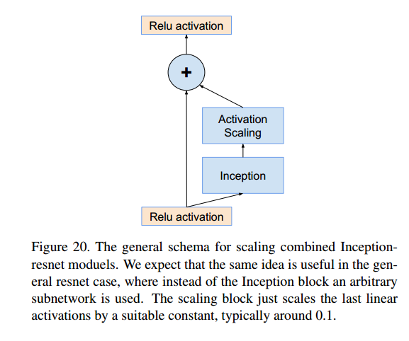

# Inception-v4

__paper__ : [link](http://xxx.itp.ac.cn/abs/1602.07261)

提出了Inception-v4和Inception-resnet-v1, Inception-resnet-v2

简单说，Inception V4与Inception V3相比主要是对inception结构前的常规conv-pooling结果进行了改进，并加深了网络。

还是3类Inception-模块，2类Reduction模块， 堆叠了更多的Inception模块，并且其中的卷积核的数量变多了。

然后将Inception V3与V4分别与ResNet结合，得到了Inception-ResNet-v1和v2。

所以v2相对v1而言，也是卷积核数量更多了，网络更深了而已。

去掉BN能够节省内存，为了能够在单个GPU上运行Inception-ResNet，论文中去除了一些BN。

在不同分支的特征拼接起来后， 进行卷积操作后没有BN（是省略了这些BN吗）

__Scaling of the Residuals__

作者发现，当卷积核的数量超过1000时，残差块的输出为0，那么相当于恒等变换。这种现象无法通过降低学习率或者是加入BN层的方法避免。

作者通过加入scale参数，来对残差块的输出进行缩放， 然后再和恒等映射结果加起来，从而解决了这个问题，

scale一般取0.1到0.3。

## 结论

Inception-ResNet相比于Inception-v4来说收敛速度更快，说明残差模型可以加速收敛。

## 参考

[经典分类CNN模型系列其六：Inception v4与Inception-Resnet v1/v2](https://www.jianshu.com/p/006248a3fd7f)

[谷歌Inception网络中的Inception-V3到Inception-V4具体作了哪些优化？](https://www.zhihu.com/question/50370954)