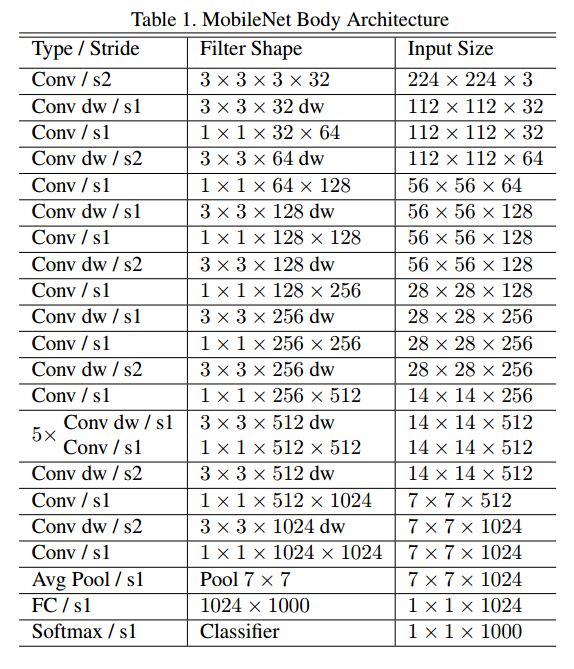
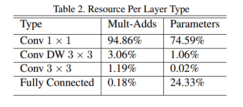
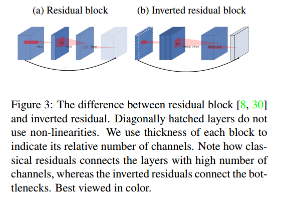
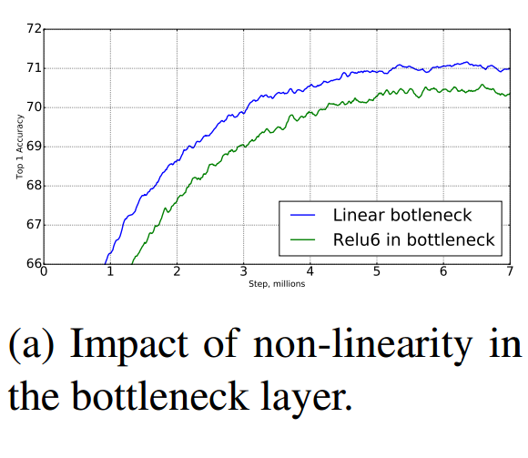
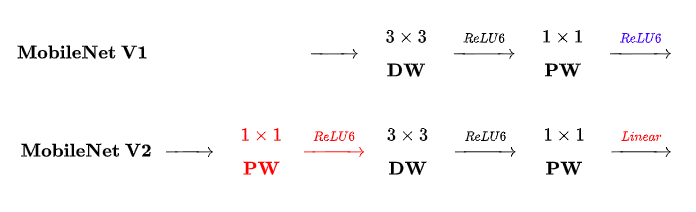
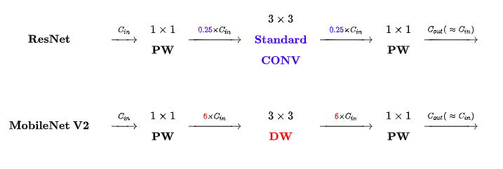

[TOC]

## v1

[MobileNets: Efficient Convolutional Neural Networks for Mobile Vision Applications](http://xxx.itp.ac.cn/abs/1704.04861)

[code pytorch](https://github.com/marvis/pytorch-mobilenet)

[code tensorflow](https://github.com/Zehaos/MobileNet/blob/master/nets/mobilenet.py)

引入两个超参数来权衡模型的延迟和精度。并且使用深度可分离卷积来减少模型参数和模型计算量。

### 深度可分离卷积

假设输入的特征图大小为$D_F \times D_F \times M$,卷积核的大小为$D_K \times D_K \times N$，那么卷积后得到的特征图大小为：
$$
D_F \times D_F \times N
$$
计算量为:
$$
D_F \times D_F \times M \times N \times D_K \times D_K
$$
若是使用Depthwise卷积，那么其计算量为：
$$
D_F \times D_F \times M \times D_K \times D_K
$$
但是Depthwise卷积是逐通道进行卷积，通道之间的信息没有进行交互，也就说生成新特征图时没有考虑通道信息的联系，这是不好的。为了弥补这一点，在Depthwise卷积之后需要使用Pointwise卷积（也即1x1卷积核）来对通道信息进行整合。其计算量为：
$$
D_F \times D_F \times M \times N
$$
所以深度可分离卷积总的计算量为：
$$
D_F \times D_F \times M \times D_K \times D_K + D_F \times D_F \times M \times N
$$
那么使用代替深度可分离卷积来替代原始的卷积操作，能够降低多少计算量呢：
$$
\frac{D_F \times D_F \times M \times D_K \times D_K + D_F \times D_F \times M \times N}{D_F \times D_F \times M \times N \times D_K \times D_K}
\\ =\frac{1}{N} + \frac{1}{D_K^2}
$$
一般$N$都挺大的，而$D_K$比较小，所以总体能够减低的计算量主要取决于$D_K$。若使用$3\times3$的深度可分离卷积核来替换传统的卷积核，那么计算量大约相当于越来的$\frac{1}{9}$，所以差不多能够少8到9倍的计算量。

### 模型结构

模型的结构如下，除了第一个卷积核是正常的$3\times3$卷积，其余的卷积都被分成了Depthwise卷积+Pointwise卷积，并且将下采样操作使用卷积核stride=2来实现。

可看到，网络中$1\times1$卷积核的计算量占据了整个网络的95%，而其参数量则占据了整个网络的75%。

### 两个超参数

width multiplier and resolution multiplier 

## v2

[MobileNetV2: Inverted Residuals and Linear Bottlenecks](http://xxx.itp.ac.cn/abs/1801.04381)

[code1](https://github.com/Randl/MobileNetV2-pytorch/blob/master/model.py)

[code2](https://github.com/d-li14/mobilenetv2.pytorch/blob/master/models/imagenet/mobilenetv2.py)

简单地来说就是skip connection已经被各种实验证明了非常有用，例如ResNet, DenseNet等结构已经证明通过复用图像特征， 使用concat/eltwise+ 等操作进行融合， 能极大提升网络的性价比。但是MobileNet-v1中并没有用到这个结构，所以在MobileNet-v2中加上。当然了，加也不是直接加就行了，因为使用了深度可分离卷积，为了使得残差结构中能够使用深度可分离卷积，就提出了下面两个创新点：

两个创新点：

1. inverted residual block
2. Linear bottleneck

__Inverted residual block__ and __Linear bottleneck__:

该模块接受低维的压缩表示作为输入，首先扩展至高维，然后使用深度可分离卷积，然后将结果投影回低维度表示。

原始的Residual block是:

1. 先使用1x1卷积核__降低__通道数，然后经过ReLU
2. 再使用3x3卷积提取特征，然后经过ReLU
3. 最后使用1x1卷积核恢复通道数，然后经过ReLU，并和输入相加

> Residual block（bottleneck）可以有两个解释：
>
> 1. 高纬特征图存在信息冗余，所以可以通过1x1卷积核进行降维，然后再提取特征；
> 2. 先通过1x1卷积核进行降维，从而降低3x3卷积核的和参数量和计算量；
>
> 第二个解释是毫无疑问的，至于第一个解释应该也是成立的吧，因为如果这个不成立的话，那么这个干应该会降低精度吧，那么为了精度，大家应该不会使用这个吧。

而Inverted residual block是这么做的：

1. 先使用1x1卷积核__提升__通道数（文中称这一扩张比例为扩张系数，用t表示，实际采用的数值为t=6），然后经过ReLU
2. 再使用3x3的Depthwise卷积进行特征提取，然后经过ReLU
3. 最后使用1x1卷积核降低通道数，不经过ReLU

### 为什么使用Inverted Residual Block

不管其中最后的1x1卷积核的结果不经过ReLU，其余的操作和Residual block挺像的，只不过Residual block是“压缩-变换-扩张”，而Inverted residual block是“扩张-变换-压缩”。正好和Residual block反着来，所以叫做Inverted residual block。

可能就是使用了深度可分离卷积之后，计算量下降，所以就没比好使用原始的Bottleneck，毕竟其发明是为了降低计算量。那么就可以利用其中的一些计算量，先对特征进行升维度，然后提取特征，然后降低维。

> 太牵强了，实在不知道该怎么解释。

### 为什么使用Linear Bottleneck

至于为什么最后的1x1卷积核的结果不经过`ReLU`激活，可能是因为其3x3卷积核用的是深度可分离卷积核的缘故，shuffleNet和Xception都建议在depthwise卷积之后不要使用non-linearity，因为会造成性能的下降，__但是本文不是去掉depthwise之后的卷积，而是去掉pointwise之后的卷积__。

> 又或者可以参考[Deep Pyramidal Residual Networks](http://xxx.itp.ac.cn/pdf/1610.02915v4)，这里面也是去除了使用pre-activation的Residual block中的第一个ReLU。去除第一个`ReLU`也就是将`BN-ReLU-conv-BN-ReLU-conv`变成`BN-conv-BN-ReLU-conv`，这样子两个`conv`操作之间有一个`ReLU`激活函数就能够保证non-linearity；而去除第二个`ReLU`的话，就是将`BN-ReLU-conv-BN-ReLU-conv`变成`BN-ReLU-conv-BN-conv`，两个`conv`之间没有激活函数，就会降低网络的非线性。

反正就是知道了residual block中可能不需要那么多激活函数，但是由于网络结构和之前的网络结构不一样，所以也不能说之间按照之前的经验直接去掉。所以就是做了对比实验，将每个Inverted residual block中的每个`ReLU`都去掉看一下，然后可能就发现去掉最后一个`ReLU`比较好。

下面是不去掉`ReLU`和去掉最后一个`ReLU`的对比试验，可以发现去掉之后效果更好。

### 网络结构对比

__对比 MobileNet V1 与 V2 的微结构__:

> **相同点**

- **都采用 Depth-wise (DW) 卷积搭配 Point-wise (PW) 卷积的方式来提特征。**这两个操作合起来也被称为 Depth-wise Separable Convolution，之前在 Xception 中被广泛使用。这么做的好处是理论上可以成倍的减少卷积层的时间复杂度和空间复杂度。

> **不同点：Linear Bottleneck**

- **V2 在 DW 卷积之前新加了一个 PW 卷积**。这么做的原因，是因为 DW 卷积由于本身的计算特性决定它自己没有改变通道数的能力，上一层给它多少通道，它就只能输出多少通道。所以如果上一层给的通道数本身很少的话，DW 也只能很委屈的在低维空间提特征，因此效果不够好。现在 V2 为了改善这个问题，给每个 DW 之前都配备了一个 PW，专门用来升维，定义升维系数 $t=6$，这样不管输入通道数 $C_{in}$ 是多是少，经过第一个 PW 升维之后，DW 都是在相对的更高维 （$t \cdot C_{in}$）进行着辛勤工作的。
- **V2 去掉了第二个 PW 的激活函数**。论文作者称其为 Linear Bottleneck。这么做的原因，是因为作者认为激活函数在高维空间能够有效的增加非线性，而在低维空间时则会破坏特征，不如线性的效果好。由于第二个 PW 的主要功能就是降维，因此按照上面的理论，降维之后就不宜再使用 ReLU6 了。

__对比 ResNet 与 MobileNet V2 的微结构__:

> **相同点**

- MobileNet V2 借鉴 ResNet，都采用了`1x1->3x3->1x1`的模式。
- MobileNet V2 借鉴 ResNet，同样使用 Shortcut 将输出与输入相加（未在上式画出）

> **不同点：Inverted Residual Block**

- ResNet 使用 **标准卷积** 提特征，MobileNet 始终使用 **DW卷积** 提特征。
- ResNet **先降维** (0.25倍)、卷积、再升维，而 MobileNet V2 则是 **先升维** (6倍)、卷积、再降维。直观的形象上来看，ResNet 的微结构是**沙漏形**，而 MobileNet V2 则是**纺锤形**，刚好相反。因此论文作者将 MobileNet V2 的结构称为 Inverted Residual Block。这么做也是因为使用DW卷积而作的适配，希望特征提取能够在高维进行

### 一些分析

shuffleNet和Xception中都建议了depthwise conv后面不要使用non-linearity

不使用non-linearity不仅收敛速度快，而且performance更优。但是在Inception中结论是相反的（Rethinking the inception architecture for computer vision）。论文中提到的一个合理解释是：depth很关键，由于Inception中的中间层是全channel的，所以non-linearity是有利的，但是对于depthwise conv，其特征是单channle的，所以non-linearity有害，可能造成了信息丢失。

作者：小小将链接：https://www.zhihu.com/question/265709710/answer/297857085来源：知乎著作权归作者所有。商业转载

请联系作者获得授权，非商业转载请注明出处。

**Depthwise Convolution 的潜在问题：**

Depthwise Conv确实是大大降低了计算量， 而且NxN Depthwise + 1X1 PointWise的结构在性能上也能接近NxN Conv。 在实际使用的时候， 我们发现Depthwise 部分的kernel比较容易训废掉： 训完之后发现depthwise训出来的kernel有不少是空的...    当时我们认为是因为depthwise每个kernel dim 相对于vanilla conv要小得多， 过小的kernel_dim， 加上ReLU的激活影响下， 使得神经元输出很容易变为0， 所以就学废了： ReLU对于0的输出的梯度为0， 所以一旦陷入了0输出， 就没法恢复了。 我们还发现，这个问题在定点化低精度训练的时候会进一步放大。

这就解释了为什么shuffleNet和Xception建议在depthwise conv后面不要使用non-linearity。

如何评价mobilenet v2 ? - Alan Huang的回答 - 知乎
https://www.zhihu.com/question/265709710/answer/298245276

> 我的分析：
>
> 作者是如何发现那个东西有害精度呢？然后对其进行修改。
>
> 
>
> 个人理解是这个样子的：
>
> 比如说我有了一个改善网络的idea，在这里就是Residual block + 深度可分离卷积。
>
> 那么我要做的就是实现一个baseline，确定好网络的层数，然后将其中Residual block的3x3卷积改成depthwise卷积。
>
> 如果发现精度提高了，那么结束，想想怎么说一个故事。
>
> 如果发现精度下降了（比较这个idal是为了降低网络的参数量和计算量），那么就要分析是什么原因导致了网络的性能下降，然后对分析出可能导致网络精度降低的地方进行修改，如果有提高，那么就说明分析对了。
>
> 
>
> 在本论文中就是分析出了2个可能导致网络精度降低的地方：
>
> 1. Bottleneck的1x1卷积核降维，然后提取特征；
> 2. 在低维度进行non-linearity对特征是有损失的。
>
> 发现可能导致网络精度降低的问题，那么就可以做对比实验了：
>
> 1. 去除1x1卷积核的降维或使用1x1卷积核进行升维；
> 2. 去除某个non-linearity。

文中的基本单元是“扩张-变换-压缩”的范式。

而Inception的基本范式而在"split-transform-merge"。

ResNet的基本范式是Residual block。

每个网络其实都有自己的Motivation，自己的范式。

## v3

[Searching for MobileNetV3](http://xxx.itp.ac.cn/abs/1905.02244)

用NAS搜索出来的。。。。。

## 参考

[MobileNet V2 论文初读](https://zhuanlan.zhihu.com/p/33075914)

[如何评价mobilenet v2 ?](https://www.zhihu.com/question/265709710)