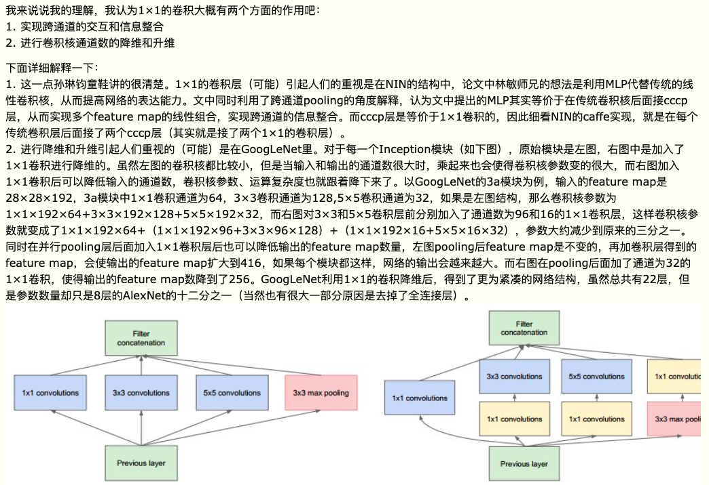

# Network In Network

__paper__ : [link](http://xxx.itp.ac.cn/abs/1312.4400)

NIN提出了两个创新点，
1. 一个是MLP Convolution Layers
2. 一个是Global Average Pooling

## MLP Convolution Layers

MLP Convolution Layers的计算公式如下：

其输入是特征图上位置$(i,j)$的1个点$x_{i,j}$, 其拥有多个通道的值，在权重（1x1卷积核，其通道数等于输入的通道数）$w_{k1}^1$的加权下得到MLP Convolution Layers特征图上对应位置$(i,j)$的一个点的值$f_{i,j,k_1}^1$.

这样的权重（1x1卷积核）有多个，也即对应MLP Convolution Layers在位置$(i,j)$上的输出值有多个通道。

所以本质上， MLP Convolution Layers是1x1的卷积核。

那么如果变成MLP的形式，应该是什么样子呢？
MLP的结点数，就是卷积核的个数，也即对应了输出的通道数。
输入的特征图的某个位置$(i,j)$的元素有多个通道，那么就与MLP的每个节点连接多少条边。也就是说MLP的每个结点都是一个1x1卷积核，输入的通道与该结点连边的数量就是1x1卷积核的通道数。

__那么为什么要使用1x1的卷积核呢？__

## Global Average Pooling

之前的卷积神经网络的结构就是分为两个部分
1. 卷积层提取特征
2. 全连接层对卷积层提取的特征进行组合变换

在传统CNN中很难解释最后的全连接层输出的类别信息的误差怎么传递给前边的卷积层.而global average pooling更容易解释.另外,全连接层容易过拟合,往往依赖于dropout等正则化手段.

global average pooling的概念非常简单,分类任务有多少个类别,就控制最终产生多少个feature map.对每个feature map的数值求平均作为某类别的置信度,类似FC层输出的特征向量,再经过softmax分类.其优点有:

1. 参数数量减少,减轻过拟合(应用于AlexNet,模型230MB->29MB);
2. 更符合卷积网络的结构,使feature map和类别信息直接映射;
3. 求和取平均操作综合了空间信息,使得对输入的空间变换更鲁棒(与卷积层相连的FC按顺序对特征进行了重新编排(flatten),可能破坏了特征的位置信息).
4. FC层输入的大小须固定,这限制了网络输入的图像大小

我怎么感觉Global Average Pooling想是在做模型融合呢？
类似VGG中的dense evaluation.
GAP将7x7的特征图平均池化成1x1的，那么就是相当于对多个特征取平均，而这些特征的感受野覆盖了图像不同的区域，那么相当于对图像的多个crop提取特征，然后取平均。