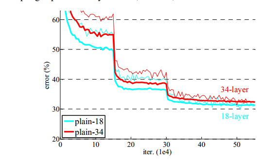
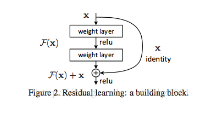
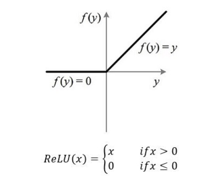

# ResNet

__paper__ : [link](http://xxx.itp.ac.cn/abs/1512.03385)

## 创新点

1. 提出了shortcut connections
2. 提出了Bottleneck结构(不过好像GoogleNet就已经提出了吧)

## Shortcut Connections到底起到了什么作用（直观理解）

ResNet的作者做了一个实验，通过单纯地堆叠卷积层，发现并不是网络越深性能越好，这就有点违反直觉了，毕竟之前的网络从LeNet->AlexNet->VGG/GoogLeNet都是越深越好。而且，就算网络什么都不学习，直接在18层后面追加16层恒等映射，从而达到34层的深度，那么34层的网络也不应该比现有的18层的网络要差啊。

那他可能就猜测网络太深了可能学不到这样的恒等映射，既然你学不到，那么我就通过一个skip connection传递过去就好了，这样子就算我的主分支没有学到什么东西，那么我skip connection通过恒等映射将数据传输过去，那么也不至于将网络的性能变差。所以就提出了下面的残差结构。

> 更新：resnet并不是为了解决梯度弥散而出现的。王峰答得很好了。resnet提出的背景是，更深层的网络不应该比浅层网络差，至少也应该是一样的，因为可以恒等映射。但事实上，对于平原网络结构，更深层的网络结果可能是更糟糕的，凯明大神在论文里证明了这一点。那么，怎么样才能让网络具备学习恒等映射的能力呢?论文里提到，直接学习任意函数的恒等映射是很困难的，但是如果使用残差函数，也就是H(x)=F(x)+x，F(x)=H(x)-x，如果能使F(x)为零的话，H(x)就是恒等映射。这里解释一下，x是残差块的输入，F是残差块内部非线性层的映射，H是残差块的输出，H也是我们希望得到的映射。至于这里为什么是x，而不是x/2或其他形式，请参见论文。整理一下流程，残差学习在浅层的时候，学习F，F+x是线性叠加。而到更深层时，F会渐渐趋于零，也就是说F(x)=0，这时，残差块为恒等映射，避免了增加层数反而影响效果的情况。个人理解，欢迎指正。
>
> 作者：王弗兰克
> 链接：https://www.zhihu.com/question/64494691/answer/272436813
> 来源：知乎
> 著作权归作者所有。商业转载请联系作者获得授权，非商业转载请注明出处。

所以说“在初始化和BN已经解决了梯度消失/爆炸”这个客观事实下，假设把浅层模型权重100%拷贝到深层，模型效果应该和浅层网络一样，不应该变差。在这个前提下，如果在浅层网络上堆叠一些新层，这些层“哪怕有一点梯度传过来，那都算是正向收益”。100%拷贝权重可以用X=H(x)表示，X是浅层输出，H(X)是)拷贝完后的深层，这也就是作者说的理想情况下的恒等映射。假如我们在X和H(X)之间加一些层“扰动或者delta”，也就是H(X)=X+F(X)，只要模型能学到这个delta网络层的权重，那么就是整个深层模型有效的。

所以，特征转换F(x)不能起作用的吧，那么就会逐渐趋于0，从而F(x) + x = x，并且之后通过激活函数Relu，如果x > 0，那么Relu也是相当于一个恒等映射。

但是如果使用别的激活函数，那么就算F(x) = 0,那么随着x的不断激活，那么这些层的输出就不好说恒等映射，可能效果就不是很好了？所以感觉ResNet和Relu很配。

> 神经网络的训练过程似乎是收到信息通路的影响很大，直连和间接链接的效果并不一样，虽然理论上直连存在一个残差网络的等效网络，但是在训练过程中很难收敛到这个等效网络，这时候残差网络起到直接信息传递的作用。因为神经网络缺乏强有力的理论支持，很多都是经验设计，至于为什么基本靠猜，没人给出不同网络结构差异的可证明的理论基础。
> 作者：saturnman
> 链接：https://www.zhihu.com/question/293243905/answer/485938047
> 来源：知乎
> 著作权归作者所有。商业转载请联系作者获得授权，非商业转载请注明出处。

> 我看的到对 ResNet 有效性的解释主要有三种。——使网络更容易在某些层学到恒等变换（identity mapping）。在某些层执行恒等变换是一种构造性解，使更深的模型的性能至少不低于较浅的模型。这也是作者原始论文指出的动机。[1512.03385] Deep Residual Learning for Image Recognition——残差网络是很多浅层网络的集成（ensemble），层数的指数级那么多。主要的实验证据是：把 ResNet 中的某些层直接删掉，模型的性能几乎不下降。 [1605.06431] Residual Networks Behave Like Ensembles of Relatively Shallow Networks——残差网络使信息更容易在各层之间流动，包括在前向传播时提供特征重用，在反向传播时缓解梯度信号消失。原作者在一篇后续文章中给出了讨论。[1603.05027] Identity Mappings in Deep Residual Networks
> 作者：Zhaoyang
> 链接：https://www.zhihu.com/question/52375139/answer/313397135
> 来源：知乎
> 著作权归作者所有。商业转载请联系作者获得授权，非商业转载请注明出处。

## Shortcut Connections到底起到了什么作用（数学公式）

[ResNet反向传播公式推导](https://blog.csdn.net/legend_hua/article/details/81741992)

## 参考

[Deep Residual Learning for Image Recognition（译） - XlyPb - CSDN博客](https://blog.csdn.net/wspba/article/details/57074389)
[到底Resnet在解决一个什么问题呢？ - 知乎](https://www.zhihu.com/question/64494691)
[Resnet中残差块的作用是完成恒等变换，那这样的恒等变换的意义是什么，在网络中能起到怎样的作用呢？ - 知乎](https://www.zhihu.com/question/293243905/answer/484708047)

[ResNet反向传播公式推导](https://blog.csdn.net/legend_hua/article/details/81741992)

[训练深度神经网络失败的罪魁祸首不是梯度消失，而是退化](https://baijiahao.baidu.com/s?id=1588911196895378943&wfr=spider&for=pc)