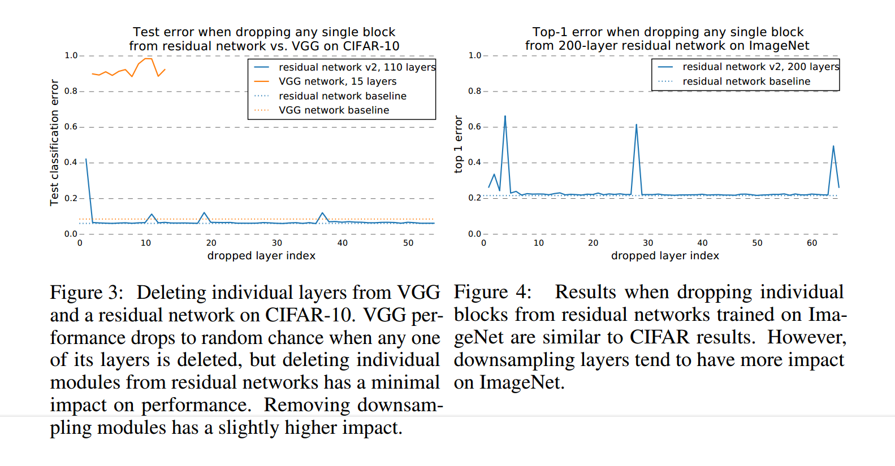

[TOC]

# ResNet及其变种

## ResNet with full-pre-activation

#### 数学推导

$$
x_1  = x_0 + F(x_0; W_0) \\
x_2  = x_1 + F(x_1; W_1) \\
x_3  = x_2 + F(x_2; W_2) \\
x_4  = x_3 + F(x_3; W_3) \\
$$
根据递推关系，可以得到
$$
x_4 = x_0 + F(x_0; W_0) + F(x_1; W_1) + F(x_2; W_2) + F(x_3; W_3) =
$$

$$
x_4 = x_0 +  \sum_{i=0}^{3} F(x_i; W_i)
$$

为了简便推导，假设其中的残差块为$F(x_i; W_i) = W_i \cdot x_i$，那么有：
$$
x_1 = x_0 + W_0 \cdot x_0
$$

$$
x_2 = x_1 + W_1 \cdot x_1 \\
x_2 = (x_0 + W_0 \cdot x_0) + W_1 \cdot(x_0 + W_0 \cdot x_0)
$$

$$
x_3 = x_2 + W_2 \cdot x_2 \\
x_3 =  (x_0 + W_0 \cdot x_0) + W_1 \cdot(x_0 + W_0 \cdot x_0) + W_2 \cdot [ (x_0 + W_0 \cdot x_0) + W_1 \cdot(x_0 + W_0 \cdot x_0)] \\

x_3 =  \\
x_0\\ 
+ W_0 \cdot x_0  \\
+ W_1 \cdot x_0 \\ 
+ W_2 \cdot x_0\\
+W_1 \cdot W_0 \cdot x_0 \\ 

+ W_2 \cdot W_0 \cdot x_0\\
+ W_2 \cdot W_1 \cdot x_0\\
+ W_2 \cdot W_1 \cdot W_0 \cdot x_0
$$

可以看到，最终的输出是通过对输入$x_0$提取不同的特征然后求和得到的（相当于特征图的ensemble），这只是从输入的角度来看的。实际上，从ResNet的任意一层的特征图出发，例如第$i$层，最后一层网络的特征图都可以看做是第$i$层特征图提取不同的特征然后求和得到的。

那么反向传播时有：
$$
\frac{\partial L}{ \partial W_0} = \frac{\partial L}{\partial x_3} \cdot \frac{\partial x_3}{\partial W_0}
$$

$$
\frac{\partial L}{ \partial W_0} = 
(W_1^T \cdot W_2^T + W_2^T + W_1^T + I)
\cdot\frac{\partial L}{\partial x_3} \cdot 
x_0^T
$$

所以就相当于反向传播时存在多条不同的路径来更新权重，这解决了梯度消失导致浅层网络的权重无法被更新的问题。

##  ResNeXt

[Aggregated Residual Transformations for Deep Neural Networks](http://xxx.itp.ac.cn/abs/1611.05431)

Argue了Inception有非常复杂的拓扑结构，但是值得借鉴的是其贯穿始终（从Inception-v1到Inception-v4）的思想：*split-transform-merge*。

* split：将输入通过1x1卷积核划分成几个低维的embeddings；
* transforms：通过特征的卷积核对特征进行转换；
* merge：然后将特征合并起来。

> todo : 忘了inception如此设计的目的了。

Inception的Inception module有不同的分支（不同的拓扑结构），并且还有不同的Inception model，而且其卷积核参数的设计比较复杂。

所以本文提出了像VGG/ResNet那样结构简单，并且又具有Inception的split-transform-merge策略的网络结构。这样子，作者就可以说ResNet和Inception是自己的特例。

> 从好的方面来看，通过提出一个更加高屋建瓴的模型，也即提出一个大一统的模型，能够将不同的模型看成是自己的特例，那么从一个特例（极端）往另外一个特例（极端）进行转换时（描述网络结构参数的转变），或者就能够提高精度了。
>
> 从不好的方面来看，其实也就结合不同模型的思想，并在精度上取得提高，

#### Related Work

相关工作写得不同，然后知道了深度学习中都有那些技术，以及本文的模型用到了哪些技术。

__Multi-branch convolutional networks__：Inception模型中的Inception module就是一个成功的multi-branch结构。而ResNet中的residual block也可以看做是一个two-branch的结构，且其中的一个分支是恒等映射。	

__Group convolutions__：组卷积最先是AlexNet提出的，后来发扬光大了。

__Compressing convolutional networks__：卷积核分解是一个可以用来加速和压缩模型的技术，卷积核分解分为空间上的分解和通道上的分解。

__Ensembling__：ResNet可以看做是许多浅层网络的融合。

#### Method

那么ResNeXt具有怎样的网络结构呢？

* split：使用1x1的卷积核对输入的特征进行降维度，变成低维的embeddings，并且通过参数来控制有多少个这样的分支；
* transform：使用3x3的卷积核对特征进行转换；
* merge：使用1x1的卷积核对特征进行升维，然后拼接在一起。

具体的结构如(a)所示，其中split的每个分支都进行相同的操作：每个分支使用4个通道数为256的1x1的卷积核对图像进行降维，生成新的通道数为4的特征图。那么32个分支总共就是等价于使用128个通道数为256的1x1卷积核对图像进行降低维度，生成新的通道数为128的特征图，其中每个4个特征图为一个分支的特征图。

由于每个分支是的transform操作是独立的，这就等价于在上一步输出的通道数为128的特征图上进行分组卷积，每4个通道为1组，分成32组。

分组卷积之后，得到的特征图的通道数仍旧是128，其中每4个通道的特征图属于一个分支。那么接下来要做的就是对于每个分支的特征图，使用256个通道数为4的1x1卷积核进行卷积，从而升维，然后将每个分支的输出叠加起来。由于存在这个叠加操作，所有可以将上面的操作合并为使用256个通道数为128的1x1卷积核对所有的特征图进行卷积。

经过上面的3个等价操作，就从图(a)的结构变成了图(b)的结构。

> 我有一个问题，输入的特征图的维度都是256吗？ResNet明显不是吧。
>
> 确实，实际上，ResNet的输入的特征图是随着Layer变化的，而且虽然被划分成32个分支，但是每个分支的3x3卷积核的个数并不是4个。作者只是使用了其中的一层作为例子，实习上每个分支3x3卷积核的数量等于总共3x3的卷积核个数除以分支数。

作者使用cardinalities $C$来描述一个block有多少分支。作者尝试了不同的分支数，由于需要保证参数量的一致，所以随着分支的增加，每个分支卷积核的数量要下降。实验表面分支为32时效果最好。

## Wide-ResNet

[Wide Residual Networks](http://xxx.itp.ac.cn/abs/1605.07146)

[code](https://github.com/meliketoy/wide-resnet.pytorch/blob/master/networks/wide_resnet.py)

WRN所提到的宽度，即每个BasicBlock或者是Bottleneck模块所输出的feature map的channel数。

WRN所做的就是增大了宽度，当然了，为了保持参数量一致，需要减少网络的参数。所以WRN就是将窄而深的网络变成了宽而浅的网络。

然后性能就提升了，然后就发表了。

不同这结构和原来的ResNet也不一样吧，

深度并非越大越好，从WRN-22-8到WRN-40-8，精度反而降低。

## ResNet with Stochastic Depth

[Deep Networks with Stochastic Depth](http://xxx.itp.ac.cn/abs/1603.09382)

[code](https://github.com/yueatsprograms/Stochastic_Depth)

作者在训练ResNet时，使每层有一定的概率失活，公式如下：
$$
H_l = ReLU(b_l f_l(H_{l-1}), id(H_{l-1}))
$$
其中$b_l \in \{0, 1\}$，是伯努利随机变量，当$b_l=1$时，残差块被激活；当$b_l = 0$时，残差块没有被激活，此时只有恒等映射能够通过。

并且每层伯努利随机变量取值的概率都不同，设$p_l = Pr(b_l = 1)$，作者使用了一个线性递减函数来描述每层失活的概率：
$$
p_l = 1 - \frac{l}{L}(1 - p_L)
$$
其中$p_L$为最后一层被激活的概率，这是要自己进行设置的，并且也只有这一个超参数，论文中设置$p_L=0.5$。有$p_0=1$，这意味这输入层不会被失活，并且随着层数的增加，每层激活的概率线性减少，这也是符合直觉的，因为前面层的重要性要高于后面层的。

那么在训练时，ResNet的实际深度是变化的，假设$\tilde{L}$为每次训练时的ResBlock的个数，那么其期望的个数为$E(\tilde{L})=\sum_{l=1}^{L} p_l$
$$
E(\tilde{L})=\sum_{l=1}^{L} p_l
$$

$$
E(\tilde{L})=\sum_{l=1}^{L} [1 - \frac{l}{L}(1 - p_L)]
$$

$$
E(\tilde{L})=\sum_{l=1}^{L} 1 - \sum_{l-1}^{L}\frac{l}{L} +\sum_{l=1}^{L} \frac{l \cdot p_L}{L}
$$

$$
E(\tilde{L})= L - \frac{1}{L}\sum_{l-1}^{L}l +  \frac{p_L}{L} \sum_{l=1}^{L}l
$$

其中$\sum_{l=1}^{L} l$使用等差数列求和公式，可得$\sum_{l=1}^{L} l = \frac{(1+L)\cdot L}{2}$,带入，可得：
$$
E(\tilde{L}) = \frac{3L - 1}{4}
$$
对于110层的ResNet，有L=54个ResBlock，那么使用随机深度之后，有$E(\tilde{L}) \approx 40$。也就说，在训练时，我们训练的是有40个ResBblock的网络，但是在测试时恢复到了54个ResBlock。这种深度的减少显著减轻了ResNet中梯度消失和信息丢失的问题？

__Training time savings__：

由于是随机深度，所以前向传播和反向传播时一些层是不需要进行传播的，所以这在训练期间就进行了加速。

__Implicit model ensemble__：

由于使用了随机深度，那么具有L个ResBlock的网络具有$2^L$个子网络组合，每次mini-batch训练时，就从这些网络中采样一个，并且进行训练（这些$2^L$个网络是共享权重的）。而在测试期间，所有网络的结果被平均，从而表现得像模型融合。其实就是像dropout一样，只不过这里dropout的是ResBlock，而dropout也是具有模型集成的效果，所以这里只是将dropout扩展了一下用法。

__Stochastic depth during testing__：
$$
H_l^{test} = ReLU(p_l \cdot f_l(H_{l-1}^{test}) + H_{l-1}^{test})
$$
由于我们训练时以概率$p_l$激活ResBlock，所以训练时每个ResBlock的期望输出为$p_l \cdot f_l(H_{l-1}) + (1-p_l)\cdot 0 = p_l \cdot f_l(H_{l-1})$，那么在训练时第$[l + 1, L]$层所得到的权重已经适应了这个期望输出。因此在测试时需要把这个ResBlock的输出乘以$p_l$以得到同样的期望输出。

#### Results

下面是在CIFAR-10和CIFAR-100上的实验结果，可以看到虽然随机深度的ResNet的__训练误差__比正常ResNet的误差高，但是其__测试误差__却更低。

#### Analytic Experiments

__Improved gradient strength__：

随机深度的ResNet，训练期间在反向传播时减少了网络的有效深度，但是在测试期间保证网路的深度不变。作者期望在反向传播期间随机深度策略能够减少梯度消失的问题，为了实验证明这一点，作者比较了从第一个卷积层到第一个ResBlock之间的梯度的magnitude，作者在CIFAR-10数据集上做的实验。

下图显示了梯度绝对值的均值，两个梯度剧烈下降的地方是由于学习率的调整，可以看出，使用随机深度策略训练的ResNet的梯度值更大，特征是在学习率调整之后，这或许可以用来证明随机深度策略能够显著减少梯度消失的问题。

这或许是可以理解的，由于使用了随机深度策略，那么训练期间，其反向传播所经过的层数是少于正常的ResNet的，所以矩阵连乘的次数也是少于正常的ResNet的，那么这就能解释为什么使用随机深度策略的ResNet的梯度值要大。

__Hyper-parameter sensitivity__：

验证了网络对超参数$p_L$的敏感程度，并得到了如下3个结论：

1. 但$p_L$设置合理时，不同每层的激活概率是线性递减的还是相同的，都能够取得比baseline好的效果；
2. 激活率线性递减的策略的性能要比每层激活率相同的性能要好；
3. 线性递减策略对与$p_L$取值更加具有容忍性，$p_L$取值在$[0.4, 0.6]$时能够取得很好的效果，哪怕是$p_L=0.2$时，其效果也比baseline要好。

并且验证了不同深度的ResNet与超参数$p_L$之间的关系，下面的图要一列一列来看，可以看到对于深度网络，$p_L=0.5$时取得最好的效果；但是对于浅层网络而已，比如说20层的ResNet（第一列），可以看出，此时$p_L$比较高时结果比较好。

这也是可以理解的，浅层网络本不存在梯度消失的问题，若随机失活某些层，导致网络层数的减少，从而造成性能的下降；而对于深层的ResNet，其存在梯度消失问题，随机失活模型层可以部分解决梯度消失问题，从而提高网络的性能。

又或者可以理解为浅层的ResNet的冗余比深度的ResNet要小。

## Random Delete Some Layers of ResNet

[Residual Networks Behave Like Ensembles of Relatively Shallow Networks](http://xxx.itp.ac.cn/abs/1605.06431)

这篇论文则比随机深度的那么论文要更加违反直觉。该论文还是按照正常的方法训练ResNet，但是在测试期间随机去掉ResNet的某一层，而且不会在造成性能的下降。

可以看到，一个ResNet在正常传播时存在很多路径，在反向传播时　

#### Lesion study

__Experiment: Deleting individual layers from neural networks at test time__

下图中的左图是随机删除VGG和ResNet的某一层，可以看到，VGG删除某一层后，性能就急剧下降了，这是因为VGGNet中网络只存在一条路径，网络的后一层严重依赖与网络前一层的输出结果。而对于ResNet而言，删除其中的某一层并不造成性能下降，但是删除降采样模块时，会对网络造成比较大的影响。

右图则是在ImageNet上的实验结果，也是能够观察到随机删除ResNet的某一层并不会造成性能下降，可以看到删除降采样模块在ImageNet上具有更大的影响。

__Experiment: Deleting many modules from residual networks at test-time__

下图是删除多层后，网络性能的变化，随着删除层数的变多，网络的性能逐渐下降。

#### The importance of short paths in residual networks

__本节的实验验证了ResNet不同长度的路径对网络的贡献是不同的。__

如上图所示，正向传播存在多条路径，反向传播也存在多条路径，不同的路径产生不同的特征图，最有将这些特征图加起来，相当于ensemble，路径长度的分布是伯努利分布，如图Fig. 6(a)所示，95%的路径的长度在$[19, 35]$之间。那么在反向传播的过程中，哪些路径的梯度大，哪些路径的梯度小呢？

作者想要得到任意长度为k的路径的梯度，那么如何实现呢？在一次反向传播期间，随机挑选k个ResBlock，对于这k个ResBlock，反向传播时只通过其中的residual module，对于剩余的n-k个ResBlock，反向传播只通过其中的skip connection，对于长度为k的路径，我们统计其1000次测量。如图Fig. 6(b)所示，梯度的大小随着路径长度的变长而变小，这是可以理解的，路径越长，权重连乘的个数越多，越可能造成梯度消失问题。

最后，作者使用这些结果来推断短的路径还是长的路径贡献更多的梯度，作者将每个长度路径的数量乘以该路径长度所对应的梯度的期望大小，从而得到该长度的路径所贡献的梯度。结果如图Fig.6 (c)所示，在训练期间，大多数的梯度更新由长度为5->17的路径产生，

> 问题：路径的起点和终点是？　起点是网络的输入，终点是网络的输出吗？

#### Discussion

作者还参考了最近所发表的在训练阶段使用随机深度策略的ResNet，作者认为，在训练期间随机删除一些层，有利于路径之间的结果相互独立。为了验证这个想法，在测试阶段，作者在使用随机深度策略训练的ResNet上删除一层，并验证其精度，其结果如下：

作者对比了使用随机深度和不使用随机深度，在测试阶段删除一层，结果显示使用随机深度的ResNet的性能要好一些，并且对降采样层的依赖也被降低了。

> 至于H的问题，ResNet的每一个module只是个单元，最早是为了解决identity mapping的问题，大致意思就是多堆一层，如果是个完全一样的传递，至少网络结果不该变坏，结果发现网络结果还真是变坏了，所以搞出skip connection一路+学习参数的另一路的这种结构。至于residual的解释，虽然很巧妙，其实比较见仁见智，反正是不如ensemble直观。具体到题主写的解释，没太确定题主的意思，大概和He Kaiming在改进版ResNet里的解释应该是一回事吧，ResNet把一层层堆网络的乘法给转换成带加法性质的网络了，后向传播的稳定性直接提升：
> [https://arxiv.org/abs/1603.05027](https://link.zhihu.com/?target=https%3A//arxiv.org/abs/1603.05027)
> 不过还是ensemble的解释更对路一些感觉，因为本质上是信息流的传递更多样了，后来基于这种思路蹦出各种通路更复杂的比如FractalNet ，DenseNet，Merge-n-Run FuseNet等等，网络结构越来越……不知道该怎么形容了。其实奇奇怪怪的神经网络结构几十年前就被研究过，可惜那会既没有卷积网络也没有GPU。
>
> 

作者：YE Y

> # Resnet可以理解成集成学习吗？
>
> 可以。Cornell的全能大神Serge Belongie的组早就发过相关论文了

> 至于H的问题，ResNet的每一个module只是个单元，最早是为了解决identity mapping的问题，大致意思就是多堆一层，如果是个完全一样的传递，至少网络结果不该变坏，结果发现网络结果还真是变坏了，所以搞出skip connection一路+学习参数的另一路的这种结构。至于residual的解释，虽然很巧妙，其实比较见仁见智，反正是不如ensemble直观。具体到题主写的解释，没太确定题主的意思，大概和He Kaiming在改进版ResNet里的解释应该是一回事吧，ResNet把一层层堆网络的乘法给转换成带加法性质的网络了，后向传播的稳定性直接提升：[https://arxiv.org/abs/1603.05027](http://link.zhihu.com/?target=https%3A//arxiv.org/abs/1603.05027)不过还是ensemble的解释更对路一些感觉，因为本质上是信息流的传递更多样了，后来基于这种思路蹦出各种通路更复杂的比如FractalNet ，DenseNet，Merge-n-Run FuseNet等等，网络结构越来越……不知道该怎么形容了。其实奇奇怪怪的神经网络结构几十年前就被研究过，可惜那会既没有卷积网络也没有GPU。
>
> 作者：YE Y链接：https://www.zhihu.com/question/54120366/answer/138415181来源：知乎著作权归作者所有。商业转载请联系作者获得授权，非商业转载请注明出处。

## FuseNet

[On the Connection of Deep Fusion to Ensembling](https://pdfs.semanticscholar.org/5782/a1b6fd73276f9f2882709ff7e3ee0764398f.pdf?_ga=2.206045460.626231839.1562913721-1215241335.1552265285)

[code](https://github.com/zlmzju/fusenet)

没看懂这论文说了什么。

不过这篇论文的改版好像是[Deep Convolutional Neural Networks with Merge-and-Run Mappings](https://arxiv.org/abs/1611.07718)

## Dual Path Networks

[Dual Path Networks](http://xxx.itp.ac.cn/abs/1707.01629)

[code](https://github.com/Cadene/pretrained-models.pytorch/blob/master/pretrainedmodels/models/dpn.py)

作者说DenseNet提取的特征冗余度高。一个有高复用率，但冗余度低；一个能创造新特征，但冗余度高，如果把这两种结构结合起来，就能发挥更大的威力，这就有了DPN

如下图，因为ResNet和DenseNet都需要对融合之后的特征进行卷积操作（sum or concat），所以DPN将两者的特征合并起来拼接，然后使用1x1卷积核将两者所提取的特征给融合起来，所以DPN利用了ResNet和DenseNet在提取特征上的不同优势。在进行3x3卷积时，DPN所使用的是和ResNeXt一样的分组卷积。之后继续进行1x1卷积核，融合不同通道之间的信息（弥补分组卷积的劣势）。

之后，将得到的特征图进行slice，前多少个通道的特征被分给ResNet这条通道，后面多少个通道的特征被分给DenseNet这条通道。然后，ResNet在输入和输出特征进行进行sum操作，而DenseNet在输入和输出特征之间进行concat操作。

论文里有说DPN比ResNeXt小多少，并且快多少。设计网络的时候他们是如何考虑到这些的呢？是先将网络的结构设计出来，然后调节卷积核的参数，从而达到性能和精度的平衡吗？

## FractaNet

**FractalNet: Ultra-Deep Neural Networks without Residuals**

## 参考

[一文简述ResNet及其多种变体](https://mp.weixin.qq.com/s?__biz=MzA3MzI4MjgzMw==&mid=2650741211&idx=1&sn=fa2229f97a63977853d7ebcea7858076&chksm=871adda5b06d54b34389edac855f55b4163b81ffc25c38f26cc12e99822d87c3e28c459d78f9&mpshare=1&scene=1&srcid=0427EnjJp1O10ZxsV6cjzN4h&pass_ticket=xVD6tFMOcBuMj0CEBB2IP92A%2B%2BkSgCQGEGdSpEO0%2BVgLTzc%2F18xnZ6S7alwGIXho#rd)

[Deep Networks with Stochastic Depth](https://zhuanlan.zhihu.com/p/31200098)

[ResNet变体：WRN、ResNeXt & DPN - Uno Whoiam的文章 - 知乎](https://zhuanlan.zhihu.com/p/64656612)

[论文笔记| 几分钟看完ResNet的融合特性及冗余性分析的三篇文章](https://blog.csdn.net/bea_tree/article/details/55210492)
