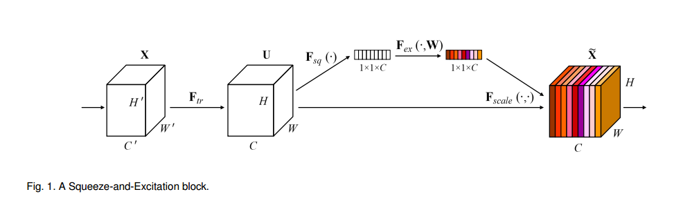
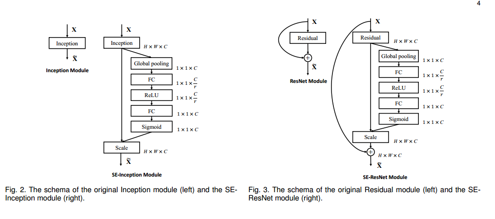
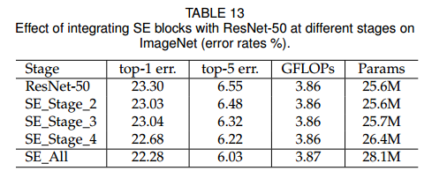

[TOC]

# SENet

[Squeeze-and-Excitation Networks](http://xxx.itp.ac.cn/abs/1709.01507)

>  最近很多工作被提出来从空间维度层面来提升网络的性能，如Inception结构中嵌入了多尺度信息，聚合多种不同感受野上的特征来获得性能增益；在Inside-Outside网络中考虑了空间中的上下文信息；还有将Attention机制引入到空间维度上等等。这些工作都获得了相当不错的成果。
>
> 我们可以看到，已经有很多工作在空间维度上来提升网络的性能。那么很自然想到，网络是否可以从其他层面来考虑去提升性能，比如考虑特征通道之间的关系？我们的工作就是基于这一点并提出了**Squeeze-and-Excitation Networks**（简称**SENet**）。在我们提出的结构中，Squeeze和Excitation是两个非常关键的操作，所以我们以此来命名。我们的动机是希望显式地建模特征通道之间的相互依赖关系。另外，我们并不打算引入一个新的空间维度来进行特征通道间的融合，而是采用了一种全新的“特征重标定”策略。具体来说，就是通过学习的方式来自动获取到每个特征通道的重要程度，然后依照这个重要程度去提升有用的特征并抑制对当前任务用处不大的特征。
> 
>
> 作者：Momenta链接：https://www.zhihu.com/question/63460684/answer/300021819来源：知乎著作权归作者所有。商业转载请联系作者获得授权，非商业转载请注明出处。

CNN可以很好的提取特征，但是它不是完美的，所以我们可以从不同维度上进行改善，加强其在该维度上提取特征的能力。Inception考虑了空间维度，而SENet考虑了通道维度。__这个思想可以借鉴，从不同的角度来思考同一个问题，同一个技术，然后对其进行改善__。

### Squeeze-and-Excitation block

SE Block的操作如下，其输入是一个$H \times W \times C$的特征图，通过SE操作之后得到一个$1 \times 1 \times C$的通道权重向量，用来对$H \times W \times C$的特征图进行`recalibrates`，也就是对特征图的每个通道乘以一个权重（相当于在通道上进行attention）。

那么是如何通过SE操作得到$1 \times 1 \times C$的通道权重向量呢？

* __Squeeze__：对$H \times W \times C$的特征图的每个通道进行Global Average Pooling得到$1\times 1 \times C$的描述符，即每个通道使用一个平均值来描述自身；

$$
z_c = F_{sq}(u_c) =  \frac{1}{H \times W} \sum_{i=1}^{H}\sum_{j=1}^{W}u_c(i,j)
$$

其中$u$为特征图，$u_c$为特征图的第$c$个通道。

* **Excitation**：首先对Squeeze得到的$1 \times 1 \times C$的特征向量进行一次FC层转换，然后通过ReLU激活函数。接着再通过FC层转换，接着通过Sigmoid激活函数，然后就得到了通道权重向量。该层就是为了模仿LSTM中门的概念，通过这个来控制信息的流通量。

$$
s = F_{ex}(z, W) = \sigma(g(z, W)) = \sigma(W_2\delta(W_1z))
$$

其中$W_1$为第一个FC层的权重，$\delta$为ReLU激活函数，$W_2$为第二个FC层的权重，$\sigma$为Sigmoid激活函数。

论文里的第一个FC层将$1 \times 1 \times C$的特征向量转为$1\times 1 \times \frac{C}{r}$的特征向量，然后第二个FC层将将$1 \times 1 \times \frac{C}{r}$的特征向量转为$1\times 1 \times  C$的特征向量。论文里对$r$的取值做了实验，最后取$r=16$。

SE block作为一个通道的特征重标定模块，并且不会改变特征图的大小和通道，所以可以嵌入到任意网络之后。例如下图，将SE block插入到Inception模块之后或者是Residual block中提取特征的分支之后，sum之前。

### Experiments

__Reduction ratio__:

之前说过，SE block中的Excitation是将第一个FC层将$1 \times 1 \times C$的特征向量转为$1\times 1 \times \frac{C}{r}$的特征向量，然后第二个FC层将将$1 \times 1 \times \frac{C}{r}$的特征向量转为$1\times 1 \times  C$的特征向量。

其中$r$为 reduction ratio，那么其值该如何取呢？

可以看到，SE block的性能对reduction ratio还是非常鲁棒的，其中$r=8$是最好的，不过作者最后取了$r=16$，可能是为了权衡精度和参数量吧。

__Squeeze Operator__：

比较了最大池化和平均池化对于SE block的影响，可以看出，平均池化效果比较好。

__Excitation Operator__：

现在一般都是使用ReLU激活函数，为什么作者在Excitation的第二个FC层之后使用Sigmoid激活函数呢？我感觉是看中了其输出在$(0, 1)$之间这个特性，能够表示权重。不过作者也是对第二个FC层之后选什么激活函数做了实验，可以看出Sigmoid确实效果比较好。所以其输出为$(0, 1)$是符合SE操作的思想的。

__Different stages__:

实验了在ResNet的不同state中加入SE block的效果，发现在不同阶段加入都是有效的，每个阶段都加更有效。

__Integration strategy__:

虽然说SE block能够嵌入到任意网络中，但是嵌入到网络中时，也有不同的位置可以插入。比如说插入到Residual block中，可以插入到以下这些不同的位置。

实验的结果如下，看不懂为什么SE-Identity有效，这就和我之前理解的ResNet相矛盾了，并且也和kaiming的[Identity Mappings in Deep Residual Networks](http://xxx.itp.ac.cn/abs/1603.05027)中的分析矛盾了吧，果然都是玄学。

__Effect of Squeeze__:

为了验证Squeeze操作是否有效，也就是说Global Average Pooling操作得到的特征向量是否使用，作者做了对比实验，去除Squeeze操作，直接在特征图上使用Excitation操作（因为Excitation操作可以用1x1卷积核实现，所以可以这么做）。__不过我不理解是它是通过1x1的卷积核得到权重，还是直接得到SE block的输出？__

实验表明Sequeeze提取的全局信息是有用的，而NonSqueeze的SE block因为无法访问全局的信息，所以性能不如SE block。

__Role of Excitation__:

那么Excitation到底起到了什么作用呢？作者将不同Stage的Excitation操作的输出的结果画了出来。横轴是通道索引，纵轴是Excitation操作经过Sigmoid激活之后得到的值。作者将不同类（4个）的图片经过网络，然后提取其Excitation的通道权重向量。

可以看到，在初始阶段(SE_2_3)，不同类的的特征图通过Excitation操作所得到的通道权重向量的分布是__相似__的，作者解释为神经网络浅层所提取的特征是general，也就是说这些特征被不同的类所公用；到了之后的阶段，不同类的的特征图通过Excitation操作所得到的通道权重向量的分布就具有__差异性__了，作者解释为神经网络神经能够提取不同类所特有的特征，所以不同类特征图所得到的通道权重向量是不同的。

## 参考

[Feature Extractor](https://www.cnblogs.com/shouhuxianjian/p/7865510.html)

[如何评价Momenta ImageNet 2017夺冠架构SENet? - Momenta的回答 - 知乎](https://www.zhihu.com/question/63460684/answer/300021819)