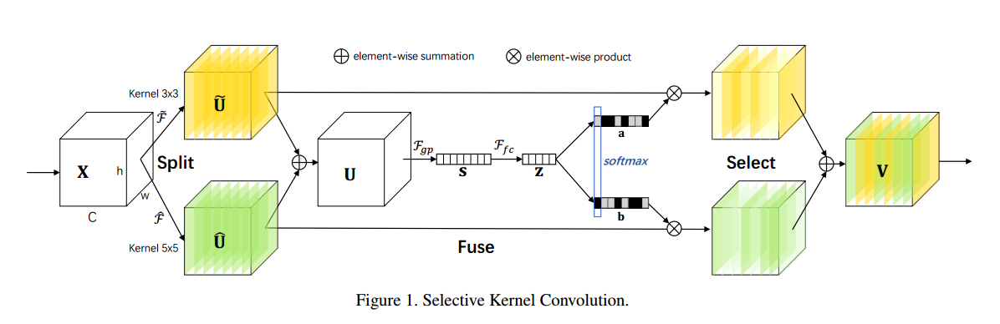
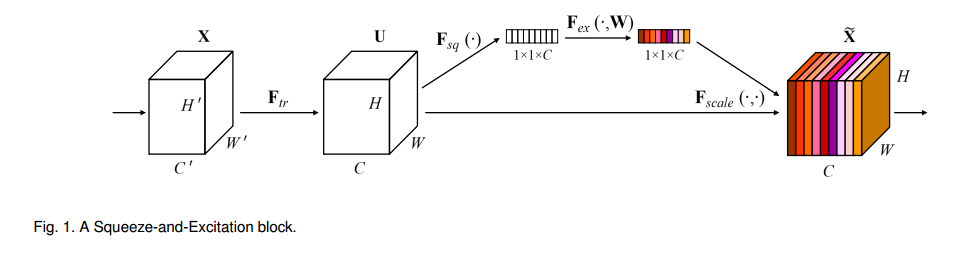
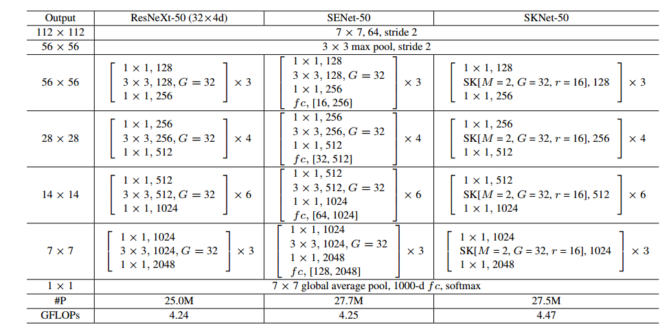

[TOC]

# SKNet

[Selective Kernel Networks](http://xxx.itp.ac.cn/abs/1903.06586)

[official code, caffe](https://github.com/implus/SKNet)

[code1](https://github.com/ResearchingDexter/SKNet_pytorch)

[code2](https://github.com/pppLang/SKNet)

简单来说就是Multi-branch卷积核+Soft channel attention机制，Multi-branch结构使用不同尺寸的卷积核来提取不同尺度的特征，然后使用SENet的channel attention机制，求出不同大小的卷积核得到的特征图的通道特征权重，也就说通过Soft channel attention来告诉网络不同尺寸的特征图在不同通道上的重要性。

## 网络结构

感觉就是在SENet的基础上改了改，其基本范式是`Split-Fuse-Select`：

* `Split`就是使用不同大小的卷积核进行卷积，然后得到不同尺度（在图中是2个尺度，实际实现可以是多个）的特征图$\tilde{U}$和$\hat{U}$；
* `Fuse`就是将不同尺度的特征图进行融合（element-wise summation），得到融合之后的特征图，然后使用SENet中的Soft channel attention机制，不过略有一些不同。SENet中的SE block是使用`GAP-FC1-ReLU-FC2-Sigmoid`得到通道权重向量，而SKNet由于有2个分支（可以是多个）所以与SENet有些如略微不同。对于第一个分支，使用`GAP-FC1-ReLU-FC2_1`得到未归一化的通道权重特征向量，对于第二个分支，使用`GAP-FC1-ReLU-FC2_2`得到未归一化的通道特征权重向量。其中的`GAP-FC1-ReLU`是两个共享的，并且这部分操作和SENet中的一样，不过由于每个分支需要得到一个通道特征权重向量，所以每个分支都有自己的`FC2`。得到两个分支未归一化的通道特征权重向量之后，需要对其归一化，这里就使用softmax对其归一化，也就是在不同权重向量的同一个通道数进行softmax，从而得到归一化的特征权重 向量$a$和$b$，其中$a_c + b_c=1$，$c$为通道索引。

* `Select`就是使用上一步计算得到的通道特征权重向量$a$和$b$对特征图$\tilde{U}$和$\hat{U}$进行选择（soft selection），公式如下，也就是使用通道特征权重对不同尺度的特征图进行加权，也就是说之前的神经网络Multi-branch的特征融合是简单的sum或者concat，也这里的融合则是使用加权求和的方式就是融合，美名约attention机制或者是作者所说的Selective kernel。

$$
V_c =  a_c \cdot \tilde{U}_c + b_c \cdot \hat{U}_c, \ \ \ a_c + b_c = 1
$$

## 网络参数

作者在ResNetXt-50的基础上进行修改的，ResNetXt的Bottleneck为`1x1卷积-3x3分组卷积-1x1卷积`，作者将其中的3x3分组卷积改成自己的SK unit，SK unit中同样是使用分组卷积。其SK unit使用参数[M, G, r]来描述，M为分支个数，G为分组卷积核的组数，r为reduction ratio。

## 参考

[SKNet——SENet孪生兄弟篇](https://zhuanlan.zhihu.com/p/59690223)