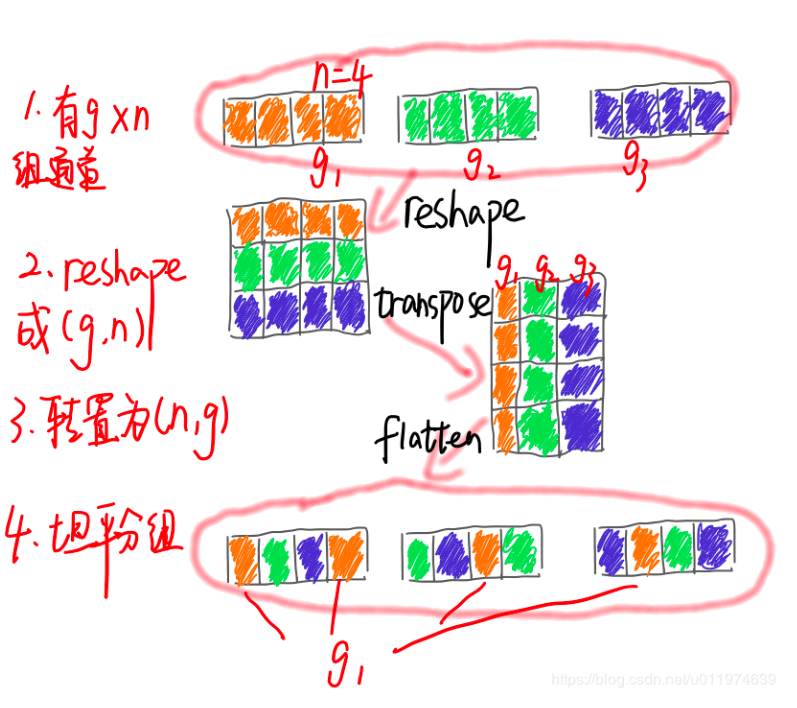
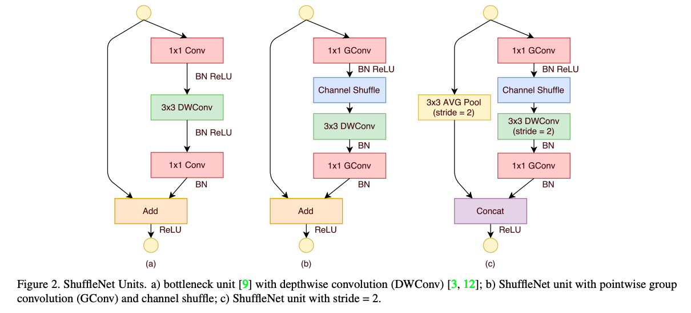

[TOC]

# ShuffleNet

[ShuffleNet: An Extremely Efficient Convolutional Neural Network for Mobile](http://xxx.itp.ac.cn/pdf/1707.01083v2)

* pointwise group convolution：进一步降低计算量。我感觉pointwise卷积的作用是降低维度或者是整合通道信息（尤其是在分组卷积或者是Depthwise卷积之后）。对于前者，使用pointwise group convolution还是可以理解的，对每个组单独进行压缩，不过分组了也确实阻碍了通道之间信息的交流；对于后者，使用pointwise group convolution确实阻碍通道之间信息的交流，不过有了channel shuffle之后，是不是就部分解决了该问题呢？

* channel shuffle ： 加强使用分组卷积时，通道信息的交流。

对于一个卷积层分为g组，

1. 有g×n g×ng×n个输出通道

2. reshape为(g,n) (g,n)(g,n)

3. 再转置为(n,g) (n,g)(n,g)

4. 平坦化,再分回g gg组作为下一层的输入

分组卷积是缺点之后是连接是稀疏的，每个输出特征图只依赖于输入特征图的某一部分通道，这阻碍了通道之间信息的交流。一个弥补的方法就是使用pointwise卷积进行通道间信息的整合。

但是作者使用channel shuffle来解决分组卷积通道之间信息交流不完整的问题，这是不是使得能够使用pointwise group convolution原因呢，从而进一步降低计算量。

## 参考

[轻量级网络--ShuffleNet论文解读](https://blog.csdn.net/u011974639/article/details/79200559)