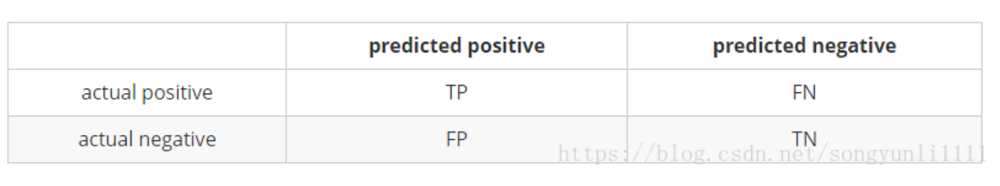

$$
Precision = \frac{TP}{TP + FP}
$$

$$
Recall = \frac{TP}{TP + FN}
$$

$$
TPR = \frac{TP}{TP + FN}
$$

$$
FPR = \frac{FP}{FP + TN}
$$

对于ROC曲线，其横坐标是FPR，纵坐标为TPR。

**TPR考虑的是第一行，实际都是正例，FPR考虑的是第二行，实际都是负例**

首先，在负样本增加的情况下（正负样本数量不均衡），是不会影响到第一行的，也就不会响应TPR的值；而对于FPR，FPR的各项也是成比例的增加，并不会有太大的变化。所以说，ROC曲线无法对正负样本不均衡不敏感。

对于PR曲线，其横坐标是Recall，纵坐标是Precision。

**Recall考虑的是第一行，实际都是正例，Precision考虑的是第一列**

这就导致负样本的比例发生变化时，PR曲线是能够知道的，若负样本变多，那么会导致FP变多，从而导致Precision下降。

## 参考

[精确率、召回率、F1 值、ROC、AUC 各自的优缺点是什么？](https://www.zhihu.com/question/30643044/answer/64151574?from=profile_answer_card)

[为什么ROC曲线不受样本不均衡问题的影响](https://blog.csdn.net/songyunli1111/article/details/82285266)

[PR曲线和F1、ROC曲线和AUC](https://blog.csdn.net/teminusign/article/details/51982877)

[精确率、召回率、F1 值、ROC、AUC 各自的优缺点是什么？](https://www.cnblogs.com/the-wolf-sky/p/10315118.html)