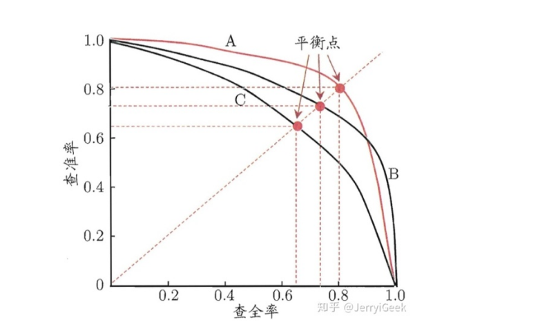

[TOC]

# 度量标准

precision, recall, accuracy, macro F, micro F

## Confusion Matrix

混淆矩阵能够比较全面的反映模型的性能，从混淆矩阵能够衍生出很多指标来。

## Accuracy & Precision & Recall & F1(二分类)

* TP：样本为正类，且预测为正类
* TN：样本为负类，且预测为负类
* FP：样本为负类，但是预测为正类
* FN：样本为正类，但是预测为负类
* TP+FP：预测为正类的样本数
* TP+FN：实际为正类的样本数

### Precision

precision为：被正确预测的正样本/被预测为正类的样本
$$
precision = \frac{TP}{TP+FP}
$$
### Recall

recall为：被正确预测的正样本/实际的数样本
$$
recall = \frac{TP}{TP+FN}
$$

### Accuracy

accuracy为：
$$
accuracy = \frac{TP + TN}{TP+TN+FP+FN}
$$

准确率是分类问题中比较简单直观的评价指标，但存在明显缺陷。比如数据集中正样本的数量为99%，那么分类器只要一直预测为正，就能够得到99%的准确率，但其实际性能是非常低小的。也就说，当数据集中不同类别的比例不均衡时，占比大的类别往往能够成为影响准确率的最主要原因。

 一个改进就是使用每个类别下的样本准确率的算术平均值作为模型的评估指标。

### F1值

F1值为：
$$
F1 = \frac{2 \cdot precision \cdot recall}{precision + recall}
$$
如果precision = recall = 1，那么$F1=1$。但是如果precision或者recall其中一个比较小的话，F1值就会被拉下来。

F1是调和平均值，之所以使用调和平均值而不是算术平均值在于它可以惩罚极端值。比如对$precisio=1$，而$recall=0$的分类器而已，算术平均值为$0.5$，但F1分数为$0$。

## Precision & Recall & F1(多分类)

>很多时候我们会有多个二分类Confusion Matrix，比如好多次训练和测试，每次都会产生一个Confusion matrix；或者多分类任务时，类别之间两两组合产生很多个confusion matrix。这时我们想在n个confusion matrix上综合考察precision和recall。
>作者：武秉文Jerry链接：https://zhuanlan.zhihu.com/p/39957290来源：知乎著作权归作者所有。商业转载请联系作者获得授权，非商业转载请注明出处。
>
>
>
>macro就是现在每个confusion matrix上计算precision和recall，最后计算平均值.
>
>
>
>micro则是先将每个confusion matrix中各个对应位置上的元素平均，得到TP、FP、TN、FN的平均值，然后计算precision、recall和F1.

对于多分类问题，我们可以计算出其混淆矩阵

多分类问题，有两种计算precison，recall和F1的方式。

* 将一个类看为正类，其它类为负类，然后依次计算每个类的precision，然后求和取平均。（macro）
* 将一个类看为正类，其它类为负类，然后在TP，FP，TN，FN上求和取均值，得到$\overline{TP}$，$\overline{FP}$，$\overline{TN}$，$\overline{FN}$，然后用这些指标来计算precision和recall等度量指标。(micro)

**macro**

则有多个precision和recall，也即每个类别都有一个。

对于precision，可以根据一列来计算，例如狗的$precion = \frac{24}{24 + 2 + 4}$。

对于recall，可以根据一行来计算，例如够的$recall = \frac{24}{24 + 2 + 5}$。

最终的precision和recall为：
$$
macroP = \frac{1}{n} \sum_{i=1}^{n}P_i
$$

$$
macroR = \frac{1}{n} \sum_{i=1}^{n}R_i
$$

用macroP和macroR计算F1就得到了macroF1
$$
macroF1 = \frac{2 \cdot macroP \cdot macroR}{macroP + macroR}
$$

对于accuracy，则是对角线元素相加，然后除以总元素个数。

**micro**

对于每一个类，将其类看为正类，其它类为负类，然后在TP，FP，TN，FN上求和取均值，得到$\overline{TP}$，$\overline{FP}$，$\overline{TN}$，$\overline{FN}$。然后用其来计算度量标准
$$
microP = \frac{\overline{TP}}{\overline{TP} + \overline{FP}}
$$

$$
microP = \frac{\overline{TP}}{\overline{TP} + \overline{FN}}
$$

$$
microF1 = \frac{2 \cdot microP \cdot microR }{microP + microR}
$$

> 此处应该有利用混淆矩阵计算metric的代码。

## P-R曲线

precision-recall曲线。

 分类模型输出的结果往往是一个概率，因此我们可以对样本进行排序，最前面是模型认为“最可能”是正例的样本，最后面则是模型认为“最不可能”是正例的样本。根据阈值的不同，可以将不同的预测结果分为正类或者负类。所以我们可以将样本按照预测的概率从大到小排序，然后依次取每个概率为阈值。根据阈值的不同，就有不同的TP，FP，TN，FN，从而就有了precision和recall。对于每个阈值能够得到一对precision和recall，将recall作为横坐标，precision作为纵坐标，从而可以在坐标轴上画出一个点，将这些点连起来，从而形成了P-R曲线。如下：

可见P-R曲线直观的显示了模型在样本总体上的precision和recall的表现。如果一个模型的曲线自始至终位于另一个曲线之上，那么该模型的分类性能就更好，比如图中模型A性能就比模型C强。但是如果想模型A和模型B那样曲线有了交叉，那么只能在具体的点上去比较性能。

并且，随着recall的增大，precision随之减少。所以，有这样一个评价标准，可以看看recall=0.95时，1-precison多小，叫做FPR95。FPR95越小，说明在recall=0.95的情况下，precision很高，这是我们期望看到的，查得即全又准。

## ROC曲线和AUC

有的模型是将预测结果与一个阈值进行比较，如果大于该阈值则预测为正例，否则为反例。所以这个阈值非常重要，直接决定了模型的泛化能力。同时根据这个阈值我们可以将样本进行排序，“最可能”是正例的排在最前面，“最不可能”是正例的排在最后面。因此，如果我们想让precision更高，可以将阈值设置在排序靠前的位置，相反如果想让recall更高，可以将阈值设置在排序靠后的位置。

P-R曲线是根据不同的阈值预测之后，算出precision-recall，然后以recall作为横坐标，precision作为纵坐标。而ROC曲线则是计算不同阈值下的true positive rate和false positive rate：
$$
TPR = \frac{TP}{TP+FN}
$$

$$
FPR = \frac{FP}{TN + FP}
$$

FPR其实就是recall

模型比较同P-R曲线类似，如果一个模型的曲线自始至终高于另一个模型的曲线，则该模型性能更好。如果曲线发生交叉，则要通过AUC（Area Under ROC Curve）进行比较。

## Average Precision(AP)

average precision字面含义就是对precison取平均，这是很好理解的。那么AP是对哪些precision取的平均呢？

一句话概括AP：**AP表示Recall从0~1的平均精度值**。比如说Recall=0.1时，Precision=y1；Recall=0.2时，Precision=y2；...... ；Recall=1.0时，Precision=yn。那么可以以Recall为横轴，Precision为纵轴画一条曲线，曲线下的面积就是AP。

但是实际的计算中可能并不是取面积，而是有多种不同的实现。一般来说，不同的数据集mAP介绍方法会有一些细微差异。

## Mean Average Precision(mAP)

AP衡量的是学出来的模型在每个类别上的好坏，mAP衡量的是学出的模型在所有类别上的好坏，得到AP后mAP的计算就变得很简单了，就是取所有AP的平均值。

一句话概括mAP：**mAP表示多个物体类别上的平均AP**。注意，mAP有两次平均，一次在Recall取不同值时平均，一次在类别上平均。

## 平衡数据集和不平衡数据集

什么指标能够反映出数据集的不平衡呢？

micro和macro的区别

P-R曲线和ROC曲线的区别

## 参考

[多标签分类的结果评估---macro-average和micro-average介绍](https://www.cnblogs.com/yuuken/p/8822496.html)

[模型评价指标 - 分类任务](https://www.jianshu.com/p/c1978f632710?utm_campaign)

[多分类的评价指标Macro-P/R和Micro-P/R以及Average Precision(AP)和mAP](https://www.jianshu.com/p/100f3dee345d)

[机器学习分类任务中常见的性能度量方法对比与总结 - 武秉文Jerry的文章 - 知乎](https://zhuanlan.zhihu.com/p/39957290)

[P-R曲线及与ROC曲线区别](https://www.cnblogs.com/gczr/p/10137063.html)

[白话mAP - 我爱馒头的文章 - 知乎](https://zhuanlan.zhihu.com/p/60834912)
