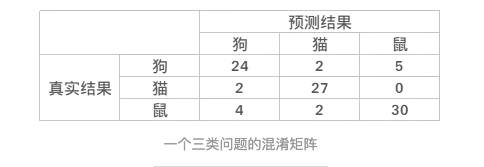

[TOC]

# 度量标准

precision, recall, accuracy, macro F, micro F

## Precision and Recall

### 二分类问题

* TP：样本为正类，且预测为正类
* TN：样本为负类，且预测为负类
* FP：样本为负类，但是预测为正类
* FN：样本为正类，但是预测为负类
* TP+FP：预测为正类的样本数
* TP+FN：实际为正类的样本数

precision为：被正确预测的正样本/被预测为正类的样本
$$
precision = \frac{TP}{TP+FP}
$$
recall为：被正确预测的正样本/实际的数样本
$$
recall = \frac{TP}{TP+FN}
$$

accuracy为：
$$
accuracy = \frac{TP + TN}{TP+TN+FP+FN}
$$

### 多分类问题

对于多分类问题，我们可以计算出其混淆矩阵

多分类问题，有两种计算precison和recall的方式。

* 将一个类看为正类，其它类为负类
* 将一个类看为负类，其它类为正类

**方式1**

则有多个precision和recall，也即每个类别都有一个。

对于precision，可以根据一列来计算，例如狗的$precion = \frac{24}{24 + 2 + 4}$。

对于recall，可以根据一行来计算，例如够的$recall = \frac{24}{24 + 2 + 5}$。

对于accuracy，则是对角线元素相加，然后除以总元素个数。

**方式2**

？？

> 此处应该有利用混淆矩阵计算metric的代码。

## F1

$$
F1 = \frac{2 \cdot precision \cdot recall}{precision + recall}
$$

如果precision = recall = 1，那么$F1=1$。但是如果precision或者recall其中一个比较小的话，F1值就会被拉下来。

## 参考

[多标签分类的结果评估---macro-average和micro-average介绍](https://www.cnblogs.com/yuuken/p/8822496.html)

