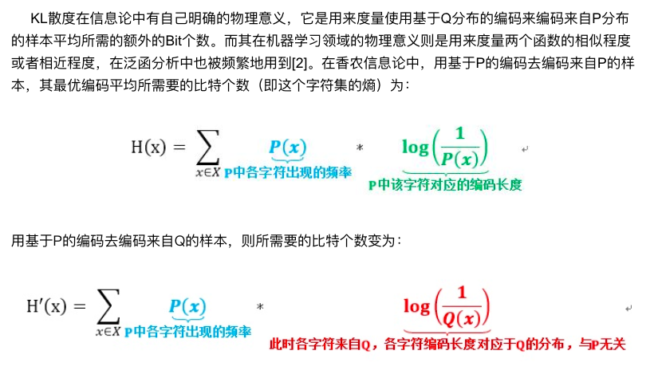

# 损失函数

## 交叉熵损失函数

> 

首先就是直观理解信息熵表示平均编码长度，如下所示

$$H(x) = \sum_{x_i \in X} P(x_i) log(\frac{1}{P(x_i)})$$

但是如果编码长度不使用与概率$P(x_i)$所对应的编码长度$log(\frac{1}{P(x_i)})$，而是使用另外一个分布$Q(x_i)$所对应的编码长度$log(\frac{1}{Q(x_i)})$，那么新的平均编码长度为

$$
H^{'}(x)= \sum_{x_i \in X} P(x_i) log(\frac{1}{Q(x_i)})
$$

如果$P(x_i)$和分布$Q(x_i)$是不同的分布，那么新的编码长度$log(\frac{1}{Q(x_i)})$对于分布$P(x_i)$来说并不是最优的，那么新的平均编码长度就变大了，所以就有
$$
H(x) \le H^{'}(x)
$$
如果分布$P(x_i)$和分布$Q(x_i)$非常接近（或者是越来越接近，在优化问题中），那么由$log(\frac{1}{Q(x_i)})$得到的编码长度就接近由$log(\frac{1}{P(x_i)})$得到的编码长度，所以就用KL散度来衡量两个分布的接近程度：

$$
KL(P||Q) = H^{'}(x) - H(x)
$$

在深度学习中，每个样本都有一个类别分布，我们希望预测得到的分布和标签分布越接近越好，所以可使用KL散度来衡量两个分布的距离。其中$H(x)$表示标签的分布，而$H^{'}(x)$表示预测的分布，由于标签的分布$H(x)$是固定值，所以KL散度可以简化为如下，从而变成交叉熵损失函数:

$$
H^{'}(x)= \sum_{x_i \in X} P(x_i) log(\frac{1}{Q(x_i)})
$$
其中$P(x)$是标签，而$Q(x)$是预测的概率分布，由于$P(x)$是onehot向量，只有一个位置为1，所以可以简化为

$$
L = log(\frac{1}{Q(x_i)}) = -logQ(x_i)
$$

## 参考

[KL散度的含义与性质 - 最佳损友 - CSDN博客](https://blog.csdn.net/qq_40406773/article/details/80630280)

[一文搞懂交叉熵在机器学习中的使用，透彻理解交叉熵背后的直觉 - 史丹利复合田的博客 - CSDN博客](https://blog.csdn.net/tsyccnh/article/details/79163834)

