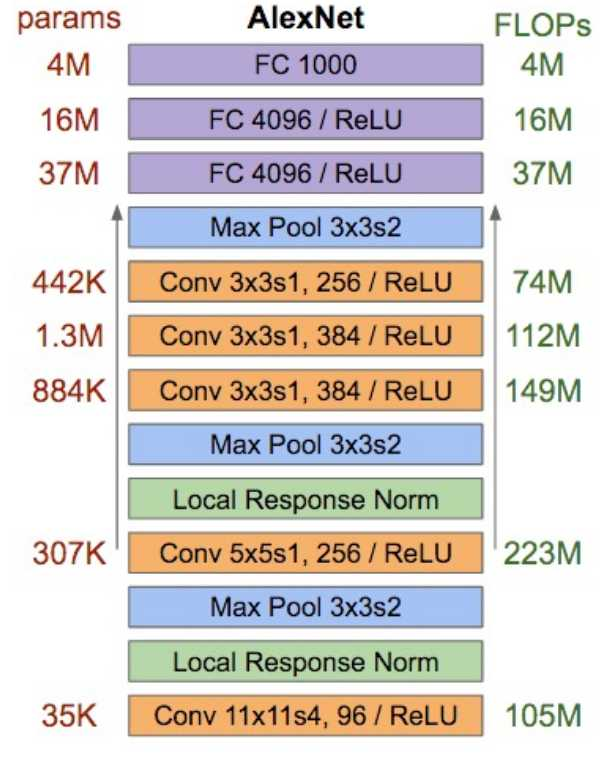

[TOC]

# 模型显存占用及其计算量

## 显存占用
当我们在GPU上跑一个模型时，显存的占用分为两个部分：模型参数和模型输出。

1. 模型参数量所占用的显存大小。(例如：卷积核参数、BN层、全连接层参数等)
2. 如果是训练阶段，那么优化器也会占用显存，因为每个参数都需要存储梯度。所以训练阶段使用了SGD，那么需要2倍模型参数的显存占用，`模型参数`+`模型参数梯度`；或者使用了SGD+Momentum，那么需要3倍，`模型参数`+`模型参数梯度`+`模型参数动量`；又或者使用了Adam，那么需要4倍的显存占用，`模型参数`+`模型参数梯度`+`模型参数动量`+`模型参数二阶动量`。
3. 模型每层输出的特征图所占用的显存大小。（由于反向传播时需要对中间层的输出进行求导，所以中间层的输出是不会被释放的）
4. 如果是训练阶段，那么因为使用链式求导，那么可能需要保存对特征图的导数，但是由于特征图不需要优化，所以训练阶段，特征图需要2倍显存。

简单来说，显存的占用主要是模型本身的参数占用和每一层的输出的特征图大小（这一部分和batch_size呈线性正相关）。

#### 模型参数的显存占用

这里简介下卷积核和全连接层的参数量是如何计算的：

1. 每层卷积核的参数量的计算公式为$ C_{out} \times (C_{in} \times K^2 +1) $。
2. BN层参数量的计算公式为$2 \times C_{in}$，几乎可以忽略不计。
3. 全连接层的参数量的计算公式为 $FC_{in} \times FC_{out}$。

$K$ ： 表示卷积核的大小；

$C_{in}$ ： 表示卷积核的通道数，也表示__输入__特征图的通道数；

$C_{out}$ ：表示卷积核的数量，也表示__输出__特征图的通道数；

$FC_{in}$ ： 表示全连接层输入的数量；

$FC_{out}$ ：表示全连接层输出的数量。

> Note : 模型参数的显存占用是和batch size无关的。

如果是训练阶段，那么优化器也会占用显存，因为每个参数都需要存储梯度。所以训练阶段使用了SGD，那么需要2倍模型参数的显存占用，`模型参数`+`模型参数梯度`；或者使用了SGD+Momentum，那么需要3倍，`模型参数`+`模型参数梯度`+`模型参数动量`；又或者使用了Adam，那么需要4倍的显存占用，`模型参数`+`模型参数梯度`+`模型参数动量`+`模型参数二阶动量`。

#### 每层特征图的显存占用

每层输出特征图的显存占用为$B \times C_{out} \times H \times W$，特征图的显存占用与batch size的大小呈正比。

$B$ ：表示batch size的大小；

$C_{out}$ ：表示输出特征图的通道数；

$H$ ：表示输出特征图的高度；

$W$ ：表示输出特征图的宽度。

如果是训练阶段，那么因为使用链式求导，那么可能需要保存对特征图的导数，但是由于特征图不需要优化，所以训练阶段，特征图需要2倍显存。

输入（数据，图片）一般不需要计算梯度 神经网络的每一层输入输出都需要保存下来，用来反向传播，但是在某些特殊的情况下，我们可以不要保存输入。比如ReLU，在PyTorch中，使用`nn.ReLU(inplace = True)`能将激活函数ReLU的输出直接覆盖保存于模型的输入之中，节省不少显存。感兴趣的读者可以思考一下，这时候是如何反向传播的（提示：y=relu(x) ->*dx = dy.copy();dx[y<=0]=0*）`

#### 节省显存的方法

在深度学习中，一般占用显存最多的是卷积等层输出的`特征图`。模型参数占用的显存相对较少，其中全连接层的参数量又占据了模型参数的大部分。

所以降低显存一般有如下办法：

1. 降低batch size
2. 池化
3. 去掉BN？（现有的操作都是Conv后加BN，那么就相当于要维护两份特征图，而网络中又存在着大量的Conv，导致BN也很多，所以去掉BN一般能够节省40%的显存）
4. 减少全连接层，例如VGGNet中有三层全连接层，而现在的网络都使用Global Average Pooling来替代全连接层，只保留最后一层全连接层用于分类。
5. Pytorch中的inplace操作

## FLOPs计算

> FLOPS：注意全大写，是floating point operations per second的缩写，意指每秒浮点运算次数，理解为计算速度。是一个衡量硬件性能的指标。

> FLOPs：注意s小写，是floating point operations的缩写（s表复数），意指浮点运算数，理解为计算量。可以用来衡量算法/模型的复杂度。

模型的FLOPs越大，那么执行一遍前向传播或者反向传播的时间也就越长，从而导致漫长的训练时间。

前面的显存占用，只需要考虑一层便足够了，比较好计算。而模型FLOP使得计算，则需要考虑前后量层，也即前一层的特征图通过计算得到当前层的输出，这其中所需要占用的计算量。

#### 卷积层FLOPs计算

$$
B \times \underbrace{HWC_{out}}_{输出点的个数} \times \overbrace{(2\cdot C_{in} K^2 - 1)}^{计算每个点的FLOPs}
$$

$B$ ：表示batch size的大小；

$HWC_{out}$：表示输出的特征图有多少个元素；

$2\cdot C_{in}K^2 - 1$：表示原特征图要经过多少次计算后才能够得到输出特征图上的一个点，需要$C_{in}K^2$次乘法操作和$C_{in}K^2-1$次加法操作，但是并没有考虑bias。所以不考虑bias时有$-1$，考虑bias​时没有$-1$。

其实卷积核FLOPs的计算也是比较简单的，就是计算输出的特征图上有多少个元素，然后计算每个元素需要多少计算量得到，最后乘以batch size的大小，那么就得到了卷积层的FLOPs了。

#### 池化层FLOPs计算

$$
B \times \underbrace{HWC}_{输出点的个数} \times \overbrace{K^2}^{池化的FLOPs}
$$

$K$：表示池化层卷积核的大小，如果是平均池化层，那么需要$K^2-1$次加法操作和$1$次除法操作，所以总共$K^2$次操作；至于最大池化层，就不知道是如何实现的了。

#### BN层FLOPs计算

$$
5 \times BHW \times C
$$

对于一个batch的数据，每个通道都需要需要计算均值（每个元素一次加法），计算方差（每个元素一次加法，一次乘法），归一化（每个元素一次减法，一次除法），所以总共需要$5$倍的计算量。

#### 全连接层FLOPs计算

$$
B \times \underbrace{(2 FC_{in} -1)}_{每个输出神经元所需的计算量}\times FC_{out}
$$

全连接层的$F_{in}$个元素需要经过$F_{in}$次乘法和$F_{in}-1$次加法才能得到输出层的一个神经元的输出，但是没有考虑bias。所以不考虑bias时有$-1$，考虑bias没有$-1$。

#### 减少卷积层的计算量

1. 使用2个$3 \times 3$的卷积核替换一个$5\times5$的卷积核；
2. 将$n \times n$的卷积核分解成$1\times n$和$n \times 1$的卷积核，或者是分解成$n \times 1$和$1 \times n$的卷积核；
3. 深度可分离卷积，先进行Depthwise卷积操作，然后进行Pointwise卷积操作。

#### 实例分析

可以看出：全连接层占据了绝大多数的参数 卷积层的计算量最大。

## 一些分析

1. 时间更宝贵，尽可能使模型变快（减少flop） ；
2. 显存占用不是和batch size简单成正比，模型自身的参数及其延伸出来的数据也要占据显存 ；
3. batch size越大，速度未必越快。在你充分利用计算资源的时候，加大batch size在速度上的提升很有限。比如说$batch\_size = 8$时，模型的FLOPs等于GPU的峰值FLOPS，并且假设GPU能够维持其峰值FLOPS，那么刚好1秒跑一个batch size；若此时令$batch\_size= 16$，那么需要2秒跑一个batch size，并不能提升训练速度。

## 参考

[浅谈深度学习:如何计算模型以及中间变量的显存占用大小 - OLDPAN的文章 - 知乎](https://zhuanlan.zhihu.com/p/38142800)

[CNN 模型所需的计算力（flops）和参数（parameters）数量是怎么计算的？ - chen liu的回答 - 知乎](https://www.zhihu.com/question/65305385/answer/451060549)

[卷积神经网络中参数量的计算与模型占用显存的计算](https://www.jianshu.com/p/b8d48c99a47c)

[GPU显存：GPU 和显存分析 - 综合编程类其他综合 - 红黑联盟](https://www.2cto.com/kf/201712/708227.html)
