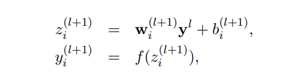
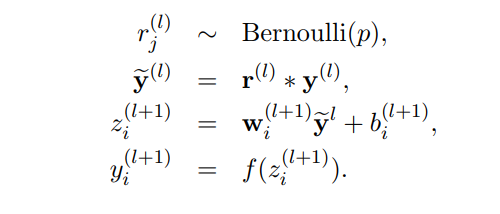
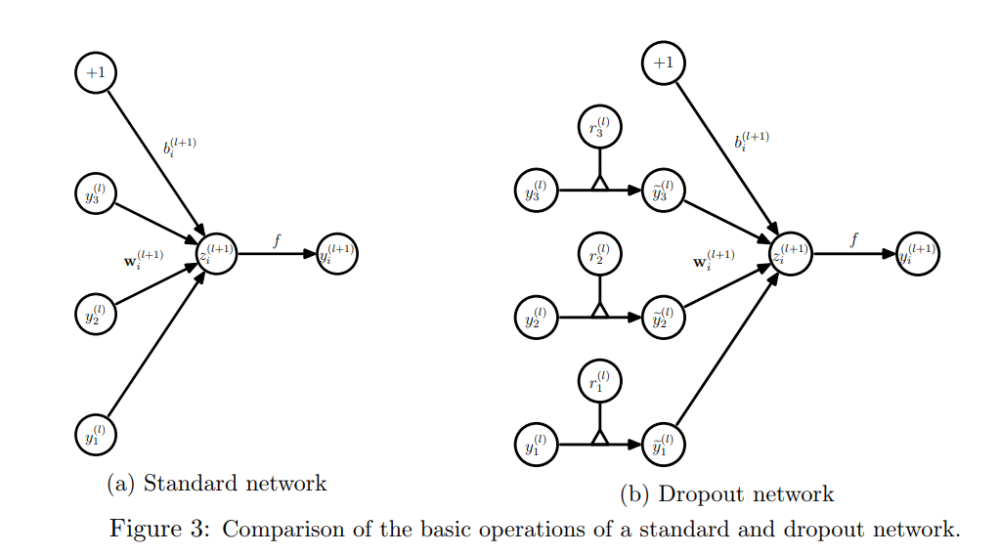

[TOC]

# Dropout

[Improving neural networks by preventing co-adaptation of feature detectors](https://arxiv.org/pdf/1207.0580.pdf)

[Dropout: A Simple Way to Prevent Neural Networks from Overfitting](http://jmlr.org/papers/volume15/srivastava14a.old/srivastava14a.pdf)

## 定义

__不使用Dropout的神经网络的定义__：

__使用Dropout的神经网络的定义__：

更加直观的定义如下，也即每个输入都乘以一个隐藏的激活值，该激活值来自伯努利分布

由于Dropout是让每个神经元的输入都乘以一个隐藏的激活值，而该激活值来自伯努利分布，那么我们可以扩展这种定义。比如说乘以的激活值不再来自伯努利分布，而是来自其它的分布。

Dropout的作者发现，如果隐藏的激活值如果来自分布$N(1, 1)$，那么也可以取得很好的效果，或者比使用伯努利分布的效果要更好。所以可以用下面的方式来使用Dropout：
$$
y_i r', \ \ r' \sim N(1, 1)
$$
又或者是
$$
y_i + y_i r, \ \ r \sim N(0, 1)
$$

## 公式

每个神经元以概率$p$随机将该神经元的输出置为$0$。那么第$l$层的期望输出为：
$$
E(y_l) = p_l \cdot 0 + (1 - p_l) \cdot y_l = (1 - p_l) \cdot y_l
$$
所以说$y_l$的整体尺度被缩放了，那么这就会影响下一层：
$$
y_{l+1} = W_{l+1} y_l
$$
由于$y_l$的期望输出的$E(y_l)$，所以神经网络下一层的权重$W_{l+1}$是适配该尺度的，由于在__测试__阶段会关闭dropout，令所有的神经元一起工作，这导致每层输入的尺度变大，使得权重不再匹配该尺度。为了解决输入的尺度问题，有以下两种做法：

__训练时rescale__：

由于训练阶段的期望输出是$E(y_l) = (1 - p_l) \cdot y_l$，所以我们可以在dropout之后，将每个神经元的输出乘以$\frac{1}{ 1 - p_l}$，这样子就是的神经元的期望输出变成$E(y_l) = y_l$，在__测试阶段__关闭dropout之后无需做任何事。

__测试时rescale__：

在测试阶段，神经元的期望输出是$E(y_l) = y_l$，但是此时的权重期望前一层神经元的输出尺度为$E(y_l) = (1 - p_l) \cdot y_l$，所以在测试阶段，需要对神经元的输出乘以$(1 - p_l)$，以匹配权重所期望前一层神经元的输出尺度。

## 原理分析

__为什么dropout能够防止过拟合，提高泛化性呢__？

如果大型网络用在小数据集上，那么就很容易发生过拟合。

1. 那么dropout随机失活某些神经元，可以减少一次训练的参数量，从而防止过拟合；
2. 如果不使用dropout，那么每个神经元的输入依赖于上一层所有神经元的输出，假设为$n$个；而使用dropout之后，每个神经元不再依赖于上一层所有神经元的输出，只依赖于上一层$n \cdot (1 - p_l)$个神经元的输出，并且是随机依赖于任意$n \cdot (1 - p_l)$个，那么就下来就可以从两个方面来理解：
   1. 每个神经元依赖的输入是随机的，所以输入同一张图像多次，每个神经元所接受到的输入不一样的（但是神经元所接受的输入的期望的一致的），这获取可以看做是一种数据增强的手段；
   2. 虽然同一张图像，在不同的时刻输入，神经元的输入的变化的，但是神经元所接收的输入的期望的一致，所有网络参数所学习的是在该期望下的输入下所能work的参数，但是每次的输入的肯定不会完全等于其期望，相当于存在噪声，所以能够防止过拟合。（相当于BN的均值和方差的计算存在噪声，所以能够防止过拟合）

3. 训练时每次只有部分网络起到作用，而测试时测试整个网络起到了作用，相当于ensemble。

