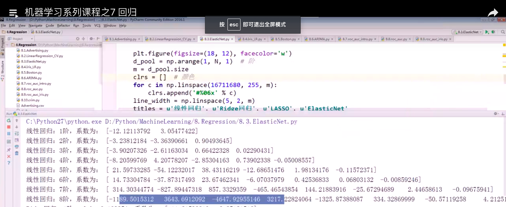
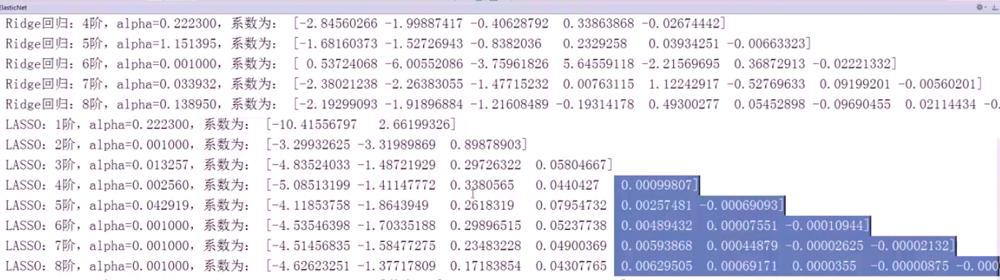
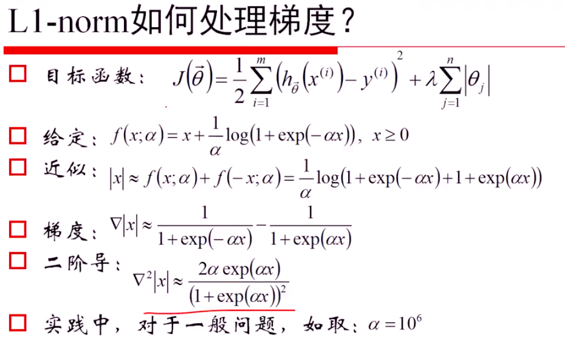
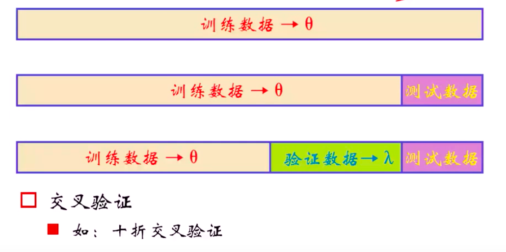

[TOC]

# L1/L2正则化

L1/L2就是权重衰减，那么为什么减少权重有利于防止过拟合呢？

权重小的模型比较简单。

为什么参数小，模型简单，模型稳定呢？

* 为什么参数小，模型稳定？若参数大，即使数据变得很小，在经过高权重的加权后，最后的结果变化也会很大；
* 为什么参数小，模型简单？我做过一个实验，就是在二维平面上随机生成9个点，然后用1到8阶的曲线去拟合这9个点，然后发现线性模型的阶数越高，其权重的绝对值也就越大。1到6阶的曲线的权重都是0点几或者十几，7阶和8阶的曲线的权重都是几百、几千。

__L1—特征选择__：

LASSO也即是线性模型+L1正则，发现高阶的系数接近0。所以可以理解L1正则有特征选择的作用，在这个问题中，则认为高阶的特征没有什么作用。

## L1相比于L2为什么能够获得稀疏解

$$
h(w) = f(w) + \lambda |w|
$$

* $h(w)$是目标函数

* $f(w)$是没加正则项的损失函数

* $\lambda |w|$是L1正则项目

既然L1正则化能够获得稀疏解（大部分的权重倾向于0），那么就求目标函数在0点处的导数，看看发生什么。

由于L1正则化在0点处不可导，所以我们求目标函数在0点处的左右导数：
$$
h_{left}'(0) = f'(0) - \lambda
$$

$$
h_{right}'(0) = f'(0) + \lambda
$$

若目标函数在0点处取得极大值，那么就有其在0点的左右导数异号：
$$
h_{left}'(0) \cdot h_{right}'(0) = (f'(0) - \lambda) \cdot (f'(0) + \lambda) < 0
$$
由于$\lambda >0$，所以当$f'(0) < \lambda$或者$f'(0) > -\lambda$时目标函数的左右导数异号。也即
$$
\lambda > |f'(0)|
$$
时导致0点变为极小值点。

> L1正则化，当权重在0点处的变量的导数满足一定的条件时，其0点会变成极小值点。

对于高维优化问题，L1获得稀疏解就是由于$\lambda$相对于某个权重其在原点处导数的绝对值大，从而导致0点变为该权重的极小值点。

而对于L2正则，
$$
h(w) = f(w) + \frac{\lambda}{2} w^2
$$
其在0点处的导数为：
$$
h'(0) = f'(0)
$$

>  并不会像L1正则那样，影响其在0点处的导数。 也就若原先0点不是极小值点，加了L2正则后并不会变成极小值点。

## L1正则如何处理梯度

因为在0点的左导数为-1，右导数为1。所以实现的时候可以直接让0点的导数为1。

实际实现，为了不用if语句判断， 可以使用上面的方向，加上一个式子，该式子的值在任意点都接近0，但是在0点的导数却为1，正好解决我们的问题。

所以用上面的式子来近似取绝对值的操作。

## 如何确定正则项的系数

通过交叉验证在选择合适的$\lambda$参数。

也就是说，对每个$\lambda$参数，交叉验证其在验证集上的精度。然后选择在验证集上精度最高的那个$\lambda$。

## 参考

[神经网络正则化(1)：L1/L2正则化 - 习翔宇的文章 - 知乎](https://zhuanlan.zhihu.com/p/35893078)

[L1正则化与L2正则化](https://zhuanlan.zhihu.com/p/35356992)

[机器学习中使用正则化来防止过拟合是什么原理？ - Chan.Keh的回答 - 知乎](https://www.zhihu.com/question/20700829/answer/627874879)

[l1 相比于 l2 为什么容易获得稀疏解？](https://www.zhihu.com/question/37096933)