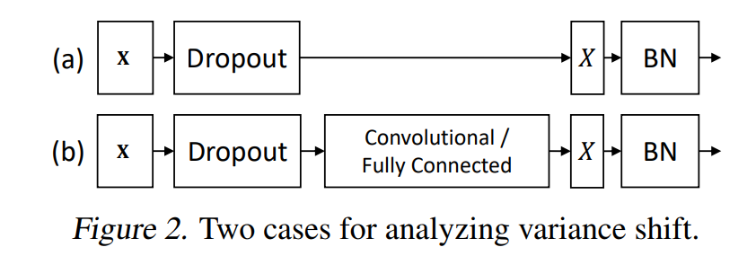
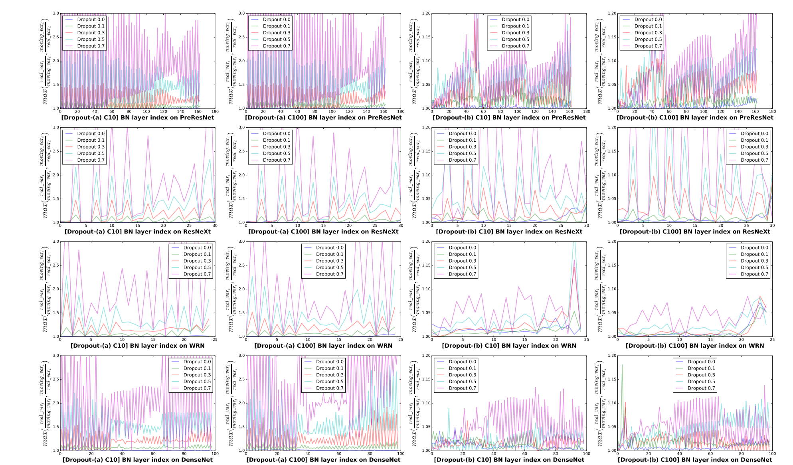
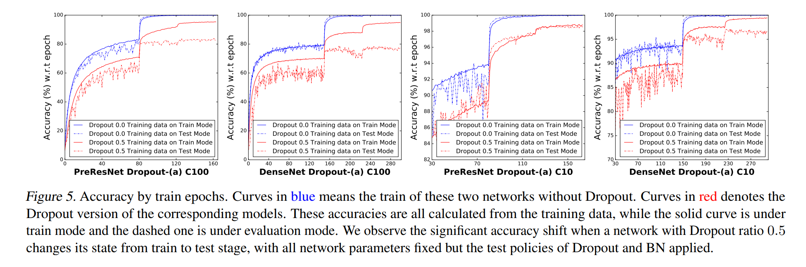
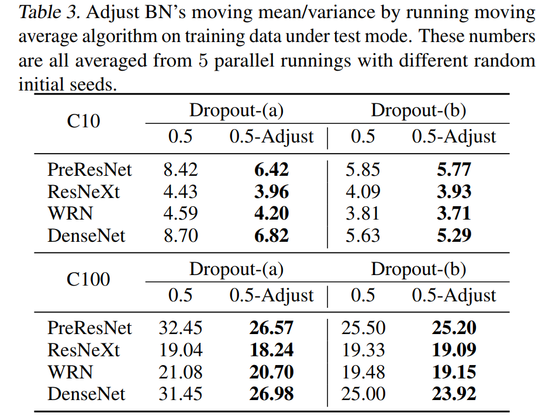

[TOC]

# Dropout和BN一起使用的问题

[Understanding the Disharmony between Dropout and Batch Normalization by Variance Shift](http://xxx.itp.ac.cn/abs/1801.05134)

dropout的以概率$p$随机失活改变了神经元输出的均值和方差，而其在训练阶段乘以$\frac{1}{1 - p}$或是在测试阶段乘以$１－p$的做法只是解决了神经元输出均值变化的问题，并没有解决方差的问题，这会导致BN的方差统计错误，使得再训练阶段统计的方差无法在测试阶段使用。

那么问题来了，单独使用dropout，不是也有输出的方差在训练和测试阶段不一样的问题吗，为什么实际使用的时候没有问题？

__Dopout + BN__：

dropout的输出的方差在训练和测试阶段是不同的，而BN则是统计dropout层输出的方差，那么BN统计的就是dropout在训练阶段输出的方差。那么在测试时，由于dropout测试阶段的方差和训练阶段的方差不一样，导致BN在训练阶段统计得到的方差不再适用于测试阶段，论文中称之为"variance shift"问题。

所以，在测试阶段，BN归一化所除以的方差是错误的，这是导致dropout + BN性能下降的原因。

## Motivation

Motivation就是联合使用dropout和BN会造成模型精度的下降，但是Wide-ResNet(WRN)中联合使用了两者，居然获得了稳定的精度提升。WRN是在`BN-ReLU-Conv-BN-ReLU-Conv`中两个卷积核的ReLU之后添加dropout，也即是变成`BN-ReLU-Conv-BN-ReLU-Dropout-Conv`，如果将两个残差块连接起来，那么就会出现`Dropout-Conv-BN`的顺序。作者为了查明为什么`Dropout-BN`无效，但是在WRN中，`Dropout-Conv-BN`有效，就写了这篇论文。首先，作者分析了两种使用策略所造成的"variance shift"问题：

## Theoretical Analyses

首先作者一顿方差分析，将测试时$X$的方差$Var^{Test}(X)$除以训练时的方差$Var^{Train}(X)$，从而得到方差偏移系数（shift ratio）：
$$
\Delta(p) = \frac{Var^{Test}(X)}{Var^{Train}(X)}
$$
作者分别计算了上述两种联合使用的策略下的方差偏移系数，（公式还没看明白，就不写了，先说结论）

* 第一种联合使用策略的方差偏移系数，只和`dropout rate`有关，其值越小，方差偏移系数就越接近1，也就说没有偏移。
* 第二种了联合使用策略的方差偏移系数，不仅和`dropout rate`有关，还和其中间卷积操作的通道数$d$有关，其值越大，方差偏移系数就越接近1，而恰恰WRN的特征就是卷积核的通道数多，所以这也是为什么这种联合使用策略在WRN中有效的原因。

## Statistical Experiments

在CIFAR10和CIFAR100上，使用PreResNet，ResNetXt, WRN，DenseNet进行实验。并且测试了两种Dropout放置方案：

__Dropout-(a)__：在每个Bottleneck中的最后一个BN层之前放置Dropout，确保是Dropout + BN的配置，能够发现是否Dropout会导致BN的方差统计错误；

__Dropout-(b)__：在每个Bottlenetck中的最有一个卷积核之前放置Dropout，确保Dropout + Conv的配置，能够发现Dropout之后加Conv，是否能够降低Dropout所造成的方差偏移现象。

### Statistics of variance shift

__moving_var__

训练阶段，dropout开启时，所统计得到的方差。

__real_var__：

测试阶段，将dropout关闭，模型的参数也停止更新，让training data再次通过神经网络，从而计算得到测试阶段的真正方差。

作者使用下面的值来衡量方差偏移情况，$i \in [1, n]$，将每一个BN层之前的特征图求得moving_var和real_var，画出来，就能够知道方差偏移的情况。如果曲线是一条之间（y = 1)，那么不存在方差偏移，如果曲线远离y = 1，那么就说明存在方差偏移。作者对dropout rate为[0,0, 0.1, 0.3, 0.5, 0.7]的情况，都绘制了该曲线。
$$
max(\frac{real\_val_i}{moving\_var_i}, \frac{moving\_var_i}{real\_val_i})
$$
从下图可以观察到三个结论：

* 当dropout rate比较低时，方差偏移的情况不严重。随着dropout rate的增大，方差偏移的情况也越严重；
* __Dropout-(b)__的方差偏移情况没有__Dropout-(a)__的方差偏移要小；
* 在__Dropout-(b)__策略下，WRN所遭受的方差偏移情况最小，这与之前分析的卷积核通道数多能够降低第二种结合策略的方差偏移的结论是一致的。

__Even the training data performs inconsistently between train and test mode__：

作者还发现，即使是训练数据，其精度在训练模型下和测试模型下是不同的。蓝线是Dropout rate为0时，training data在训练和测试模式下的精度，可以发现训练初期两者略有不同，但是后期，两者相同，应该是BN统计到后期更加稳定。而红线是Dropout rate为0.5时，training data在训练和测试模式下的精度，可以发现其在测试阶段的性能一值低于训练阶段。训练和测试阶段的表现不同的地方在于Dropout和BN，而Dropout rate为0时没问题，而为0.5时有问题，所以这肯定是Droput的问题啊。

__Only an adjustment for moving means and variances would bring an improvement, despite all other parameters fixed__：

为了进一步表明是由Dropout训练和测试阶段的不同行为，导致其输出的方差变化，从而导致BN训练期间统计的方差在测试时无效的结论，作者对BN所计算得到的均值和方差进行调整。也就说在测试时，不再使用BN在训练期间统计得到的均值和方差，而是使用调整之后的均值和方差，那么是如何调整的呢？

在测试模式下，作者将训练数据再次通过模型，使用滑动平均的方式来统计每个BN层的均值和方差。

然后发现，调整过后，精度确实上升了，那么这再次证明了作者之前的分析是对的。

## Strategies to Combine Them Together

说完了原因， 那么接下来就是解决方案了，一个就是按照之前的分析，使用WRN的那种方式来使用，但是这种方式要求卷积核的通道数要大，这就使得这种结合策略不适用于任意的网络结构。

下面给出作者提供的两种结合策略。

1. 一种最简单也是最直观的解决策略就是`BN + Dropout`
2. 改变Dropout的方式，使得其输出的方差在训练和测试期间更加一致。$r_i \sim  U(-\beta, \beta)$，$X + x_i + x_i r_i$，这样子，其方差偏移系数为:

$$
\frac{Var^{Test}(X)}{Var^{Train}(X)} = \frac{3}{3 + \beta}
$$

* 若$\beta = 0.1$。那么其方差偏移系数为$\frac{300}{301} \approx 0.996677$，非常接近1；
* 若$\beta = 0.5$。那么其方差偏移系数为$\frac{300}{325} \approx 0.9230769$，还行吧；

作者提出的这种方案叫做"Uout"，其参考了[Dropout: A Simple Way to Prevent Neural Networks from Overfitting](http://jmlr.org/papers/volume15/srivastava14a.old/srivastava14a.pdf)中使用高斯分布的dropout，只不过将高斯分布改成了均匀分布。

## 参考

[大白话《Understanding the Disharmony between Dropout and Batch Normalization by Vari - 李翔的文章 - 知乎](https://zhuanlan.zhihu.com/p/33101420)

[如何评价论文the Disharmony between Dropout and BN？](https://www.zhihu.com/question/265819518)