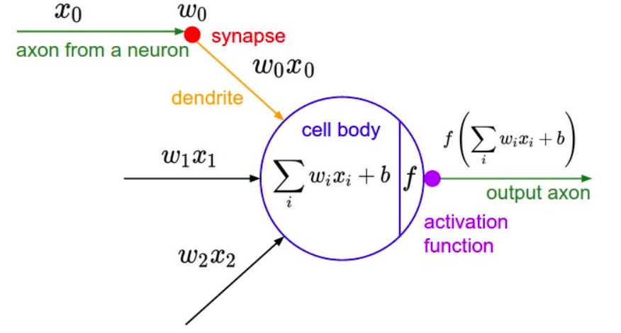
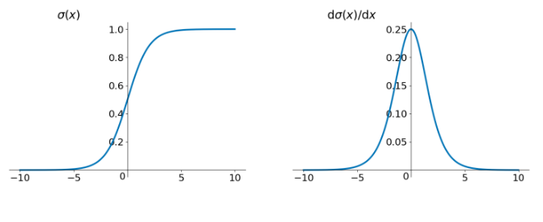
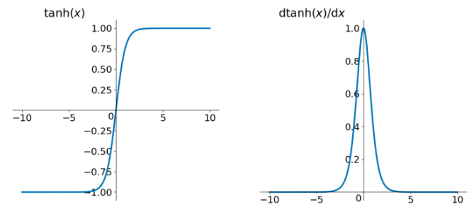
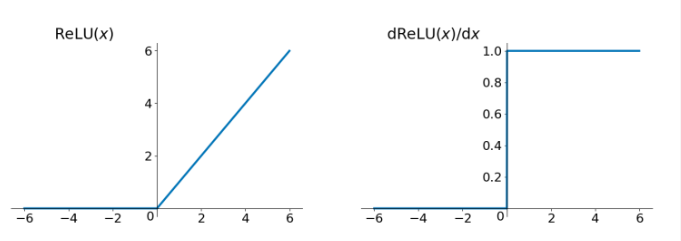
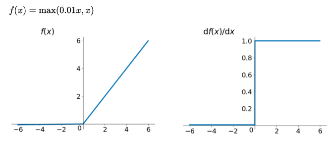
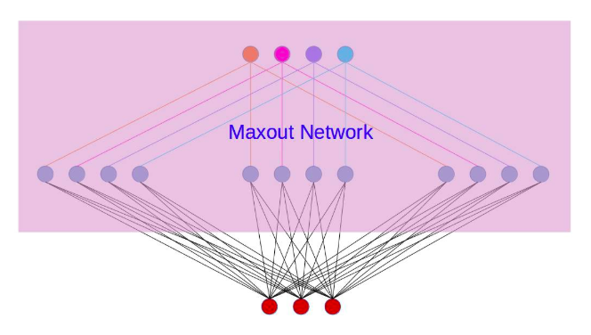
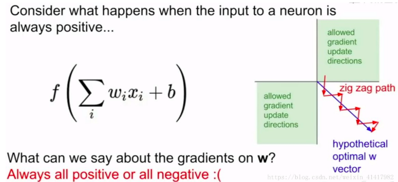

# 各种激活函数

激活函数需要注意的地方

1. 可微
2. 单调递增
3. 输出值范围(是否关于原点对称)
4. 是否存在饱和区域

饱和区域导致梯度消失，网络难以训练，收敛慢。
激活函数的输出不是以0为中心，参数更新时走之字形路线，收敛慢。

## Sigmoid

公式为：
$$f(x) = \frac{1}{1+e^{-x}}$$
导数为：
$$f'(x) = f(x)(1-f(x))$$

缺点：
1. 两端存在软饱和，具有梯度消失问题。
2. 输出值不是关于原点对称，优化时会走之字型路线，收敛慢。
3. 计算exp比较耗时

## Tanh

公式为：
$$f(x) = \frac{1-e^{-2x}}{1+e^{-2x}}$$

导数为：
$$f'(x) = 1-(f(x))^2$$

优点：
1. 输出值关于原点对称，解决了Sigmoid激活函数不是关于原点对称的问题。

缺点：
1. 两端存在软饱和，具有梯度消失问题。
## ReLU

公式为：
$$f(x)=
\begin{cases}
x& x \ge 0 \\
0& x \lt 0
\end{cases}$$

导数为：
$$f'(x)=
\begin{cases}
1& x \ge 0 \\
0& x \lt 0
\end{cases}$$

优点：
1. 在x轴正半轴不存在梯度消失问题，部分解决了梯度消失的问题。
2. 计算简单
缺点：
1. 不是关于原点中心对称
2. x轴负半轴存在硬饱和，具有梯度消失问题。

## Leaky ReLU

公式为：
$$f(x)=
\begin{cases}
x& x \ge 0 \\
\alpha x& x \lt 0
\end{cases}$$

导数为：
$$f'(x)=
\begin{cases}
1& x \ge 0 \\
\alpha& x \lt 0
\end{cases}$$

优点：
1. 不存在饱和区域，解决了梯度消失的问题。
2. 计算简单
缺点：
1. 不是关于原点中心对称

## PReLU

## Maxout

## 激活函数饱和，梯度消失

以sigmoid激活函数为例子，
$$
\sigma(x) = \frac{1}{1 + e^{-x}}
$$
其导数为：
$$
\sigma'(x) = \sigma(x)(1 - \sigma(x))
$$

假设我们有一个神经元$v = \sum_i (w_i x_i + b)$，激活函数为sigmoid，激活之后的输出为$f = \sigma(v)$。假设$L$为我们的损失函数，那么

$$
w'_i = w_i - \alpha \frac{\partial L}{\partial w_i}
$$

$$
\frac{\partial L}{\partial w_i}=\frac{\partial L}{ \partial f} \frac{\partial f}{\partial v} \frac{\partial v}{\partial w_i} = \frac{\partial L}{\partial f} \cdot \sigma(v)(1-\sigma(v))\cdot x_i
$$

所以有：
$$
w'_i = w_i - \alpha \frac{\partial L}{\partial f} \cdot \sigma(v)(1-\sigma(v)) \cdot x_i
$$

如果$v$位于激活函数sigmoid的饱和区，那么会导致导数$\frac{\partial f}{\partial v}=\sigma(v)(1-\sigma(v)) \approx 0$,从而使得$w'_i \approx w_i$，从而使得梯度得不到更新或者是更新很慢（比较sigmoid函数是软饱和）。

## 以零为中心的影响
为什么都想要激活函数以零为中心呢，以零为中心这个特性在神经网络优化过程中起到了什么作用呢？

以sigmoid激活函数为例子，
$$
\sigma(x) = \frac{1}{1 + e^{-x}}
$$
其导数为：
$$
\sigma'(x) = \sigma(x)(1 - \sigma(x))
$$

假设我们有一个神经元$v = \sum_i (w_i x_i + b)$，激活函数为sigmoid，激活之后的输出为$f = \sigma(v)$。假设$L$为我们的损失函数，那么

$$
w'_i = w_i - \alpha \frac{\partial L}{\partial w_i}
$$

$$
\frac{\partial L}{\partial w_i}=\frac{\partial L}{ \partial f} \frac{\partial f}{\partial v} \frac{\partial v}{\partial w_i}
=
\frac{\partial L}{\partial f} \cdot \sigma(v)(1-\sigma(v))\cdot x_i
$$

所以有：
$$
w'_i = w_i - \alpha \frac{\partial L}{\partial f} \cdot \sigma(v)(1-\sigma(v)) \cdot x_i
$$
在权重的更新中，$\sigma(v)(1-\sigma(v))$是一个正数，介于$[0,1]$之间，学习率$\alpha$也是一个正数。也就说$w_i$的变化方向由$x_i$和$\frac{\partial L}{\partial f}$所决定，又考虑到 $\frac{\partial L}{\partial f}$对于所有的 $w_i$ 来说是常数，因此各个$w_i$更新方向之间的差异，完全由对应的输入值 $x_i$的符号决定。

如果输入值$x_i$是由前一层网络通过sigmoid函数激活得到的，那么$x_i$就都是正值，所以反应在更新方向上就是各个$w_i$更新方向都是相同的，也即各个$w_i$只能同时上升或者同时下降。

所以如果我们得到一个理想权重相对于权重的初始化或者是前一轮迭代得到的权重值而言，需要的是部分$w_{i}$降低，部分$w_{i}$上升，那么就会使得优化时走 Z 字形逼近最优解 。

如图所示，为了从蓝色箭头的末尾（初始值）走到箭头（最优值），由于各个$w_i$只能同时上升或者同时下降，所以导致走之字型路线，所以使用 Sigmoid 函数作为激活函数的神经网络，收敛速度就会慢上不少了。

## 一些思考
### BN和激活函数的顺序问题

对于Sigmoid激活函数而言，BN + Sigmoid的顺序可能比较好，因为BN进行归一化之后，使得数据落在Sigmoid的非饱和区域。

但是对于ReLU而言，BN是放在前面还是放在后面好的。
BN + ReLU可能存在的问题就是BN将数据归一化到0均值1方差，那么意味着有一般的数据会被ReLU变成0，这对神经网络而言来说是不好的。

ReLU + BN的话，优点可能是将ReLU大于0的输出变成了0均值1方差的分布，对于之后的层可能比较友好；不好的地方在于ReLU先把小于0的部分去掉了，然后BN再对分布进行调整，可能造成分布剧烈变化。

不过在何凯明的identity论文中有对ResNet做实验，表面ReLU + BN的顺序更好。

### Dying ReLU能够复活吗

假设我们有一个神经元$v = \sum_i (w_i x_i + b)$，激活函数为sigmoid，激活之后的输出为$f = ReLU(v)$。假设$L$为我们的损失函数，那么

$$
w'_i = w_i - \alpha \frac{\partial L}{\partial w_i}
$$

$$
\frac{\partial L}{\partial w_i}=\frac{\partial L}{ \partial f} \frac{\partial f}{\partial v} \frac{\partial v}{\partial w_i}
=
\frac{\partial L}{\partial f} \cdot \frac{\partial f}{\partial v}\cdot x_i
$$

所以有：
$$
w'_i = w_i - \alpha \frac{\partial L}{\partial f} \cdot \frac{\partial f}{\partial v} \cdot x_i
$$
如果

$$\frac{\partial f}{\partial v}
=0$$

那么权重$w_i$就不会被更新，这就是Dead ReLU问题，更重要的是，需要对整个数据集而言，在通过神经元$v = \sum_i (w_i x_i + b)$后，其值都为负数，那么这个才是Dead的，因为遍历了整个数据集，不存在数据使得梯度$w_i$能够被更新。

网上大部分都说一个神经元因为ReLU死掉的话，那么就永远死掉了，无法复活。
但是前些层的网络参数是变化的，而当前层的输入又是之前层的输出，所以此刻而言，即使神经元无法被整个数据集激活，但是随着训练，因为前些层网络参数的变化，那么当前层的神经元是有机会被重新激活的。

## 为什么ReLU比Sigmoid好

首先，Sigmoid和ReLU都存在non-zero center的问题。

虽然ReLU的正半轴不存在饱和问题，但是负半轴存在饱和问题，并且其输出值不是zero center的，优化时会走子字型路线。那么为什么ReLU会比Sigmoid要好呢？

首先，至少存在两个方面会引起梯度消失，一是小于0的梯度连乘导致的梯度消失；二是输入值落到了激活函数的饱和区导致梯度为0 从而梯度消失。

ReLU和Sigmoid都存在第二个会引起梯度消失的问题，但是ReLU的梯度横为1，而Sigmoid的梯度为$\sigma(x)(1-\sigma(x)) \le 0.25$,由于网络是多层的，每层的激活函数，所以Sigmoid的梯度连乘就会引起梯度消失的问题，因此导致Sigmoid的收敛速度比ReLU要慢。

另外虽然ReLU负半轴存在饱和问题，但是却引入了稀疏性质，使得神经网络是稀疏表达的（神经网络稀疏表达是存在优点的），可能就是这个原因导致了ReLU性能Leaky ReLU要好。

## 参考
[激活函数中的硬饱和，软饱和，左饱和和右饱和。 - donkey_1993的博客 - CSDN博客](https://blog.csdn.net/donkey_1993/article/details/81662065)

[神经网络中激活函数的真正意义？一个激活函数需要具有哪些必要的属性？还有哪些属性是好的属性但不必要的？ - Hengkai Guo的回答 - 知乎](https://www.zhihu.com/question/67366051/answer/262087707)

[激活函数（Sigmoid, tanh, Relu） - Aliz_ - CSDN博客](https://blog.csdn.net/weixin_41417982/article/details/81437088)
[谈谈激活函数以零为中心的问题 \| 始终](https://liam.page/2018/04/17/zero-centered-active-function/)

[The Activation Function in Deep Learning 浅谈深度学习中的激活函数 - rgvb178 - 博客园](https://www.cnblogs.com/rgvb178/p/6055213.html)
[深度学习中，使用relu存在梯度过大导致神经元“死亡”，怎么理解？ - 知乎](https://www.zhihu.com/question/67151971)
[BAT面试题47：Sigmoid、Tanh、ReLu这三个激活函数有什么缺点或不足，有没改进的激活函数？ - 云+社区 - 腾讯云](https://cloud.tencent.com/developer/article/1399909)
[What is the 'dying ReLU' problem in neural networks? - Quora](https://www.quora.com/What-is-the-dying-ReLU-problem-in-neural-networks)
[Batch-normalized 应该放在非线性激活层的前面还是后面？ - 知乎](https://www.zhihu.com/question/283715823)

[machine learning - What are the advantages of ReLU over sigmoid function in deep neural networks? - Cross Validated](https://stats.stackexchange.com/questions/126238/what-are-the-advantages-of-relu-over-sigmoid-function-in-deep-neural-networks)

[在层数较少（3-6层）的神经网络中用 ReLU 层训练效果会不会比tanh/sigmoid 层好？ - 杜客的回答 - 知乎](https://www.zhihu.com/question/48931796/answer/114310813)