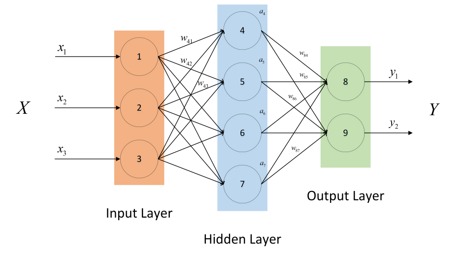

[TOC]

# DNN的正向反向传播

## DNN的正向传播

第$l$层单个神经元的正向传播公式：
$$
z_i^l = \sum_{k=l}^{N^{l-1}}  W_{ik}^{l} a_k^{l-1} + b_i^{l}
$$

$$
a_{i}^{l} = f(z_{i}^{l})
$$

$W_{ik}^{l}$ : 表示第$l-1$层的第k个结点和第$l$层的第$i$个结点连接的权重；

$b_{i}^{l}$ : 表示第$l$层的第i个结点的偏置；

$a_{i}^{l}$ : 表示第$l$层的的第$i$个结点的激活值；

$z_{i}^{l}$ : 表示第$l$层的的第$i$个结点的状态值；

第$l$层$N^{l}$个神经元的正向传播公式：
$$
\left[ \begin{array}{c}
z_1^l\\
z_2^l\\
\vdots \\
z_{N^l}^l\\
\end{array} \right]
=
\left[ \begin{array}{cccc}
W_{11}^{l} & W_{12}^{l} & \cdots & W_{1N^{l-1}}^{l}\\
W_{21}^{l} & W_{22}^{l} & \cdots & W_{2N^{l-1}}^{l}\\
\vdots & \vdots & \cdots & \vdots\\
W_{N^{l}1}^{l} & W_{N^{l}2}^{l} & \cdots & W_{N^{l}N^{l-1}}^{l}\\
\end{array} \right]

\left[ \begin{array}{c}
a_1^{l-1}\\
a_2^{l-1}\\
\vdots \\
a_{N^{l-1}}^{l-1}\\
\end{array} \right]
$$

$$
\left[ \begin{array}{c}
a_1^l\\
a_2^l\\
\vdots \\
a_{N^l}^l\\
\end{array} \right]
=
f(\left[ \begin{array}{c}
z_1^l\\
z_2^l\\
\vdots \\
z_{N^l}^l\\
\end{array} \right])
$$

缩写成矩阵的形式为：
$$
z^l = W^la^{l-1}
$$

$$
a^l = f(z^l)
$$

所以对一个L层的DNN神经网络，其正向传播的公式如下：
$$
z^1 = W^1 x \\
a^1 = f(z^1) \\
z^2 = W^2 a^1 \\
a^2 = f(z^2) \\
\cdots \\
z^l = W^l a^{l-1} \\
a^l = f(z^l) \\
a^{l+1} = f(z^{l+1}) \\
\cdots \\
z^L = W^L a^{L-1} \\
a^L = f(z^L) \\
L = Loss(a^L)
$$

## DNN的反向传播

反向传播需要用到链式求导法则，首先定义一个中间变量$\delta_{i}^{l+1}$：
$$
\delta_{i}^{l+1} = \frac{\partial L}{\partial z_{i}^{l+1}}
$$
那么根据链式求导法则，第$l$层第$i$个神经元的梯度为：
$$
\delta_{i}^{l} = \frac{\partial L}{\partial z_i^l} = \sum_{k=1}^{N^{l+1}}  \frac{\partial L}{\partial z_{k}^{l+1}} \frac{\partial z_k^{l+1}}{z_i^l}
$$
因为正向传播时，第$l$层的每个结点都会连接第$l+1$层的$N^{l+1}$个结点，所以反向传播时，第$l$层每个结点的梯度都会由第$l+1$层的$N^{l+1}$个结点的梯度累计求和得到。
$$
\delta_{i}^{l} = \frac{\partial L}{\partial z_i^l} 

= \sum_{k=1}^{N^{l+1}}  \frac{\partial L}{\partial z_{k}^{l+1}} \cdot \frac{\partial z_k^{l+1}}{z_i^l} 

= \sum_{k=1}^{N^{l+1}}  \frac{\partial L}{\partial z_{k}^{l+1}} \cdot  \frac{\partial z_k^{l+1}}{a_i^l}  \cdot \frac{\partial a_i^l}{z_i^l}

= \sum_{k=1}^{N^{l+1}} \delta_k^{l+1} \cdot  W_{ki}^{l+1} \cdot  f'(z_i^l)
$$

第$l$层$N^{l}$个神经元的反向传播公式为：
$$
\left[ \begin{array}{c}
\delta_{1}^{l} \\
\delta_{2}^{l}\\
\vdots \\
\delta_{N^l}^{l} \\
\end{array} \right]

=

\left[ \begin{array}{cccc}
W_{11}^{l+1} & W_{21}^{l+1} & \cdots & W_{N^{l+1}1}^{l+1}\\
W_{12}^{l+1} & W_{22}^{l+1} & \cdots & W_{N^{l}2}^{l+1}\\
\vdots & \vdots & \cdots & \vdots\\
W_{1N^{l}}^{l+1} & W_{2N^{l}}^{l+1} & \cdots & W_{N^{l+1}N^{l}}^{l+1}\\
\end{array} \right]

\left[ \begin{array}{c}
\delta_{1}^{l+1} \\
\delta_{2}^{l+1}\\
\vdots \\
\delta_{N^{l+1}}^{l+1} \\
\end{array} \right]

\odot

\left[ \begin{array}{c}
f'(z_1^l) \\
f'(z_2^l) \\
\vdots \\
f'(z_{N^l}^l) \\
\end{array} \right]
$$
简写成矩阵乘法的形式为：
$$
\delta^l = (W^{l+1})^T \cdot \delta^{l+1} \odot f'(z^l)
$$

> Note : 其中$\odot$表示向量的对应元素相乘。

或者也可以写成以下形式：
$$
\delta^l =  f'(z^l) \odot (W^{l+1})^T \cdot \delta^{l+1}
$$

> 该形式的优点是运算符的顺序是__从右往左__计算的。

并且，根据递归关系，可以得到下面的式子：
$$
\delta^l = (W^{L})^T \cdots (W^{l+2})^T \cdot (W^{l+1})^T \cdot \delta^{L} \odot f'(z^l) \odot f'(z^{l+1}) \cdots \odot f'(z^{L-1})
$$

> 这样子就得到了梯度连乘和激活函数连乘。

虽然看起来是连乘，但是并不能直接相乘，因为维度不一样。真正的计算应该按照下面式子从右往左计算：
$$
\delta^l =  f'(z^l) \odot (W^{l+1})^T \cdot f'(z^{l+1}) \odot (W^{l+2})^T \cdots f'(z^{L-1}) \odot (W^{L})^T\delta^{L}
$$

特别的，如果神经网络使用平方损失函数$L = \frac{1}{2} ||y - a^L||^2$
$$
\delta^L = \frac{\partial L}{\partial a^L} = -(y-a^L)
$$

接下来，求各个参数的梯度。

#### 对权重$W$的梯度

第$l$层权重矩阵$W^l$中某个权重$W_{ij}^{l}$的梯度为：
$$
\frac{\partial L}{\partial W_{ij}^{l}} 
=
\frac{\partial L}{\partial z_{i}^{l}} 
\cdot
\frac{\partial z_{i}^{l}}{\partial W_{ij}^{l}}
= 
\delta_{i}^{l} 
\cdot 
a_{j}^{l-1}
$$
写成矩阵的形式为：
$$
\left[ \begin{array}{cccc}
\frac{\partial L}{\partial W_{11}^{l} } & \frac{\partial L}{\partial W_{12}^{l}} & \cdots & \frac{\partial L}{\partial W_{1N^{l-1}}^{l}} \\

\frac{\partial L}{\partial W_{21}^{l} } & \frac{\partial L}{\partial W_{22}^{l}} & \cdots & \frac{\partial L}{\partial W_{2N^{l-1}}^{l}} \\

\vdots & \vdots & \cdots & \vdots\\
\frac{\partial L}{\partial W_{N^{l}1}^{l}} & \frac{\partial L}{\partial W_{N^{l}2}^{l}} & \cdots & \frac{\partial L}{\partial W_{N^{l}N^{l-1}}^{l}}\\
\end{array} \right]
=
\left[ \begin{array}{c}
\delta_{1}^{l} \\
\delta_{2}^{l} \\
\vdots \\
\delta_{1}^{N^{l}}\\
\end{array} \right]

\left[ \begin{array}{cccc}
a_1^{l-1} &
a_2^{l-1} &
\cdots &
a_{N^{l-1}}^{l-1}\\
\end{array} \right]
$$
简写以后，变成：
$$
\frac{\partial L}{\partial W^{l}} = \delta^l \cdot (a^{l-1})^T
$$

#### 对偏置换$b$的梯度

第$l$层偏置向量$b^l$中某个偏置值$b_{i}^{l}$的梯度为：
$$
\frac{\partial L}{\partial b_{i}^{l}} 
=
\frac{\partial L}{\partial z_{i}^{l}} 
\cdot
\frac{\partial z_{i}^{l}}{\partial b_{i}^{l}}
= 
\delta_{i}^{l} 
\cdot 
1
= 
\delta_{i}^{l} 
$$
写成矩阵的形式为：
$$
\left[ \begin{array}{c}
\frac{\partial L}{\partial b_{1}^{l} }\\

\frac{\partial L}{\partial b_{2}^{l} }\\

\vdots \\
\frac{\partial L}{\partial b_{N^{l}}^{l}}\\
\end{array} \right]
=
\left[ \begin{array}{c}
\delta_{1}^{l} \\
\delta_{2}^{l} \\
\vdots \\
\delta_{1}^{N^{l}}\\
\end{array} \right]

\odot

\left[ \begin{array}{c}
1\\
1 \\
\vdots \\
1\\
\end{array} \right]
=
\left[ \begin{array}{c}
\delta_{1}^{l} \\
\delta_{2}^{l} \\
\vdots \\
\delta_{1}^{N^{l}}\\
\end{array} \right]
$$
简写之后，变成：
$$
\frac{\partial L}{\partial b^{l}} = \delta^l
$$

## 参考

[DNN反向传播详解 - zynash2的博客 - CSDN博客](https://blog.csdn.net/zynash2/article/details/79360195)

[反向传播四：反向传播的4个公式 - 无用的文章 - 知乎](https://zhuanlan.zhihu.com/p/379169)

[深度神经网络（DNN）反向传播算法(BP) - 刘建平Pinard - 博客园](https://www.cnblogs.com/pinard/p/6422831.html)

[神经网络反向传播的数学原理 \| 雷锋网](https://www.leiphone.com/news/201709/g1GOtQcEM3vAVSs7.html)

