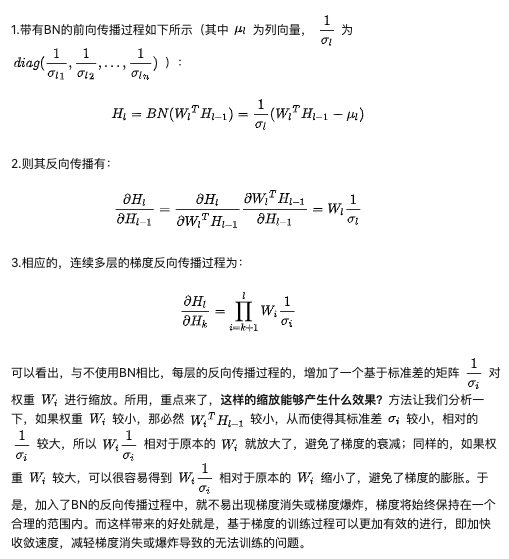
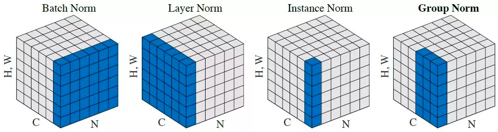

[TOC]

# Batch Normalization

__paper__ : [link](http://xxx.itp.ac.cn/abs/1502.03167v3)

将*Internal Covariate Shift*定义为由于训练期间网络参数变化所导致的网络激活后分布发生变化。为了提高训练，我们想要减少Internal Covariate Shift。通过在训练过程中固定每层输入x的分布，我们期望训练速度。众所周知，对输入进行白化(whitened)，也即将输入变成零均值单位方差，并且去相关，那么训练时网络收敛得更快。

## BN的作用
1. 保证每层的输入分布不变
2. 使得反向传播时，梯度和参数的尺度无关，从而可以使用更大的学习率，加快网络的收敛。（论文里加了BN和不加BN训练的收敛速度差别很大，可能就是因为这些技术，还有框架的优化技术，使得我们个人也能很快地训练神经网络）
3. 正则化
4. 防止网络陷入饱和

## 保证每层的输入分布不变

输入的维度是$(N, C, H, W)$。

具体的思想就和预处理时的归一化是一个道理。就是将输入数据每个通道的分布变成均值为0方差为1的分布。

 > 例如对于输入数据来说，预处理时的归一化，就是对所有的数据在R，G，B三个通道上求均值和方差，例如在R通道上求均值，就是将所有数据在R通道上将所有元素加起来，从而得到一个数字，从而得到均值，方差的计算也是类似的。从而得到三个均值和三个方差。
 >

假设我们的网络只有2层，那么可以将第1层网络看做是预处理网络或者是提出特征的网络。将N个数据通过第1层网络，得到处理后的N个数据或者是N个数据的特征。那么在N个数据总体来说肯定是满足一个分布的，那么第2层网络也是在该分布下进行学习的。

但是由于第一层网络的参数没有学好，所以在学习的过程中，有第一层网络处理后的数据的分布也是变化的，因此对于第二层网络来说，要在不断变化的分布上学习出有用的参数，那么就比较难了。

因此，我们可以学习预处理时的归一化，将第一层网络的输出进行归一化，从而使得无论第一层网络的参数怎么变化，其输出的N个数据的分布都是均值为0方差为1的分布。这对第二层网络是有利的，在确定分布的输入上学习参数。

即使第一层网络的输出的分布是确定的，但是由于第一层的参数是在变化的，所以N个数据中的每个数据在该分布中的位置是不确定的。因此，对于第二层网络来说，N个数据总体的分布是确定的，但是每个数据在该分布中的位置是不确定的，但是这正是神经网络所要学习的，通过标签的监督信息，使得每个数据在分布中固定自己的位置，从而使得分类器知道怎么分类。

由于数据是一个batch一个batch输入到神经网络的，所以没有办法像预处理那样在神经网络的每一层对输出计算整个数据集的均值和方差。实际上，训练时是通过一个batch来计算均值和方差，也即在一个batch通过神经网络时，在神经网络的每一层输出计算均值和方差，然后进行归一化成均值为0方差为1的分布。因为从统计学上来说，batch数据的均值和方差是整体数据的均值和方差的一个估计，所以是可以这么做的，因此这个技术被叫做Batch Normalaiation(BN)。由于是估计，所以训练时batch size不能够太小，否则就会影响BN的性能。

那么预测时，均值和方差从哪里来呢？训练时，虽然每次只计算一个batch的均值和方差，但是我们可以将每个batch的均值和方差存下来，那么在跑完一个epoch之后不就可以计算整个数据集的均值和方差了。原理是这么个原理，但是实际实现上这个干太费存储空间了，所以实际实现是使用了Exponentially motion average（指数移动平均，pytorch是这么实现的）来计算整个数据集的均值和方差。

$$
global\_mean = momentum * global\_mean + (1 - momentum) * batch\_mean
$$

$$
global\_var = momentum * global\_var + (1 - momentum) * batch\_var
$$

默认momentum=0.9，因为global_mean已经累计了很久了，很稳定了，所以权重大一点；而batch_mean是一个batch的均值，不够稳定，所以权重小一点。

Batch Normalization对一个batch计算均值和方差并进行归一化的公式如下，并且进行归一化之后还要进行rescale和shift。 

那么为什么要在归一化之后进行缩放和平移呢？我的理解就是不同的feature map通道之间的数值可能存在联系，但是BN时是对每个通道进行单独BN，可能就打破了这种联系，也就意味着把学到东西的一部分给丢失了（损失了表达能力），所以要在BN之后对数据进行重新映射，我们可能是不知道如何进行映射，所以让神经网络学习这两个参数，学习如何重新映射。

另一个理解就是，在使用Relu作为激活函数时，如果强制分布为均值0方差1，那么也就意味着相当于强制让其输出中总有一半为0，这肯定不是很好，所以加入额外的两个参数，让模型自己学习如何缩放和平移。

## 反向传播时，梯度和参数的尺度无关

##### BN对权重尺度的不变性

设$\alpha W = W'$
$$
BN(\alpha Wx)= \gamma \frac{W'x - \mu'}{\sigma'} +\beta
$$

$$
= \gamma \frac{\alpha Wx - \alpha \mu}{\alpha \sigma} + \beta 
$$
$$
=\gamma \frac{W x- \mu}{\sigma} + \beta=BN(Wx)
$$

因此BN对权重尺度具有不变性，那么由此引发了什么样的好处呢？

##### BN解决梯度消失和爆炸问题

下面是正向传播的公式：
$$
H_l = W_l^T H_{l-1} 
$$

$$
H_{l-1} = W_{l-1}^T H_{l-2} 
$$
$$
...
$$
$$
H_i = W_{i}^T H_{i-1} 
$$
$$
...
$$
$$
H_2 = W_{2}^T H_{1} 
$$

下面是一层的反向传播的公式：
对$H_{l-1}$求导：
$$
\frac{\partial l}{\partial H_{l-1}}=
\frac{\partial l}{\partial H_{l}} \frac{\partial H_l}{\partial H_{l-1}} = \frac{\partial l}{\partial H_{l}}  \frac{\partial W_l^T H_{l-1}}{\partial H_{l-1}} =\frac{\partial l}{\partial H_{l}}   W_l
$$

对$W_{l}$求导：
$$
\frac{\partial l}{\partial W_l}=
\frac{\partial l}{\partial H_{l}} \frac{\partial H_l}{\partial W_l} = \frac{\partial l}{\partial H_{l}}  \frac{\partial W_l^T H_{l-1}}{\partial W_{l}} =\frac{\partial l}{\partial H_{l}}   H_{l-1}
$$
下面是多层的方差传播公式：
对$H_{k}$求导：
$$
\frac{\partial l}{\partial H_{k}} =\frac{\partial l}{\partial H_{l}} \frac{\partial H_{l}}{\partial H_{l-1}} \frac{\partial H_{l-1}}{\partial H_{l-2}} ... \frac{\partial H_{k+1}}{\partial H_{k}}
$$
$$
=\frac{\partial l}{\partial H_{l}}W_{l}W_{l-1}...W_{k+1}
$$

$$
=\frac{\partial l}{\partial H_{l}}  \prod_{i=k+1}^{l} W_i
$$

对$W_{k}$求导：
$$
\frac{\partial l}{\partial W_{k}} =\frac{\partial l}{\partial H_{l}} \frac{\partial H_{l}}{\partial H_{l-1}} \frac{\partial H_{l-1}}{\partial H_{l-2}} ... \frac{\partial H_{k+1}}{\partial H_{k}} \frac{\partial H_{k}}{\partial W_{k}}
$$
$$
=\frac{\partial l}{\partial H_{l}}W_{l}W_{l-1}...W_{k+1}H_{k-1}
$$
$$
=\frac{\partial l}{\partial H_{l}}  \prod_{i=k+1}^{l} W_i H_{k-1}
$$

梯度消失和梯度爆炸就是由于连续乘法的出现。因为网络层很深，如果 $W_i$ 大多小于1，那么传到这里的时候梯度会变得很小比如 $0.9^{100}$ ；而如果 $W_i$  又大多大于1，那么传到这里的时候又会有梯度爆炸问题 比如$1.1^{100}$ 。

下面是使用了BN的正向传播的公式：
$$
H_l = BN(W_l^T H_{l-1}) 
$$

$$
H_{l-1} = BN(W_{l-1}^T H_{l-2}) 
$$
$$
...
$$
$$
H_i = BN(W_{i}^T H_{i-1}) 
$$
$$
...
$$
$$
H_2 = BN(W_{2}^T H_{1}) 
$$

下面是一层的反向传播的公式：
对$H_{l-1}$求导：
$$
\frac{\partial l}{\partial H_{l-1}}
=
\frac{\partial l}{\partial H_{l}} \frac{\partial H_l}{\partial H_{l-1}} 
$$
$$
= 
\frac{\partial l}{\partial H_{l}}  \frac{\partial BN(W_l^T H_{l-1})}{\partial H_{l-1}} 
$$
$$
= \frac{\partial l}{\partial H_{l}}  \frac{\partial (\gamma \frac{ W_l^T H_{l-1} - \mu}{\sigma} + \beta)}{\partial H_{l-1}} 
$$
$$
=
\frac{\partial l}{\partial H_{l}} \frac{\gamma}{\sigma}W_l
$$

对$W_{l}$求导：
$$
\frac{\partial l}{\partial W_l}=
\frac{\partial l}{\partial H_{l}} \frac{\partial H_l}{\partial W_l}
$$

$$
= 
\frac{\partial l}{\partial H_{l}}  \frac{\partial BN(W_l^T H_{l-1})}{\partial W_{l}}
$$

$$
=
\frac{\partial l}{\partial H_{l}}  \frac{\partial (\gamma \frac{ W_l^T H_{l-1} - \mu}{\sigma} + \beta)}{\partial W_{l}} 
$$

$$
=
\frac{\partial l}{\partial H_{l}} \frac{\gamma}{\sigma}H_{l-1}
$$

相应的，连续多层的梯度反向传播过程为：

对$H_{k}$求导：
$$
\frac{\partial l}{\partial H_{k}} =\frac{\partial l}{\partial H_{l}} \frac{\partial H_{l}}{\partial H_{l-1}} \frac{\partial H_{l-1}}{\partial H_{l-2}} ... \frac{\partial H_{k+1}}{\partial H_{k}}
$$
$$
=\frac{\partial l}{\partial H_{l}} \frac{\gamma_l}{\sigma_l} W_{l}\frac{\gamma_{l-1}}{\sigma_{l-1}}W_{l-1}...\frac{\gamma_{k+1}}{\sigma_{k+1}}W_{k+1}
$$

$$
=\frac{\partial l}{\partial H_{l}}  \prod_{i=k+1}^{l} \frac{\gamma_i}{\sigma_i}W_i
$$

在不考虑rescale参数$\gamma$的影响下，可以看出，与不使用BN相比，每层的反向传播过程的，增加了一个基于标准差的矩阵 $\frac{1}{\sigma_i}$对权重$W_i$ 进行缩放。所以，如果权重$W_i$比较小，那么必然有$W_iH_{i-1}$比较小，从而使得标准差$\sigma_i$较小，相对的$\frac{1}{\sigma_i}$较大，所以 $\frac{1}{\sigma_i}W_i$相对于原本的 $W_i$ 就放大了，避免了梯度的衰减；同样的，如果权重 $W_i$ 较大，可以很容易得到  $\frac{1}{\sigma_i}W_i$相对于原本的 $W_i$  缩小了，避免了梯度的膨胀。于是，加入了BN的反向传播过程中，就不易出现梯度消失或梯度爆炸，梯度将始终保持在一个合理的范围内。而这样带来的好处就是，基于梯度的训练过程可以更加有效的进行，即加快收敛速度，减轻梯度消失或爆炸导致的无法训练的问题。

## BN为什么能够使用大学习率

BN论文里的__3.3 Batch Normalization enables higher learning rates__解释了为什么使用BN之后能够使用大的学习率。

大的学习率会导致参数尺度的参加，这在反向传播时会增大尺度，从而发生梯度爆炸。但是使用BN之后，就不存在这个问题了，如上面的公式所分析的，反向传播时，大的权重会被缩放。这也就是为什么BN能够允许我们使用大的学习率。

## BN为什么能够加速收敛

**训练收敛速度慢的原因：**

因为深层神经网络在做非线性变换前的激活输入值，随着网络深度加深或者在训练过程中，其分布逐渐发生偏移或者变动，之所以训练收敛慢，一般是整体分布逐渐往非线性函数的取值区间的上下限两端靠近（对于Sigmoid函数来说，意味着激活输入值是大的负值或正值），所以这导致后向传播时低层神经网络的梯度消失，这是训练深层神经网络收敛越来越慢的本质原因，

而BN就是通过一定的规范化手段，把每层神经网络任意神经元这个输入值的分布强行拉回到均值为0方差为1的标准正太分布，其实就是把越来越偏的分布强制拉回比较标准的分布，这样使得激活输入值落在非线性函数对输入比较敏感的区域，这样输入的小变化就会导致损失函数较大的变化，意思是这样让梯度变大，避免梯度消失问题产生，而且梯度变大意味着学习收敛速度快，能大大加快训练速度。

## BN的正则作用

BN 有一定的正则化作用，他在mini-batch上取平均，加入噪音，加入了正则

## BN防止网络陷入过饱和
论文里面做了一组实验，在设置激活函数为sigmoid的情况下，分别使用BN和不使用BN，发现不适用BN的模型无法收敛，而使用BN的模型收敛了，从而证明了BN可以防止网络陷入过饱和。

## 不同Normalization的方法简介
Batch Normalization是$N*H*W$，Layer Normalization是$C*H*W$，Instance Normalization是$H*W$，Group Normalization是$G*H*W$。

## 参考
[BN层计算的为什么不是协方差矩阵的理解 - ginger188的专栏 - CSDN博客](https://blog.csdn.net/winter_evening/article/details/72083790)
[Batch Normalization学习笔记及其实现 - 知乎](https://zhuanlan.zhihu.com/p/26138673)
[pytorch/functional.py at master · pytorch/pytorch · GitHub](https://github.com/pytorch/pytorch/blob/master/torch/nn/functional.py#L1704)
[深度学习通用策略：BN原理详解以及优势 - BigCowPeking - CSDN博客](https://blog.csdn.net/wfei101/article/details/79997708)

[深度学习【2】Batch Normalization 论文翻译 - DCD_LIN的博客 - CSDN博客](https://blog.csdn.net/linmingan/article/details/50780761)
[深度学习中 Batch Normalization为什么效果好？ - 知乎](https://www.zhihu.com/question/38102762/answer/302841181)
[深度学习中 Batch Normalization为什么效果好？ - 青红fly的回答 - 知乎](https://www.zhihu.com/question/38102762/answer/164790133)
[深度学习中 Batch Normalization为什么效果好？ - 我不坏的回答 - 知乎](https://www.zhihu.com/question/38102762/answer/391649040)
[详解深度学习中的Normalization，BN/LN/WN - 知乎](https://zhuanlan.zhihu.com/p/33173246)
[Weight Normalization 相比batch Normalization 有什么优点呢？ - lqfarmer的回答 - 知乎](https://www.zhihu.com/question/55132852/answer/171250929)