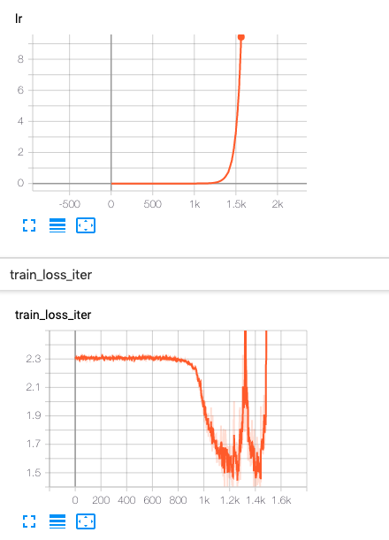

[TOC]

# CIFAR10调参记录

使用SGD学习器进行调参

# 确定初始学习率

当开始一个新的任务时，我们并不知道如何确定初始的学习率。但是我们可以大概设置一个学习率的区间，比如$[1^{-10}, 10]$。初始时将学习率设为该区间的最小值，然后在每次迭代时慢慢增加学习率，并且在每次迭代时记录每个batch的损失。然后以学习率为横坐标，损失为纵坐标，画出lr和loss的对应图。由于tensorboard的横坐标不能使用浮点数，所以我将学习率的变化和loss的变化画到了两个图中。

下面是运行了4个epoch的学习变化和loss变化的图，学习率从$[1^{-10}, 10]$进行变化。可以看出，随着学习率的增大，loss先减少，然后增大，然后减少再增大（**论文里是先减少然后增大**，有的模型也是也减少然后增大，下面的模型是preact_resnet18)。

我们可以选择loss最小点所对应的学习率，这意味着在初始化阶段使用该学习率loss能够减少地最大。但是下图有两个loss最小的点，应该选哪个点呢？我一般选择学习率大的那个点，因为这样子后续调参数时，我们有更大的范围来调节参数。当然，也可以试一试两个学习率，开两个任务跑一下，看看哪个的效果更好，那么就选哪个。

## 确定后续的学习率

确定初始的学习率之后，就可以看出训练了。刚开始新任务时，由于对任务不了解，最好手动调整学习率。

* 使用初始学习率学习，直到在验证集上的精度不下降，再来调整学习率。**不要在验证精度不变时马上调整，因为此时不是真的不变，让其多迭代几个epoch，这才能充分说明不下降了。一般来说，多迭代几个epoch，总会有那么一点下降。
* 调小学习率（除以2，5或者是10，一般选10），在之前的迭代中，选取在验证集上精度最高的模型继续学习，或者在精度差不多的情况下，选择迭代次数多的模型）。
* 重复上面两步骤，直到模型收敛。

## 适应CIFAR10数据集的模型

需要注意，CIFAR10数据集的图像大小是32x32，而官方模型库和github上的模型都是为ImageNet设计的，其期望的输入大小是224，299，330。这些模型都会对输入降采样32倍，最后的特征图是输入的$\frac{1}{32}$，然后在特征图上进行全局平均池化操作，然后全连接层进行分类。

所以，若在CIFAR10上使用这些模型，那么就会导致一个问题，在降采样32倍之后，最后特征图的大小为1x1，这会导致模型在CIFAR10上的精度不会达到最高。因此，若要在CIFAR10上训练，需要降低降采样的倍数，以ResNet为例，其网络分为主干部分和接下来的4个stage，其中主干部分会降采样4倍，而接下来的4个stage中有3个stage会降采样2倍，整个模型合计降采样32倍。我们可以将主干部分的降采样去掉，从而使模型只降采样8倍。如此，最后输出的特征图大小是4x4。

>  那么为什么我们不想最后的特征图是1x1呢。在我们看来，可以从两个三个角度来理解
>
> __防止过拟合__：
>
> 池化操作其中的一个作用就是防止过拟合，例如，若特征图大小只有1x1，那么如果受到了噪声影响，其分类就错了。而如果特征图大小是4x4，那么其中的一个特征受到了特征影响，但是在平均池化之后，能够降低噪声，从而可能就就不分类错了。
>
> __特征图ensemble__：
>
> 特征图最后如果是4x4，那么这特征图的4个点看到是原图像的左上角，右上角，左小角，右下角。那么做平均池化之后，就相当于特征图的ensemble。这个思想可以参考分类模型的预测时对数据增强，对图像进行多次crop并分类，然后综合各个分类结果，取得最后的分类结果。
>
> __避免信息丢失__：
>
> CNN之所以需要池化，其中一个目的是为了降低计算量，但是缺点就是造成信息丢失。所以降采样8倍相对于降采样32倍，损失的信息更少，所以能够达到更高的精度。
>
> 并且由于CIFAR10的图像很小， 所以只降采样8倍，其计算量也不会很大。

若特征图降采样32倍，那么能够达到的精度是88%，89%，90%左右。若特征图降采样8倍，精度在94%，95%左右。

## 参考

[自 Adam 出现以来，深度学习优化器发生了什么变化？ - 机器之心的文章 - 知乎](https://zhuanlan.zhihu.com/p/52084949)

平均池化和最大池化分别适用于什么场景呢？ - xggiou的回答 - 知乎
https://www.zhihu.com/question/335595503/answer/755701361

