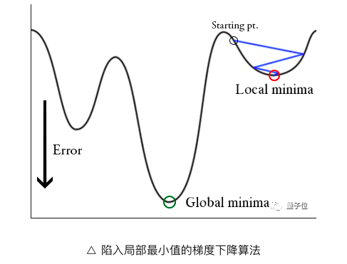
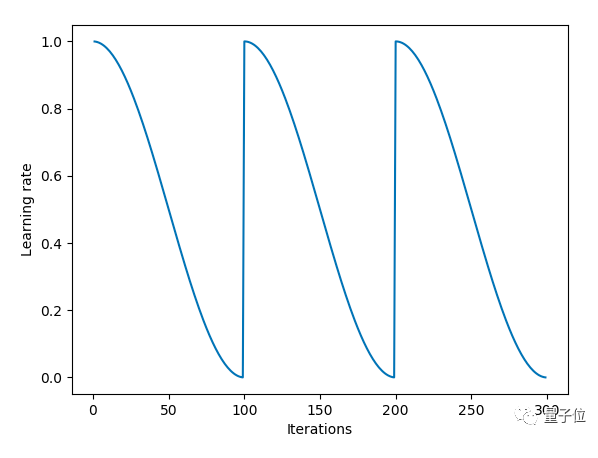
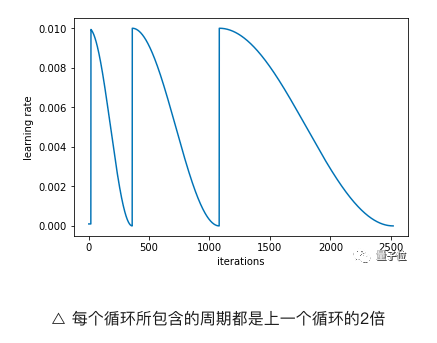
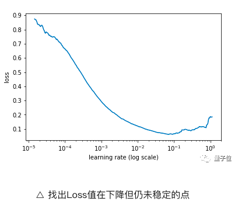

[TOC]

# 如何确定及调整学习率

## 学习率重启动

梯度下降算法可以通过**突然提高学习率**，来“跳出”局部最小值并找到通向全局最小值的路径，如下图所示。这种方式称为**带重启的**随机梯度下降方法（stochastic gradient descent with restarts, **SGDR**）。

其调整学习率的公式为：
$$
\eta_t = \eta_{min} + \frac{1}{2}(\eta_{max} - \eta_{min})(1+cos(\frac{T_{cur}}{T}\pi))
$$
使用了余弦退火公式（cosine annealing）。

* 其中$\eta_{min}$和$\eta_{max}$是学习率取值的范围；
* $T_{cur}$是当前距离上一次重启动（当学习率恢复到最大时，称为重启动）已经运行了多少个eopch；
* $T$则表示重启的周期，也即多少个eopch重启一次。

当$T_{cur}=0$时，$\eta_t=\eta_{max}$，也即初始时学习率取最大值。当$T_{cur}=T$时，$cos(\frac{T_{cur}}{T}\pi)=-1$,那么由$\eta_t = \eta_{min}$，也即一个周期时，学习率取最小值。

根据论文里面的图来看，当$T_{cur}=T$，然后迭代一个epoch之后，就会让$T_{cur}=0$，这样学习率$\eta_t$就会突然提高到最大的学习率，从而跳出局部最小值。

并且，周期也是可变的。

[SGDR: STOCHASTIC GRADIENT DESCENT WITH WARM RESTARTS](http://xxx.itp.ac.cn/abs/1608.03983v5)

## 周期性学习率

也是使用周期学习率，不过我觉得论文中比较有用的是提了一个方法来找到最佳的初始化学习率。

先跑几个epoch的迭代，然后在迭代的过程中不断增加学习率，记录每个学习率对应的Loss值，然后画出学习率和Loss值的关系图：

通过找出学习率最高且Loss值仍在下降的值来确定最佳学习率。在上述情况中，该值将为0.01。

不过我的问题是如何记录每个学习率的loss值？是每个batch增加学习率，然后记录该学习率所对应的loss吗？还是应该每个不同的学习率多跑几个batch的数据，求得loss后取平均？

[Cyclical Learning Rates for Training Neural Networks](https://ieeexplore.ieee.org/abstract/document/7926641)

## 参考

[如何找到最优学习率 - Sherlock的文章 - 知乎](https://zhuanlan.zhihu.com/p/31424275)

