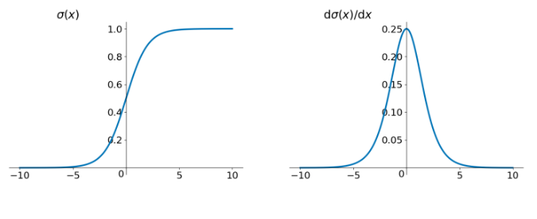
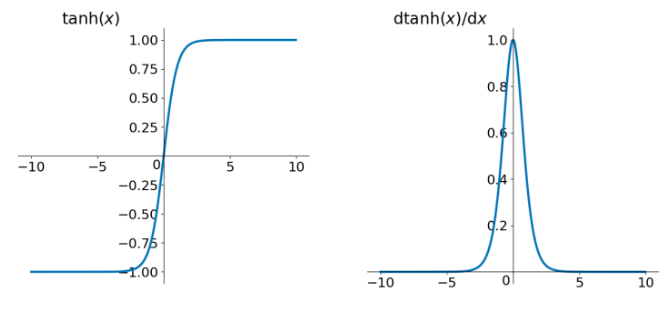

[TOC]

TODO：加入数学公式的说明。

## 梯度消失和梯度爆炸的原因分析

神经网络反向传播中存在激活函数导数的连乘和权重矩阵的连乘，这因为导致了梯度消失和梯度爆炸的问题。

## 从矩阵连乘的角度

如果权重矩阵的值很小，那么矩阵连乘就会出现梯度消失的问题。或者权重矩阵的值很大（比如说学习率很大，导致更小之后权重矩阵的尺度变大），那么矩阵连乘就会出现梯度爆炸问题。

> Note：矩阵连乘，大部分人只注意到了连乘，矩阵乘法是一行乘以一列然后求和得到一个元素，所以说反向传播时一个权重的梯度有多大，不止取决于权重矩阵元素的值，还取决于权重矩阵的行数和列数。
>
> 
>
> 因为这个求加的存在，所以权重初始化时不能初始化成很大的值，不然求加之后会得到更大的值，更进一步，权重的初始化还和权重矩阵的行数和列数相关（详见Xavier初始化和Kaiming初始化），所以权重矩阵因为都初始化为挺小的小数。

## 从激活函数的角度

以前的激活函数为`Sigmoid`，$f(x) = \frac{1}{1+e^{-x}}$，其梯度为$f'(x) = f(x) \cdot (1-f(x))$。由于$f(x) \in (0, 1)$，所以其梯度的最大值为$0.25$，也就是说在激活函数为`Sigmoid`的情况下，激活值的梯度永远都是小数，更不用说当输入值落在激活函数的饱和区时会导致更小的梯度。

而激活函数`Tanh`则要比`Sigmoid`要好一些，因为其梯度的最大值为1。

但是如果激活函数是`ReLU`时，由于其正半轴的梯度恒为$1$，$1$的连乘还是$1$，算是比较好地解决了由于激活函数梯度过小从而导致激活函数梯度连乘所造成的梯度消失的问题。但是负半轴的梯度恒为0，那么连乘时有一个为0，就导致梯度就是0了

> 因此深层神经网络在反向传播中由于激活函数梯度连乘从而导致了梯度消失的现象。

$$
\delta^l =  f'(z^l) \odot (W^{l+1})^T \cdot f'(z^{l+1}) \odot (W^{l+2})^T \cdots f'(z^{L-1}) \odot (W^{L})^T\delta^{L}
$$
TODO : 把这个公式给展开吧。

$\delta^l$是一个梯度向量，如果真的去计算这个公式的话，那么会发现$\delta^l$的每个梯度是很多数求和得到的，然后这很多数的每个数也是求和得到的，并且每个数其实累计乘了很多激活函数的梯度，所以如果激活函数的梯度是小数，那么连乘就很小很小了，然后$\delta^l$的每个元素其实是很小的元素求和得到的，那么其实也是很小的。若激活函数的梯度为1，那么就没这个问题了。

## 梯度消失爆炸解决方案

详见参考文献。

## 参考

[详解机器学习中的梯度消失、爆炸原因及其解决方法 - Double_V的博客 - CSDN博客](https://blog.csdn.net/qq_25737169/article/details/78847691)