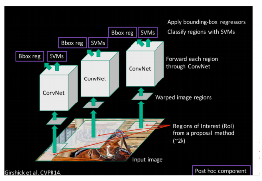
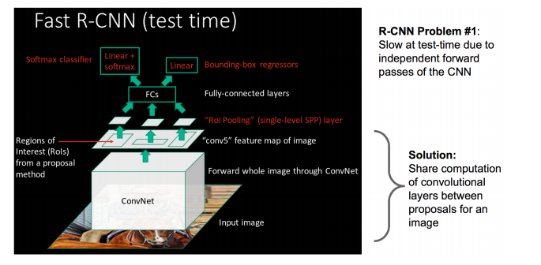
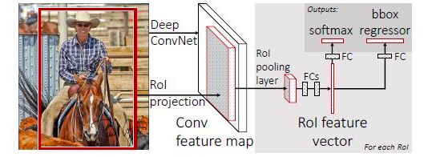

[TOC]

## Fast RCNN

R-CNN与Fast RCNN的区别有哪些呢？
先说RCNN的缺点：即使使用了selective search等预处理步骤来提取潜在的bounding box作为输入，但是RCNN仍会有严重的速度瓶颈，原因也很明显，就是计算机对所有region进行特征提取时会有重复计算，Fast-RCNN正是为了解决这个问题诞生的。

它们的区别如下图，也即有没有重复提取特征：

RCNN的处理流程是先提proposal，然后CNN提取特征，之后用SVM分类器，最后再做bbox regression，而在Fast-RCNN中，作者巧妙的把bbox regression放进了神经网络内部，与region分类和并成为了一个multi-task模型，实际实验也证明，这两个任务能够共享卷积特征，并相互促进。Fast-RCNN很重要的一个贡献是成功的让人们看到了Region Proposal+CNN这一框架实时检测的希望，原来多类检测真的可以在保证准确率的同时提升处理速度，也为后来的Faster-RCNN做下了铺垫。

### ROI映射变换(SSP-Net中的做法)

Fast RCNN对特征提取部分进行了改进，避免对预选框重复提取特征。那么怎么知道原图中的预选框对应到了特征图的哪个区域呢？

只需要将预选框在原图中的左上角和右下角的坐标映射到特征图中，就能够知道图中的预选框对应到了特征图的哪个区域。

具体的推导流程是这样的，推导的时候是从特征图往原图中推导，也即当我们知道了特征图中的某个点对应原图中的某个点，那么自然知道了原图中某个点对应特征图中的某个点。

那么如何知道特征图中的某个点与原图中的某个点的坐标变换关系呢？下面是当前层特征图上的点与前一层特征图上的点的变换关系：
$$
p_i = s_i \cdot p_{i+1} + \frac{k_i - 1}{2} - padding
$$
那么要知道最后一层的特征图上的点与原图点的对应关系，只需要将上面的公式级联起来即可。

下面是何凯明在SSP-Net中提出来的更加简单的计算方法，不过也是需要满足一些假设的：

令每一层的$padding = \lfloor k_i / 2 \rfloor$，从而简化公式$p_i = s_i \cdot p_{i+1} + \frac{k_i - 1}{2} - padding$为$p_i = s_i \cdot p_{i+1} + \frac{k_i - 1}{2} - \lfloor k_i / 2 \rfloor$

* 当$k_i$为奇数时：$\frac{k_i - 1}{2} - \lfloor k_i / 2 \rfloor=0$，所以$p_i = s_i \cdot p_{i+1}$
* 当$k_i$为偶数时：$\frac{k_i - 1}{2} - \lfloor k_i / 2 \rfloor = 0.5$，所以$p_i = s_i \cdot p_{i+1} + 0.5$

而$p_i$是坐标值，不可能取小数（或者卷积核大小$k_i$一定是奇数？），所以基本上可以认定为$p_i = s_i \cdot p_{i+1}$。公式得到了化简，当前层感受野中心点的坐标$p_i$只和后一层$p_{i+1}$相关。

级联之后，就能够得到最后一层特征图上的点$(x', y')$与原图中点$(x, y)$的对应关系：
$$
p_i = s_i \cdot p_{i+1}
$$

$$
p_0 = S \cdot p_{i+1}, \ \ \ S = \prod_{0}^{i} s_i
$$

所以特征图上的点坐标转换到原图上的点坐标为：
$$
(x, y) = (Sx', Sy')
$$
所以原图上的点坐标转换到特征图上的点坐标为：
$$
(x', y') = (x / S, y/S)
$$
利用上面的坐标，就能够将原图中的预选框变换到最后一层的特征图上。而SSP-Net论文中的实际做法是：

* 对于预选框左上角的点，$(x', y') = (\lfloor x/S \rfloor + 1, \lfloor y / S \rfloor + 1)$
* 对于预选框右下角的点，$(x', y') = (\lceil x/S \rceil - 1, \lceil  y / S \rceil - 1)$

+1和-1的作用是偏移，也就是左上角要向右下偏移；右下角要向左上偏移。为什么呢？

### ROI Pooling

RCNN是在原图中截取出预选框大小的图像，然后放大到网络所能接收的固定尺寸去提取特征和分类。

Fast RCNN则是对整张原始图像提取特征，然后将预选框映射到特征图上，从而得到预选框的特征图。预选框的 特征图有大有小，那么Fast RCNN是如何处理的呢？ Fast RCNN用了ROI Pooling来解决这个问题（ROI Pooling是单尺度的SSP-Net）。

Fast RCNN的roi层很简单，就是将特征图分为7 * 7块(原文)，每块中取最大或者平均值。这样得到7\*7的一个新特征图。想想看这个过程是不是和池化一样。这样做的好处是，不管特征图有多大，不管特征图是什么形状，我都可以将这个特征图转化为一个固定大小的尺寸。

### 共同优化分类和回归

在Fast-RCNN中，作者巧妙的把bbox regression放进了神经网络内部，与region分类和并成为了一个multi-task模型，实际实验也证明，这两个任务能够共享卷积特征，并相互促进。

##  总结

* Fast RCNN解决了RCNN每个预选框都要经过CNN的问题;
* 提出了ROI层，比较巧妙地解决了全连层需要固定大小的输入的问题，相对于RCNN的resize操作要好多了；
* 将回归和分类共同优化，从而形成end-to-end的优化。

那么为什么RCNN要用SVM呢？

## 参考

[*原始图片中的ROI如何映射到到feature map?*](https://zhuanlan.zhihu.com/p/24780433)

[*fast*-*rcnn*里的RoI和bbox到底是什么，求通俗解释？](https://www.zhihu.com/question/54259963/answer/139396620)

[RCNN,Fast RCNN, Faster RCNN整理总结](https://blog.csdn.net/gentelyang/article/details/80469553)