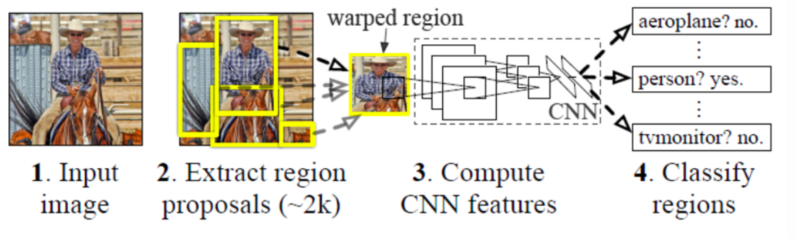
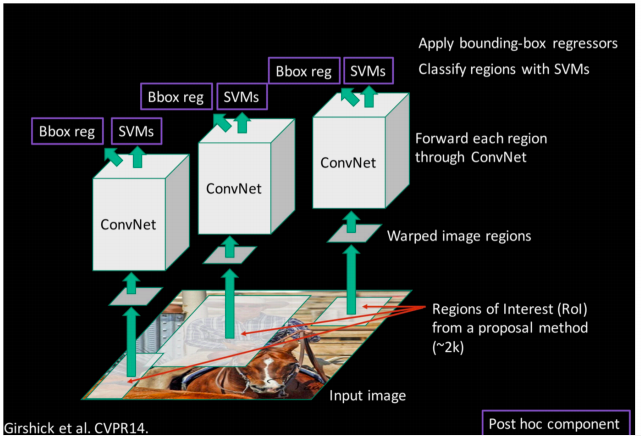
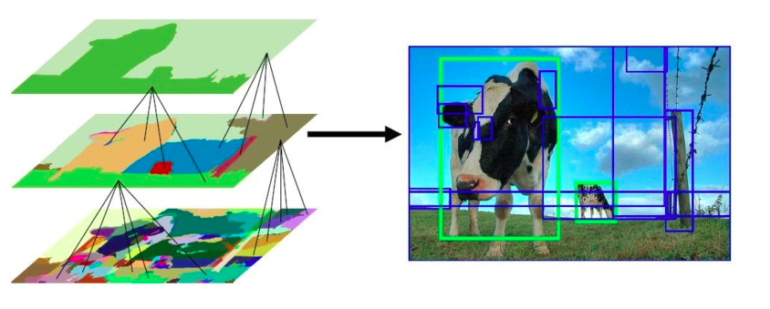
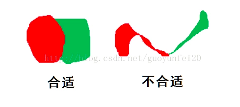
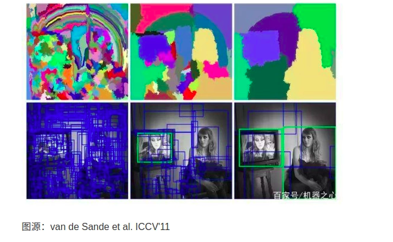
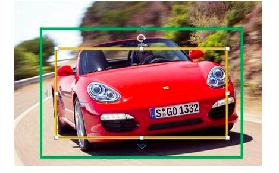

[TOC]

## R-CNN

RCNN-将CNN引入目标检测的开山之作

**流程**

1. 提取框（region proposal）
2. 对每个提取框提取特征
3. 图像分类
4. 非极大抑制
5. 目标框回归

1. 输入一张图，使用selective search得到2000个region proposal；
2. 对每个region proposal将其变换到固定的尺寸，并作为已经训练好的CNN神经网络的输入（用来提取每个region proposal中的特征），得到fc7层的4096维特征，由于有2000个region proposal，所以最后的输出为2000 * 4096；
3. 对每个region proposal进行分类。对于每个区域的特征，使用已经训练好的SVM进行分类（二分类？那么对于一个区域分到不同的类别该怎么办？）。最后得到2000 * 20的评分矩阵，表示每个region proposal属于每一个类别的概率；
4. 非极大阈值，在2000 * 20的评分矩阵中，对于每一列分别进行非极大抑制。例如，对于第一列，找到得分最高的region proposal区域，然后删除那些和当前得分最高的region proposal的IOU过大的那些region proposal；这一轮删除之后，再从剩下的region proposal中找分数最高的，然后删除IOU过大的region proposal，依次类推；对于每一列都这么做，最后每一列（每个类别）都能够得到一些region proposal；（每个类别都有吗？一张图像中不应该含有所有的类别吧，那么怎么去掉错误的？）
5. 用20个回归器对上一步得到的20个类别的region proposal进行回归，最后得到每个类别修正之后的bounding box。

### Region Proposal—Selective Search

由于物体的尺度千差万别，所有我们并不知道bounding box的大小是多大。

[目标检测(Object Detection)的前世与今生(一)](https://segmentfault.com/a/1190000016138673)

在RCNN中使用了一个叫做SS（selective search 选择性搜索）的方法，该论文作者发现，图片中的目标（比如人，汽车，小猫...）与背景是有区别的，比如颜色区别，纹理区别、大小区别等。

如上图所示（截自原论文）,图片中的大量天空背景是无效的，而我们想要检测的奶牛在`颜色`、`纹理`方面很相似，可以与背景区分开来。

论文的思想是

- 首先通过利用颜色的相似性（毕竟如果颜色很相似，那么极有可能是一个整体），形成一些小的区域（上图左边最下面一层），具体算法是将整张图看成一个`无向图`,节点之间的距离就是像素的距离（在这里使用RGB计算距离并不好，最好转换以下色彩空间，比如HSV等），然后设定一个阈值，从其中寻找`最小生成树`,形成最初的感兴趣区域（region of interest ROI）（如果没有学过离散，可以看以下这篇文章[基于图的图像分割](https://blog.csdn.net/guoyunfei20/article/details/78727972))
- 然后对ROl进行再次的合并（如上图）,但是合并要遵循一些规则--相邻区域的相似度
  - 颜色相似度（color similarity）：比较两个区域的颜色直方图
  - 纹理相似度（texture similarity）：比较两个区域的`梯度直方图`（这个会有点难理解，其实纹理的形状表现在其轮廓上，所有用梯度直方图可以很好的表示出纹理之间的差异）
  - 尺寸相似度（size similarity）：防止大的区域和小的区域合并，要遵循先小的合并（因为图片中存在包含关系，比如轮子和汽车都很容易被框选出来，而轮子是属于汽车的，如果直接大的和小的合并，那么很多细节会被丢失掉）
  - 交叠相似度（shape compatibility measure）：这个不太好描述（见下图），当两个区域合并后，合并形成的新图形占其边框矩形面积的多少 代表着这样合并的合理性，比如图中的右侧，合并后它们只占了框定他们矩形的很小的一部分，当我们把这样的一个区域投入cnn中识别的时候，效果依然很差，还是存在大量的背景信息，所以这样是不合理的

- 相似度是上一步骤的计算得到的各种相似度的加权和，然后利用这个相似度作为合并的标准，然后重复这个步骤，直到最终合并为一个区域，而在这个合并过程中，得到的大大小小的区域的边界框，都将作为我们的侯选框

更多具体的算法细节可以看[选择性搜索](https://blog.csdn.net/guoyunfei20/article/details/78723646)这篇文章。

### Region Proposal

由于提取特征的网络是最后几层的全连接层，那么就要求网络的输入是固定的，但是region proprosal的大小并不与网络输入的大小一致。所以需要将region proposal框出来的图像缩放到227 * 227，那么该如何进行缩放呢？

> 作者：晓雷
>
> 
>
> (1)各向异性缩放
>
> 这种方法很简单，就是不管图片的长宽比例，管它是否扭曲，进行缩放就是了，全部缩放到CNN输入的大小227*227，如下图(D)所示；
>
> 
>
> 
>
> (2)各向同性缩放
>
> 因为图片扭曲后，估计会对后续CNN的训练精度有影响，于是作者也测试了“各向同性缩放”方案。有两种办法
>
> A、先扩充后裁剪： 直接在原始图片中，把bounding box的边界进行扩展延伸成正方形，然后再进行裁剪；如果已经延伸到了原始图片的外边界，那么就用bounding box中的颜色均值填充；如上图(B)所示;
>
> B、先裁剪后扩充：先把bounding box图片裁剪出来，然后用固定的背景颜色填充成正方形图片(背景颜色也是采用bounding box的像素颜色均值),如上图(C)所示;
>
> 对于上面的异性、同性缩放，文献还有个padding处理，上面的示意图中第1、3行就是结合了padding=0,第2、4行结果图采用padding=16的结果。经过最后的试验，作者发现采用各向异性缩放、padding=16的精度最高。
>
> （备注：候选框的搜索策略作者也考虑过使用一个滑动窗口的方法，然而由于更深的网络，更大的输入图片和滑动步长，使得使用滑动窗口来定位的方法充满了挑战。）

### 关于正负样本

关于正负样本问题：

一张照片我们得到了2000个候选框。然而人工标注的数据一张图片中就只标注了正确的bounding box，我们搜索出来的2000个矩形框也不可能会出现一个与人工标注完全匹配的候选框。因此在CNN阶段我们需要用IOU为2000个bounding box打标签。如果用selective search挑选出来的候选框与物体的人工标注矩形框（PASCAL VOC的图片都有人工标注）的重叠区域IoU大于0.5，那么我们就把这个候选框标注成物体类别（正样本），否则我们就把它当做背景类别（负样本）。

### 为什么使用SVM进行分类

CNN训练的时候，本来就是对bounding box的物体进行识别分类训练，在训练的时候最后一层softmax就是分类层。那么为什么作者闲着没事干要先用CNN做特征提取（提取fc7层数据），然后再把提取的特征用于训练svm分类器？

这个是因为svm训练和cnn训练过程的正负样本定义方式各有不同，导致最后采用CNN softmax输出比采用svm精度还低。事情是这样的，cnn在训练的时候，对训练数据做了比较宽松的标注，比如一个bounding box可能只包含物体的一部分，那么我也把它标注为正样本，用于训练cnn；采用这个方法的主要原因在于因为CNN容易过拟合，所以需要大量的训练数据，所以在CNN训练阶段我们是对Bounding box的位置限制条件限制的比较松(IOU只要大于0.5都被标注为正样本了)；然而svm训练的时候，因为svm适用于少样本训练，所以对于训练样本数据的IOU要求比较严格，我们只有当bounding box把整个物体都包含进去了，我们才把它标注为物体类别，然后训练svm，具体请看下文。

### Bounding Box Regression

如下图所示，绿色框为Ground Truth，卡宴车辆的实际框；黄色框为SS算法得出的建议框，即Region Proposal。尽管黄色框中也识别正确，但绿色框和黄色框IoU值并不够大，因此检测精度并不够高。采用回归器是为了对建议框进行校正，使得校正后的Region Proposal与Ground Truth更接近， 来提高最终的检测精度。RCNN论文中采用bounding-box回归使mAP提高了3~4%。

那么该如何做回归呢？

输入到边界框回归的数据集为$\{ (P^i, G^i) \}_{i=1, \cdots, N}$，其中$P^i = (P_x^i, P_y^i, P_w^i, P_h^i)$，$G^i = (G_x^i, G_y^i, G_w^i, G_h^i)$，分别代表候选的目标框和真实的目标框。

[【计算机视觉—*RCNN*目标检测系列】二、边界框*回归*（Bounding-Box *Regression*）](https://zhuanlan.zhihu.com/p/76603583)

## 参考

[第二十九节，目标检测算法之R-CNN算法详解](https://www.cnblogs.com/zyly/p/9246221.html)

[第三十三节，目标检测之选择性搜索-Selective Search](https://www.cnblogs.com/zyly/p/9259392.html)

[*RCNN*- 将CNN引入目标检测的开山之作](https://zhuanlan.zhihu.com/p/23006190)

[Fast R-CNN中的边框回归](https://www.cnblogs.com/wangguchangqing/p/10393934.html)

[【计算机视觉—*RCNN*目标检测系列】二、边界框*回归*（Bounding-Box *Regression*）](https://zhuanlan.zhihu.com/p/76603583)

[目标检测(Object Detection)的前世与今生(一)](https://segmentfault.com/a/1190000016138673)