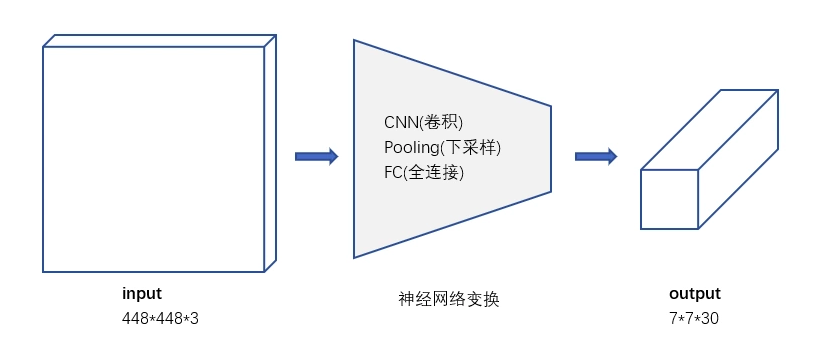

RCNN系列是两阶段处理模式：先提出候选区，再识别候选区中的对象。YOLO意思是You Only Look Once，创造性的将候选区和对象识别这两个阶段合二为一，看一眼图片（不用看两眼哦）就能知道有哪些对象以及它们的位置。

实际上，YOLO并没有真正去掉候选区，而是采用了预定义的候选区（。也就是将图片划分为 7*7=49 个网格（grid），每个网格允许预测出2个边框（bounding box，包含某个对象的矩形框），总共 49*2=98 个bounding box。可以理解为98个候选区，它们很粗略的覆盖了图片的整个区域。

RCNN虽然会找到一些候选区，但毕竟只是候选，等真正识别出其中的对象以后，还要对候选区进行微调，使之更接近真实的bounding box。这个过程就是**边框回归**：将候选区bounding box调整到更接近真实的bounding box。
既然反正最后都是要调整的，干嘛还要先费劲去寻找候选区呢，大致有个区域范围就行了，所以YOLO就这么干了。

不过话说回来，边框回归为啥能起作用，我觉得本质上是因为 分类信息 中已经包含了 位置信息。就像你看到主子的脸和身体，就能推测出耳朵和屁股的位置。

### YOLO结构

去掉候选区这个步骤以后，YOLO的结构非常简单，就是单纯的卷积、池化最后加了两层全连接。单看网络结构的话，和普通的CNN对象分类网络几乎没有本质的区别，最大的差异是最后输出层用线性函数做激活函数，因为需要预测bounding box的位置（数值型），而不仅仅是对象的概率。所以粗略来说，YOLO的整个结构就是输入图片经过神经网络的变换得到一个输出的张量，如下图所示。

**7 * 7网格**

输入入就是原始图像，唯一的要求是缩放到448 * 448的大小。主要是因为YOLO的网络中，卷积层最后接了两个全连接层，全连接层是要求固定大小的向量作为输入，所以倒推回去也就要求原始图像有固定的尺寸。那么YOLO设计的尺寸就是448*448。

根据YOLO的设计，输入图像被划分为 7 * 7 的网格（grid），输出张量中的 7 * 7 就对应着输入图像的 7 * 7 网格。或者我们把 7 * 7 * 30 的张量看作 7 * 7=49个30维的向量，也就是输入图像中的每个网格对应输出一个30维的向量。

要注意的是，并不是说仅仅网格内的信息被映射到一个30维向量。经过神经网络对输入图像信息的提取和变换，网格周边的信息也会被识别和整理，最后编码到那个30维向量中

**30维向量**

30 = 8 + 2 + 20

* 8代表2个bbox的位置
* 2代表2个bbox的置信度
* 30代表该网格内对象是属于哪个类的

① 一张图片最多可以检测出49个对象
每个30维向量中只有一组（20个）对象分类的概率，也就只能预测出一个对象。所以输出的 7*7=49个 30维向量，最多表示出49个对象。

② 总共有 49*2=98 个候选区（bounding box）
每个30维向量中有2组bounding box，所以总共是98个候选区。

## 参考

[YOLO v1深入理解](https://segmentfault.com/a/1190000016692873)

[yoloV1，看过好多篇，这篇感觉讲的最通俗易懂](https://blog.csdn.net/m0_37192554/article/details/81092514)