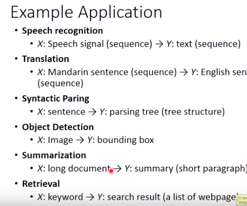
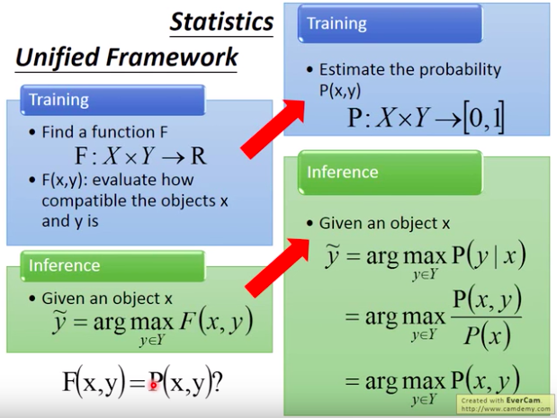
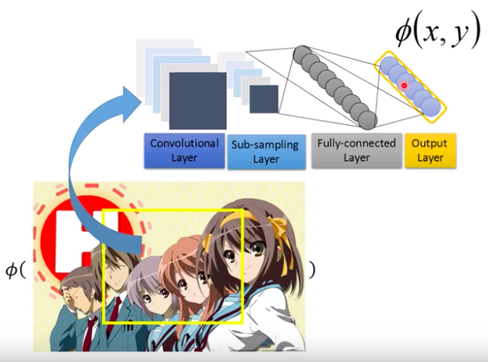

结构化学习， 学出有结构的东西？

如目标价检测中， 输入是图像，输出是目标框，是一个有结构的东西。

虽然上面的这些任务很难，但是其实他们有一个统一的框架。

**还是要学一学结构学习的， 不然遇到某些问题， 都不知道如何用神经网络去解决。**

## Unified Framework

Training：
$$
F: X \times Y \rightarrow R
$$
函数$F$的输入是$(x, y)$，$F(x, y)$用来评价结构$y$与原始的信息$x$有多匹配，越匹配越好。

Testing：
$$
\tilde{y} =	\mathop{\arg\max}_{y \in Y} F(x,y)
$$
测试的时候，给定一个x，我们去穷举所有的y，然后通过函数F，找到与x最匹配的那个y。

要使用这个框架还有3个问题要解决：

1. $F(x,y)$是什么样子的；
2.  如何解$\tilde{y} =	\mathop{\arg\max}_{y \in Y} F(x,y)$，穷举是不可能穷举的。
3. 给定训练数据，如何找到$F(x, y)$，也就是让匹配对的分数大于非匹配对的分数，这是可以完成的吗

对于问题1，我们可以假设模型具有特殊的形式，线性的。

$$
w = 
\left[
\begin{array}{c}
w_1 \\
w_2 \\
w_3 \\
\vdots
\end{array}
\right]
$$

$$
\phi(x,y) = 
\left[
\begin{array}{c}
\phi_1(x,y) \\
\phi_2(x,y) \\
\phi_3(x,y) \\
\vdots
\end{array}
\right]
$$

$$
F(x, y) = w^T \phi(x,y) = w_1 \cdot \phi_1(x,y) + w_2 \cdot \phi_2(x,y) + w_3 \cdot \phi_3(x,y) + \cdots
$$
其中$\phi(x,y)$是我们所抽取的特征，而权重$w$则是我们所有学习的。

* 特征$\phi(x, y)$是我们自己定义的（可能并不是很有用），比如说目标框中红色像素的个数作为特征1，目标框中绿色像素的个数作为特征2等等；
* 特征也可以是CNN出来的，$\phi(x, y)$的不同维度表示输入图像x的在目标框y中所存在的不同的抽象特征。而模型$F(x, y)$根据这些特征来计算出x和y的匹配程度。如下图：

所以目标检测是deep learning（提取特征） + structure learning（学习模型）

## Fast R-CNN

## Faster R-CNN

