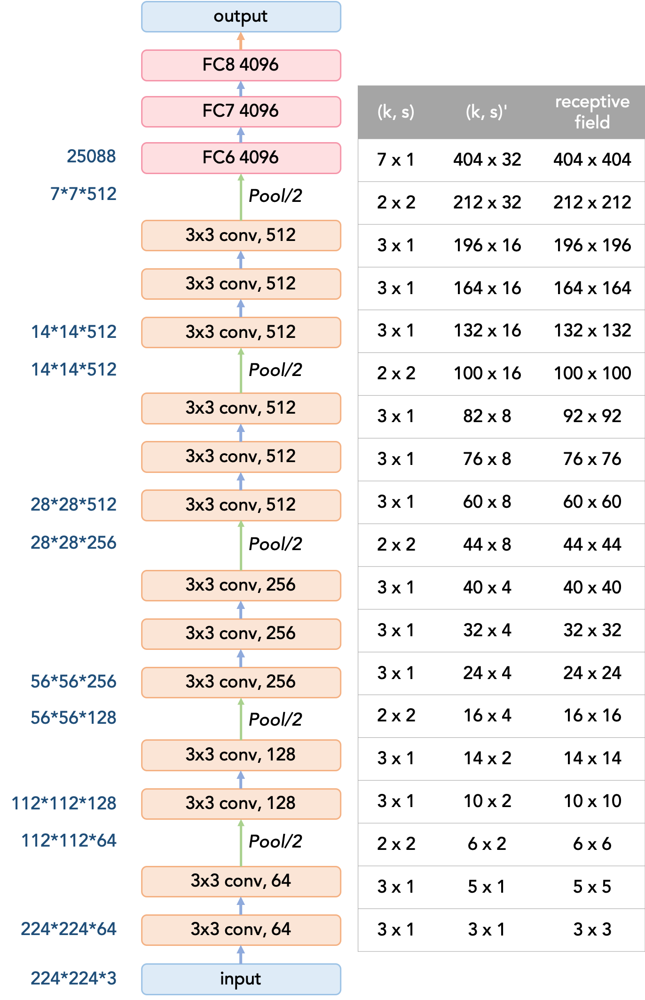
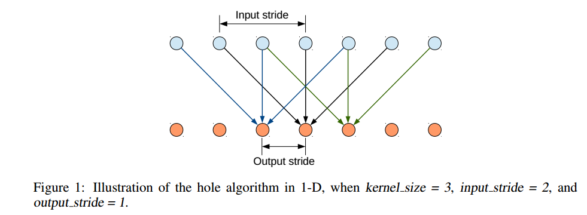
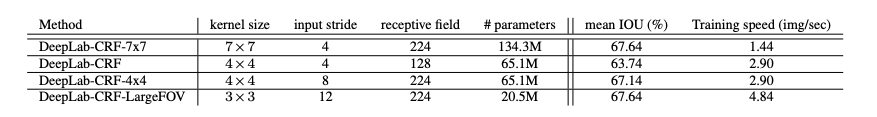

# DeepLab-v1

__Paper__       : [link](http://xxx.itp.ac.cn/abs/1412.7062v3)
__Code__        : [link](https://github.com/kazuto1011/deeplab-pytorch/tree/master/libs/models)
__Performance__ : 71.6% mIOU on PASCAL VOC2012


## VGG结构及其感受野计算





## DeepLab-v1创新点

DeepLab-v1主要是在VGG上进行修改，进行语义分割的训练。

语义分割想要提取更加__dense__的特征，也就是在特征图感受野大小不变的情况下，希望特征图越大越好。

VGG16有5个池化层，所以特征图相对于原图来说，尺寸是原图的1/32。如果直接在该特征图上进行上采样，然后得到与原图大小的分割图，那么效果并不会很好（参考FCN-32s），所以作者对VGG进行了修改，将最后两个Pool层去掉。这样子特征图相对于原图只被降采样了8倍而不是32倍（感觉这里应该是参考了FCN-8s的效果比FCN-32s的效果好）。

网上看到有的说是去掉最后的两个Pool层；有的是将最后两个Pool层的stride=1且让padding=1。但是这样两者最后的特征图的感受野大小是不同的。在经过最后一个Pool层（去掉Pool层的为经过最后一个卷积层）之后，前者特征图上每个元素的感受野为140x140，后者为156x156。

但是将最后两个Pool层去掉，便会出现特征图感受野变小的情况。原来的VGG的特征图在经过最后一个Pool层后，其特征图上的每个元素的感受野为212x212。若是将最后两个Pool层去掉或者是令最后两个Pool层的stride=1，那么最后特征图上的每个元素的感受野变成了140x140或者156x156。


由于图像分割任务被看做是逐像素的分类任务，那么自然需要借鉴VGG设计的成功经验，VGG堆叠了那么多的Conv和Pool，使得最后的特征图上的每个元素具有很大的感受野。那么贸然去掉最后两个Pool层，自热而然会觉得会影响网络的分类性能，那么在去掉最后两个Pool层的情况下，作者使用了空洞卷积带提高最后特征图的感受野。


### 空洞卷积

__stride__          : 就是平时卷积核设置的stride
__input-stride__    : 空洞卷积核的参数，又叫做rate，表示相隔多少个元素是有效的
__output-stride__   ：经过多次conv和pooling操作后，尺寸缩小的值




那么空洞卷积用在了哪个位置呢？好像用在了第一个全连接层处，第一个全连接层可以看做是一个7x7的卷积层。论文中对该层上实验了不同的配置。由于之前将最后Pool层去掉或者是将其stride=1，导致了最终特征图感受野的降低。但是下面的这些卷积核大小和input_stride的配置，好像并不能将感受野扩大到原来的大小。




### 参考

[1] [DeepLab系列 - 知乎](https://zhuanlan.zhihu.com/p/65093800)

[2] [DeepLab 语义分割模型 v1、v2、v3、v3+ 概要（附 Pytorch 实现） - 知乎](https://zhuanlan.zhihu.com/p/68531147)


## Appendix

```python
import torch.nn as nn
from .utils import load_state_dict_from_url


__all__ = [
    'VGG', 'vgg11', 'vgg11_bn', 'vgg13', 'vgg13_bn', 'vgg16', 'vgg16_bn',
    'vgg19_bn', 'vgg19',
]


model_urls = {
    'vgg11': 'https://download.pytorch.org/models/vgg11-bbd30ac9.pth',
    'vgg13': 'https://download.pytorch.org/models/vgg13-c768596a.pth',
    'vgg16': 'https://download.pytorch.org/models/vgg16-397923af.pth',
    'vgg19': 'https://download.pytorch.org/models/vgg19-dcbb9e9d.pth',
    'vgg11_bn': 'https://download.pytorch.org/models/vgg11_bn-6002323d.pth',
    'vgg13_bn': 'https://download.pytorch.org/models/vgg13_bn-abd245e5.pth',
    'vgg16_bn': 'https://download.pytorch.org/models/vgg16_bn-6c64b313.pth',
    'vgg19_bn': 'https://download.pytorch.org/models/vgg19_bn-c79401a0.pth',
}


class VGG(nn.Module):

    def __init__(self, features, num_classes=1000, init_weights=True):
        super(VGG, self).__init__()
        self.features = features
        self.avgpool = nn.AdaptiveAvgPool2d((7, 7))
        self.classifier = nn.Sequential(
            nn.Linear(512 * 7 * 7, 4096),
            nn.ReLU(True),
            nn.Dropout(),
            nn.Linear(4096, 4096),
            nn.ReLU(True),
            nn.Dropout(),
            nn.Linear(4096, num_classes),
        )
        if init_weights:
            self._initialize_weights()

    def forward(self, x):
        x = self.features(x)
        x = self.avgpool(x)
        x = x.view(x.size(0), -1)
        x = self.classifier(x)
        return x

    def _initialize_weights(self):
        for m in self.modules():
            if isinstance(m, nn.Conv2d):
                nn.init.kaiming_normal_(m.weight, mode='fan_out', nonlinearity='relu')
                if m.bias is not None:
                    nn.init.constant_(m.bias, 0)
            elif isinstance(m, nn.BatchNorm2d):
                nn.init.constant_(m.weight, 1)
                nn.init.constant_(m.bias, 0)
            elif isinstance(m, nn.Linear):
                nn.init.normal_(m.weight, 0, 0.01)
                nn.init.constant_(m.bias, 0)


def make_layers(cfg, batch_norm=False):
    layers = []
    in_channels = 3
    for v in cfg:
        if v == 'M':
            layers += [nn.MaxPool2d(kernel_size=2, stride=2)]
        else:
            conv2d = nn.Conv2d(in_channels, v, kernel_size=3, padding=1)
            if batch_norm:
                layers += [conv2d, nn.BatchNorm2d(v), nn.ReLU(inplace=True)]
            else:
                layers += [conv2d, nn.ReLU(inplace=True)]
            in_channels = v
    return nn.Sequential(*layers)


cfgs = {
    'A': [64, 'M', 128, 'M', 256, 256, 'M', 512, 512, 'M', 512, 512, 'M'],
    'B': [64, 64, 'M', 128, 128, 'M', 256, 256, 'M', 512, 512, 'M', 512, 512, 'M'],
    'D': [64, 64, 'M', 128, 128, 'M', 256, 256, 256, 'M', 512, 512, 512, 'M', 512, 512, 512, 'M'],
    'E': [64, 64, 'M', 128, 128, 'M', 256, 256, 256, 256, 'M', 512, 512, 512, 512, 'M', 512, 512, 512, 512, 'M'],
}


def _vgg(arch, cfg, batch_norm, pretrained, progress, **kwargs):
    if pretrained:
        kwargs['init_weights'] = False
    model = VGG(make_layers(cfgs[cfg], batch_norm=batch_norm), **kwargs)
    if pretrained:
        state_dict = load_state_dict_from_url(model_urls[arch],
                                              progress=progress)
        model.load_state_dict(state_dict)
    return model


[docs]def vgg11(pretrained=False, progress=True, **kwargs):
    """VGG 11-layer model (configuration "A")

    Args:
        pretrained (bool): If True, returns a model pre-trained on ImageNet
        progress (bool): If True, displays a progress bar of the download to stderr
    """
    return _vgg('vgg11', 'A', False, pretrained, progress, **kwargs)


[docs]def vgg11_bn(pretrained=False, progress=True, **kwargs):
    """VGG 11-layer model (configuration "A") with batch normalization

    Args:
        pretrained (bool): If True, returns a model pre-trained on ImageNet
        progress (bool): If True, displays a progress bar of the download to stderr
    """
    return _vgg('vgg11_bn', 'A', True, pretrained, progress, **kwargs)


[docs]def vgg13(pretrained=False, progress=True, **kwargs):
    """VGG 13-layer model (configuration "B")

    Args:
        pretrained (bool): If True, returns a model pre-trained on ImageNet
        progress (bool): If True, displays a progress bar of the download to stderr
    """
    return _vgg('vgg13', 'B', False, pretrained, progress, **kwargs)


[docs]def vgg13_bn(pretrained=False, progress=True, **kwargs):
    """VGG 13-layer model (configuration "B") with batch normalization

    Args:
        pretrained (bool): If True, returns a model pre-trained on ImageNet
        progress (bool): If True, displays a progress bar of the download to stderr
    """
    return _vgg('vgg13_bn', 'B', True, pretrained, progress, **kwargs)


[docs]def vgg16(pretrained=False, progress=True, **kwargs):
    """VGG 16-layer model (configuration "D")

    Args:
        pretrained (bool): If True, returns a model pre-trained on ImageNet
        progress (bool): If True, displays a progress bar of the download to stderr
    """
    return _vgg('vgg16', 'D', False, pretrained, progress, **kwargs)


[docs]def vgg16_bn(pretrained=False, progress=True, **kwargs):
    """VGG 16-layer model (configuration "D") with batch normalization

    Args:
        pretrained (bool): If True, returns a model pre-trained on ImageNet
        progress (bool): If True, displays a progress bar of the download to stderr
    """
    return _vgg('vgg16_bn', 'D', True, pretrained, progress, **kwargs)


[docs]def vgg19(pretrained=False, progress=True, **kwargs):
    """VGG 19-layer model (configuration "E")

    Args:
        pretrained (bool): If True, returns a model pre-trained on ImageNet
        progress (bool): If True, displays a progress bar of the download to stderr
    """
    return _vgg('vgg19', 'E', False, pretrained, progress, **kwargs)


[docs]def vgg19_bn(pretrained=False, progress=True, **kwargs):
    """VGG 19-layer model (configuration 'E') with batch normalization

    Args:
        pretrained (bool): If True, returns a model pre-trained on ImageNet
        progress (bool): If True, displays a progress bar of the download to stderr
    """
    return _vgg('vgg19_bn', 'E', True, pretrained, progress, **kwargs)
```

