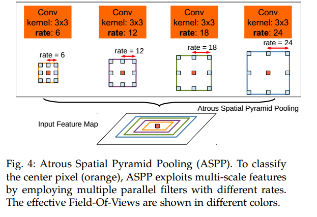
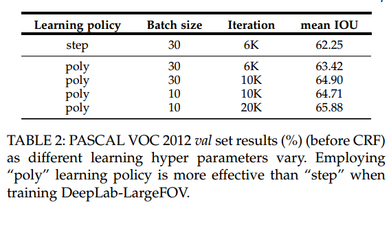
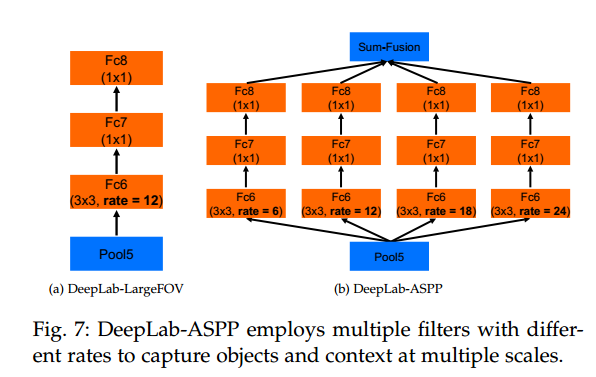
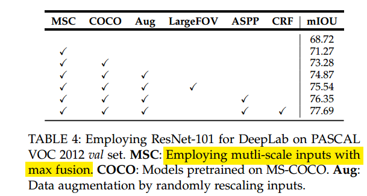

# DeepLab-v2

__Paper__       : [link](http://xxx.itp.ac.cn/abs/1606.00915)
__Code__        : [link](https://github.com/kazuto1011/deeplab-pytorch/tree/master/libs/models)
__Performance__ : 79.7% mIOU on PASCAL VOC2012 better than deeplab-v1 with 71.2% mIOU
    

## 语义分割的挑战

(1) reduced feature resoluction
(2) existence of object at multiple scales
(3) reduced localization accuracy due to DCNN invariance

第一个问题是因为连续的Pooling层导致特征图的分辨率降得很低，原图的1/32，解决方法就是使用空洞卷积。

第二个问题就是图像中存在着不同尺度的物体，解决方法就是ASPP。

第三个问题说的是分类与定位的矛盾之后，分类需要提取高层的抽象特征，那么就会失去位置信息？所以不利于定位?而定位则需要底层的特征？具体表现就是边缘不清晰？作者在本文的解决方法是CRF。而在DeepLab-v3+中是使用Encoder-Decoder架构中的skip-connection来解决这个问题。

## Atrous Spatial Pyramid Pooling(ASPP)

## “poly” learning rate policy

$$current\_lr = init\_lr * (1-\frac{iter}{max\_iter})^{power}$$

max_iter为总的迭代次数，也即总的eopch数 x 每个epoch中有的迭代次数!

可以看到这种学习率调整的方法取得了更好的效果。

## DeepLab-v1和DeepLab-v2的区别

两者在结构上的区别就是DeepLab-v2使用了ASSP结构来捕捉多尺度的特征。

可以看到，ASPP确实有效果，而且ASPP-L的效果比ASPP-S的效果好，那么能够说明捕捉的尺度越大越好吗？并不是这样的，在DeepLab-v3中会对这一点进行说明，并将ASPP中卷积核的rate进行调小，当然了，就算调小了也比本文中的ASPP-S的大。

## 最终的结果

* 简单使用ResNet-101: 68.72%
* MSC: 多尺度输入
* COCO: 由COCO数据集预训练的模型
* Aug: 通过随机缩放（从0.5到1.5）输入图像进行数据增强
* LargeFOV: 使用一次空洞卷积上采样的DeepLab模型
* ASPP: 使用并行的空洞卷积的DeepLab模型
* CRF: 全连接的条件随机场做最后处理