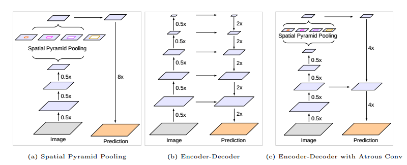
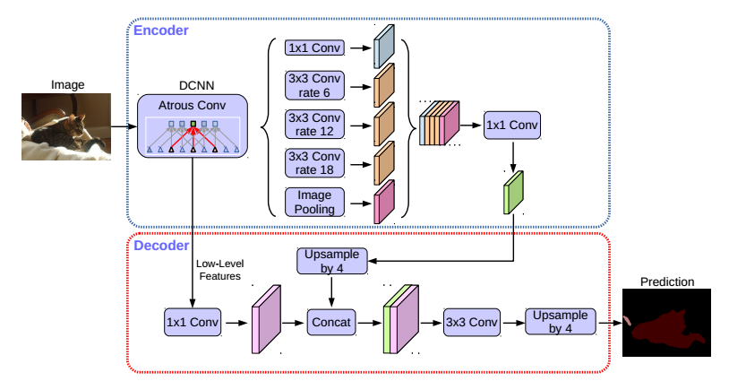
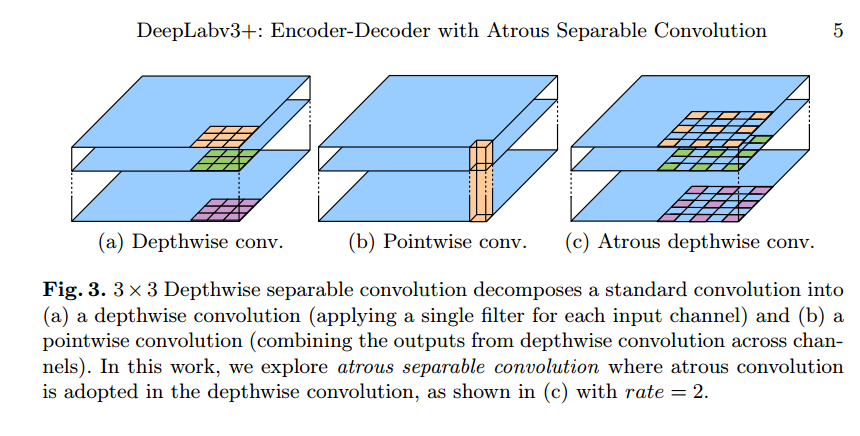

# DeepLab-v3+

__paper__ : [link](http://xxx.itp.ac.cn/abs/1802.02611)
__Performance__ : 89.0%mIOU on PASCAL VOC2012 better than deeplab-v2 with 85.7% mIOU

## Motivation

之前的DeepLab-v1和v2是将特征图降采样到8倍，当然了你也可以降采样到4倍。但是降采样的倍数少了，计算就会很密集，因为原来是在降采样16倍或者32倍的特征图上进行卷积操作，现在变成了在降采样8倍的特征图上进行操作，明显是慢了。

DeepLab一开始的卖点就是不降采样32倍，而是降低采样8倍，使用空洞卷积从而获得更好的效果，（而且还达到了8frame/s的效果？DeepLab-v1论文说的，只有就不再提了，可能之后加了金字塔，就变慢了）但是现在加了太多东西了，好像越来越慢了？但是为了能够实用，所以就在DeepLab-v3中尝试了降采样8倍和16倍的效果。 明显降采样8倍的效果比降采样16倍的效果好。DeepLab-v3中只是做了实验，并没有解决这个问题。

本文中将这个问题明确提了出来，降采样倍数少了，计算量就更大了。而降采样倍数多了，效果就不好了。而解决方案就是，不像FCN,UNet那么降采样32倍，而是降采样16倍，降采样倍数多了，那么定位就不准了，所以边界分割就不好了，为了解决这个问题，自然就是加入解码结构，在上采样的过程中融合底层的特征，从而减少大倍数降采样所造成的精度影响。

## Encoder-Decoder with Atrous Conv

之前的DeepLab结构如(a)所示，直接提取特征然后计算score map进行分类，并没有一个解码的过程。
而(b)则是FCN，UNet等分割模型的架构，在不断解码的过程中将低层次的特征融合进行，从而达到更好的边界分割结果。
所有此次的DeepLab-v3如(c)所示，也将自己视为一个Encoder-Decoder结构，但是在Decoder的过程中并没有融合太多底层的特征，因为作者做了实验，在DeepLab结构中，融合多层底层特征和一层底层特征并无区别，所以只融合了一层，在提取特征的过程中降采样了16倍，然后上采样4倍，融合同层次的特征，然后再上采样4倍。

整个Encoder-Decoder结构如下图所示：

## 深度可分离卷积

为了加速，所以也把深度可分离卷积加入进来了。

深度可分离卷积如(a)和(b)所示，把(a)的卷积变成空洞卷积就变成了(c)Atrous depthwise conv.
所以(c)和(b)结合就变成了Atrous Separable Convolution，用来替代并加速Atrous Convolution.
