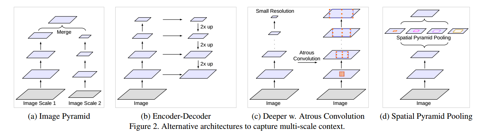
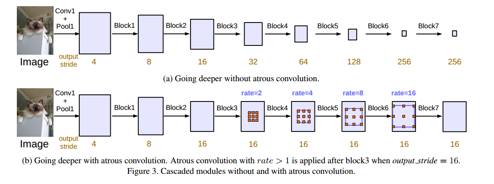
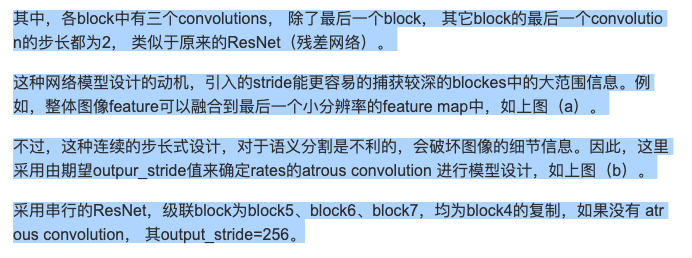
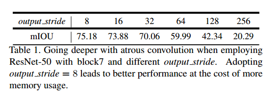
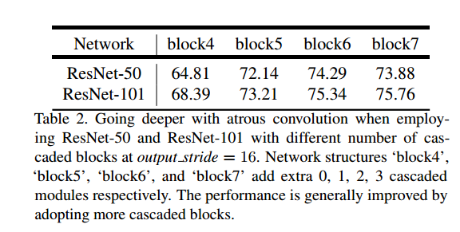
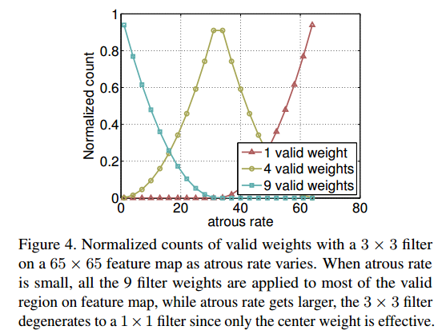
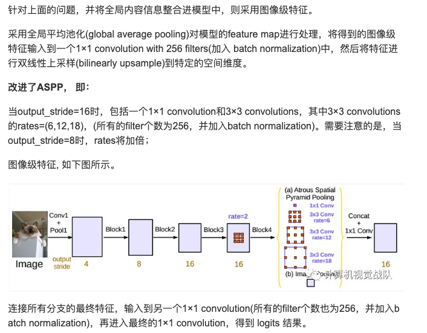

# DeepLab-v3

__Paper__       : [link](http://xxx.itp.ac.cn/abs/1706.05587)
__Code__        : [link](https://github.com/fregu856/deeplabv3/blob/master/model/resnet.py)
__Performance__ : 85.7%mIOU on PASCAL VOC2012 better than deeplab-v2 with 79.7% mIOU

existence of objects at multiple scales

1. 使用图像金字塔的图像作为不同尺度的输入，从而捕捉不同尺度的特征。
2. 使用encoder-decoder结构，因为在不同pooling层之后捕捉到的特征是位于不同尺度的，所以在decoder时，使用skip connection就能合并这些多尺度特征。
3. 级联的空洞卷积
4. 并联的空洞卷积

## 级联还是并联

### 级联
实验了级联的空洞卷积和并联的空洞卷积哪个好

首先实验了级联卷积不同rate的卷积，rate增大，也即意味着感受野增大。对于一般的卷积来说也就是先池化，再卷积。

所以作者实验了不断池化+卷积和级联不断增大rate的空洞卷积哪个效果更好

下面是上面两种方法的实验对比，可见不断池化然后卷积，对于分割这种任务，效果不会好。

而使用了rate不断增大的空洞卷积，在不池化的情况下，能够看到越来越大的感受野，从而使得分割效果越来越好。

### 并联，ASPP的改进

具有不同rate的空洞卷积能够捕捉不同尺度的信息。但是，论文发现，随着rate的增大，有效filter的权重（即有效特征区域，因为rate太大，卷积核的大小超过了特征图的大小，从而使得卷积核的部分权重无效）的数量会变小。如下图所示：当使用不同rate的3x3卷积核应用到65x65大小的特征图时，在rate越来越大时，而退化成一个1x1的卷积核，即卷积核中心的权重有效。

并且，之前的deeplab只是降采样了8倍，从本文开始，却降采样到了16倍。
## 参考

[DeepLab V3](http://www.360doc.com/content/18/0601/09/224841_758694065.shtml)