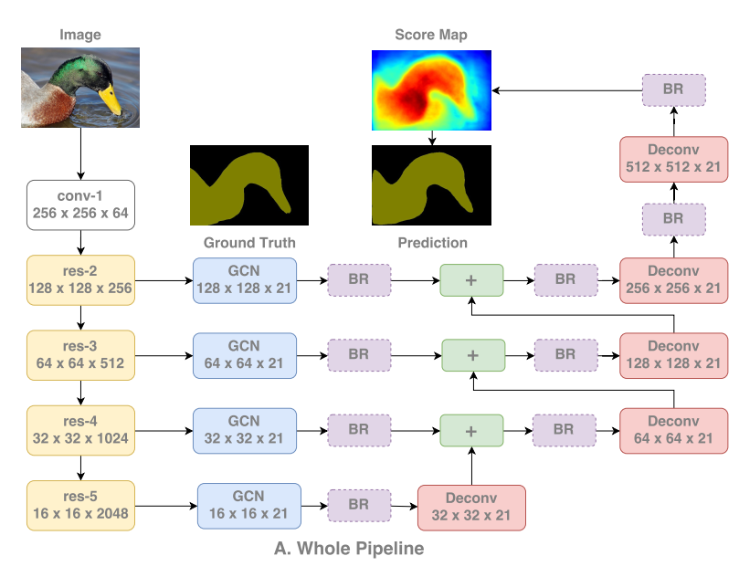
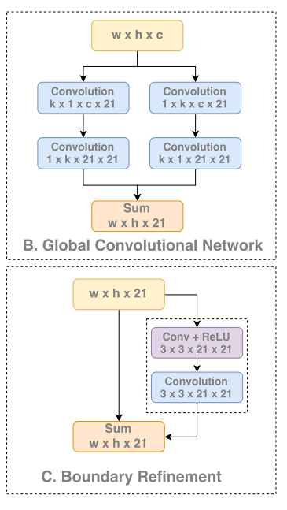

# GCN

__paper__ : [link](http://xxx.itp.ac.cn/abs/1703.02719)

就是提出了GCN和BR

BR？ 就是在融合不同层次的特征之后，加了一个conv来融合不同层次的特征， 别人的论文和代码里面也是有加的， 这篇论文只不过是把简单的conv变成了具有残差的conv而已。

拼接不同层次的特征时，使用conv融合，本来就应该会提升在边界处的精度吧。
然后这篇文件也就是做了一个这样的实验， 再特征拼接之后加不加BR，有效果就说明自己提出的BR是有效的。也就说，将一个conv用一个故事包装一下。