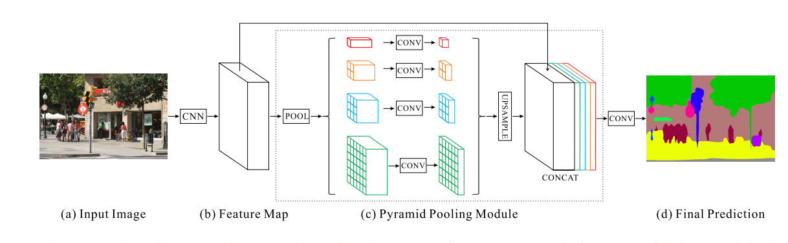

# PSPNet

__Code__ : [link](https://github.com/Lextal/pspnet-pytorch/blob/master/pspnet.py)

Motivation就是说发现现有的用于全景理解的FCN方法很少用到全局的信息。一个已有的方法就是使用空间金字塔池化，其空间统计信息为场景理解提供了很好的描述特征。

感觉就是在backone之后加了何凯明的SPP，然后把网络改名叫做PSPNet。

## 参考

[【个人整理】深入详解金字塔场景解析网络（PSPNet） - MIss-Y的博客 - CSDN博客](https://blog.csdn.net/qq_27825451/article/details/89643096)