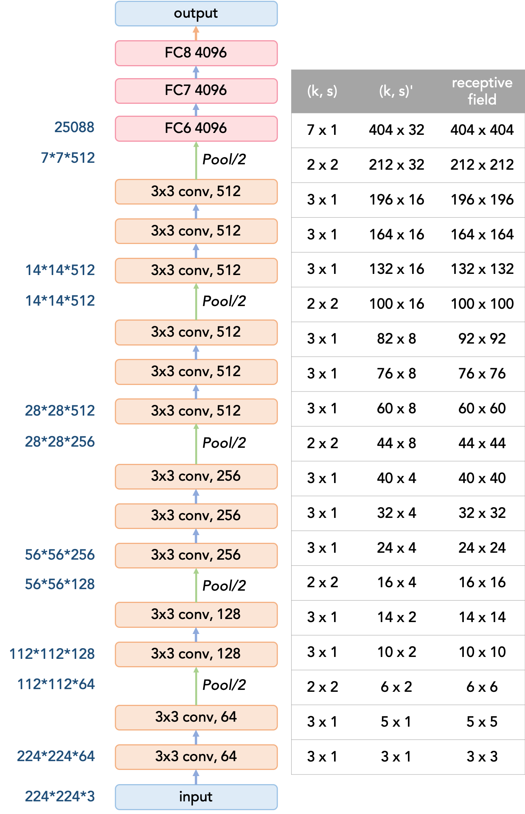

# VGG感受野计算

[感受野计算+卷积/池化输出尺寸计算+卷积参数量计算 - chenyuping333的博客 - CSDN博客](https://blog.csdn.net/chenyuping333/article/details/82883849)

[Calculate Receptive Field for VGG16 \| Zike's Blog](http://zike.io/posts/calculate-receptive-field-for-vgg-16/)

[带有空洞卷积的卷积神经网络的感受野计算方法 - Liekkas_Javey的博客 - CSDN博客](https://blog.csdn.net/Liekkas_Javey/article/details/84477720)