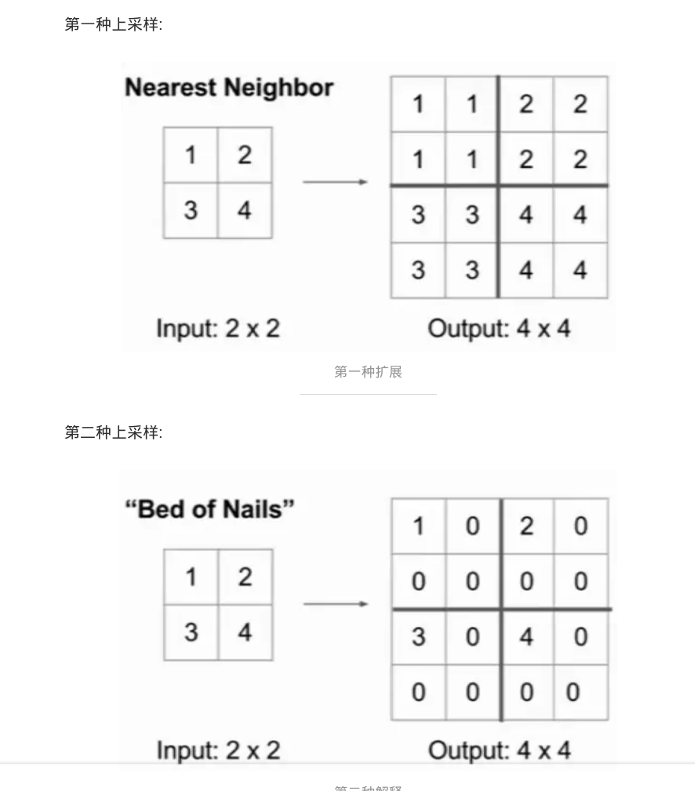
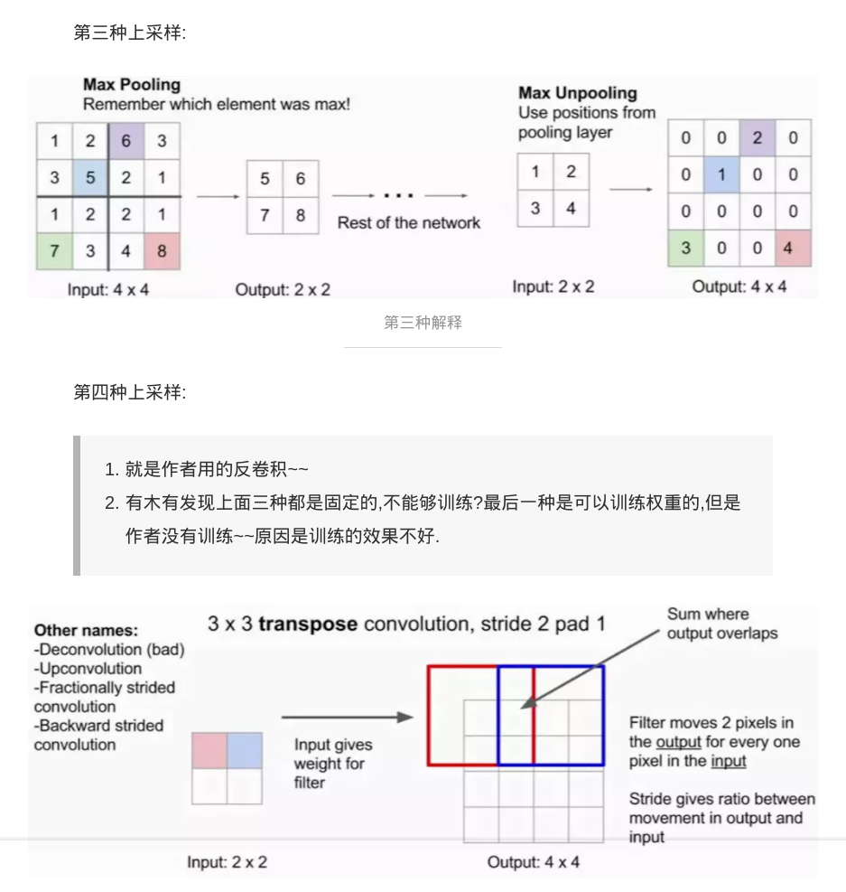

# 上采样的方式

## 转置卷积（Transposed Convolution）

## 上池化(Up-pooling)

（这里针对MaxPooling）可以看到UnPooling操作相当于在进行MaxPooling操作时候对局部最大值的出现位置进行了记录，然后在反向过程补全的时候将最大值填充回原处，然后剩余的地方全部填充零。

如果是针对AvePooling，那么应该就不用记录下标，而是将当前值除以4（如果池化的卷积核是2x2的话），然后填充回原来的4个位置。

## 上采样（Up-sampling)

（这里针对MaxPooling）与UnPooling操作不同的是UnSampling不需要记录最大值所在的位置，这个操作直接使用Pooling得到的最大值填充整个对应区域，不再考虑位置。

## 参考

[轻松理解转置卷积(transposed convolution)/反卷积(deconvolution) - lanadeus - CSDN博客](https://blog.csdn.net/lanadeus/article/details/82534425)

[[1603.07285] A guide to convolution arithmetic for deep learning](http://xxx.itp.ac.cn/abs/1603.07285)

反卷积(Transposed Convolution)详细推导 - 孙小也的文章 - 知乎
https://zhuanlan.zhihu.com/p/48501100

反卷积和上采样+卷积的区别？ - 梁德澎的回答 - 知乎
https://www.zhihu.com/question/328891283/answer/717113611