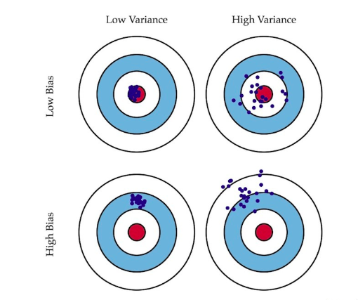
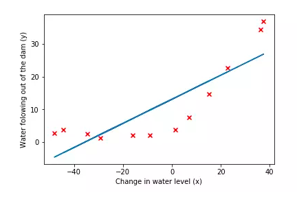
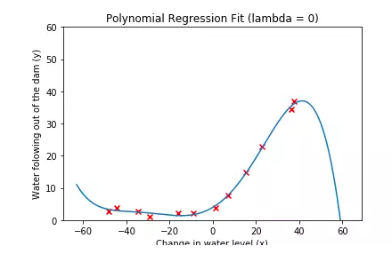
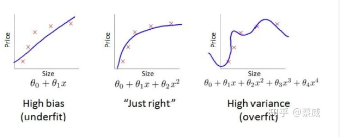
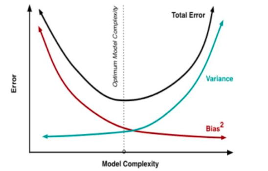

[TOC]

# Bias and Variance

## 定义&理解

当我们的模型表现不佳时，通常是出现两种问题，一种是 __高偏差__ 问题，另一种是 __高方差__ 问题。识别它们有助于选择正确的优化方式，所以我们先来看下 **偏差** 与 **方差** 的意义。 

* __偏差__：模型的输出结果的期望与真实结果的差距。
* __方差__：模型对于给定的值的输出的稳定性。

__对于偏差的理解__：

比如说我对数据集随机选择部分数据做训练集，训练得到模型后，在验证集上进行测试。在进行多次交叉验证之后，如果发现每次在验证集上的预测结果与真实值都差得很远，就说该模型的具有高偏差__偏差__。也就是说该模型的太简单了，拟合数据的能力不够强，所以每次都不能够拟合数据的正确规律，从而使得预测结果离真实值很远。

> 简单来说就是模型在训练集和验证上的误差都很大。—欠拟合

__对于方差的理解__：

同样对数据集划分训练集和验证集，训练得到模型之后，在验证集上进行测试。在进行多次交叉验证之后，如果发现在验证集上进行验证时，有时候预测值和真实值离得近（精度高），有时候预测值和真实值离得远（精度低)，也就说__模型对于给定值输出的稳定性不高__。也就说说该模型太复杂了，拟合数据的能力太强了，所以随机划分训练集时，如果训练集不包含噪声（或者包含的噪声比较小或者少)，那么训练出来的模型方差就小；如果包含噪声（或者是包含的噪声比较多），那么训练出来的模型方差就大。

> 简单来说就是模型不稳定，每次随机划分训练集和验证集后，训练出来的模型在训练集上的误差小，但是在验证集上的误差有时大有时小。—过拟合

__综合理解__：

如下图所示，

__低偏差，低方差__：表示预测结果正中红心并且多次训练的模型能够达到相同的结果；

__低偏差，高方差__：表示预测结果__虽然__能够正中红心，但是其多次训练得到的结果波动比较大，但是都是在红心周围波动。

__高偏差，低方差__：表示预测结果不准，每次训练得到的结果波动不大。

__高偏差，高方差__：表示预测结果不准，每次训练得到的结果波动也大。

## 例子

与多项式回归问题为例。

如果我们用简单的线性模型去拟合下面的散点数据，得到的结果并不好，

表现为训练和测试误差都很大。

如果我们用复杂的多项式模型去拟合下面的散点数据，得到的结果也不好，

表现为训练误差小，测试误差很大。

### 方差偏差权衡

所以我们要对方差和偏差进行权衡。也就是找到一个模型复杂度比较好的地方，使得方差和偏差都比较小，使得训练和测试误差在足够小的同时也足够接近。

##解决方案

1. __[高方差]__ 采集更多的样本数据，数据增强防止过拟合，__那么是为什么呢？？？__
2. __[高方差]__ 减少特征数量，去除非主要的特征，模型太复杂，将一些噪声特征也给拟合进来了。
3. __[高偏差]__ 引入更多的相关特征，拟合能力不够，那么进引入更多的特征，让其拟合变得简单。
4. __[高偏差]__ 采用多项式特征，拟合能力不够，那么就引入更复杂的特征，让其拟合变得简单。
5. __[高偏差]__ 减小正则化参数$\lambda$，正则化参数$\lambda$大会限制模型的复杂度，所以通过减少$\lambda$来增大模型的复杂度。
6. __[高方差]__ 增加正则化参数$\lambda$，正则化参数$\lambda$小会导致模型的复杂度高，所以通过增加\lambda$来限制模型的复杂度。

## 方差偏差分解

$$
E(error) = bias^2 + variance + noise
$$

[【机器学习】偏差-方差分解Bias-variance Decomposition](https://blog.csdn.net/qq_32742009/article/details/82142119)

## 参考

[吴恩达机器学习：方差与偏差](https://blog.csdn.net/hertzcat/article/details/80035330)

[多项式回归，方差和偏差](https://www.jianshu.com/p/24594c7c2d30)

[机器学习+过拟合和欠拟合+方差和偏差](https://blog.csdn.net/u012197749/article/details/79766317)

[增加很多无用的特征会导致训练集误差下降么？](https://www.zhihu.com/question/302993067/answer/562612599)

[【机器学习】偏差-方差分解Bias-variance Decomposition](https://blog.csdn.net/qq_32742009/article/details/82142119)