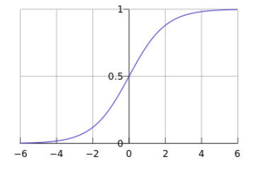

[TOC]

# LR

LR是线性分类器的一种。主要用于二分类，也可以用于多分类。

## 二分类

其模型定义如下：
$$
h_{\theta}(x) = g(\theta^T x) = \frac{1}{1+e^{-\theta^Tx}}
$$

函数的值表示将数据预测为类别1的概率：
$$
p(y=1| x;\theta) = h_{\theta}(x)
$$

$$
p(y=0|x;\theta) = 1 - h_{\theta}(x)
$$

那么对于任意的数据，其预测值为：
$$
p(y|x;\theta) = (h_{\theta}(x))^y \cdot (1-h_{\theta}(x))^{1-y}
$$
那么其似然函数为：
$$
L(\theta) = \prod_{i=1}^{m}p(y^{(i)}|x^{(i)};\theta)  = \prod_{i=1}^{m} (h_{\theta}(x^{(i)}))^{y^{(i)}} \cdot (1-h_{\theta}(x^{(i)}))^{1-y^{(i)}} 
$$
其负对数似然函数为:
$$
-\log L(\theta) = -\sum_{i=1}^{m} y^{(i)} \cdot \log h(x^{(i)}) + (1 - y^{(i)}) \cdot \log (1- h(x^{(i)}))
$$

$$
J(\theta) = -\sum_{i=1}^{m} y^{(i)} \cdot\log g(\theta^T x^{(i)}) + (1 - y^{(i)}) \cdot \log (1 - g(\theta^T x^{(i)}))
$$

省略上标，求其梯度，那么有：
$$
\begin{align}
\nonumber \frac{\partial J(\theta)}{\partial \theta} &= \frac{\partial J(\theta)}{\partial g(\theta^Tx)} \cdot \frac{\partial g(\theta^Tx)}{\partial \theta^T x} \cdot \frac{\partial \theta^Tx}{\partial \theta} \\
\nonumber &= \left( \frac{-y}{g(\theta^T x)} + \frac{(1-y)}{1-g(\theta^Tx)} \right) \cdot g(\theta^Tx) (1-g(\theta^Tx)) \cdot x \\
\nonumber &= [-y (1-g(\theta^Tx)) + (1-y) g(\theta^Tx)] \cdot x \\
\nonumber &= [-y + yg(\theta^Tx) + g(\theta^Tx) - yg(\theta^Tx)] \cdot x \\
\nonumber &= [g(\theta^Tx) - y]\cdot x
\end{align}
$$
对于m个数据的梯度的总和为：
$$
\frac{\partial J(\theta)}{\partial \theta} = \sum_{i=1}^{m} (g(\theta^Tx^{(i)}) - y^{(i)}) \cdot x^{(i)}
$$
写成矩阵的形式为：
$$
X^T (g(X\theta) - y)
$$

> LR就是只有一个神经元的神经网络， 且该神经元的激活函数为Sigmoid。

### 为什么LR是线性模型

衡量一个模型是不是线性的，可以看起决策边界（$\hat{p}=0.5$）是不是一个超平面即可。
$$
\hat{p} = \frac{1}{1 + e^{-z}} = 0.5
$$

$$
e^{-z} = 1
$$

$$
z = wx + b = 0
$$

所以说，决策边界（$\hat{p}=0.5$）是一个$wx + b = 0 $的超平面。所以说LR是一个线性模型。

像神经网络这样，具有两层及其以上的非线性激活函数的话，那么其决策边界就是非线性的。

[Why is logistic regression a linear classifier?](https://stats.stackexchange.com/questions/93569/why-is-logistic-regression-a-linear-classifier)

### 为什么LR使用交叉熵损失而不是平方损失

$$
\hat{y} =  \sigma(z) = \frac{1}{1 + e^{-z}} = \frac{1}{1 + e^{-(wx + b))}}
$$

#### 如果使用平方损失

$$
L = \frac{1}{2}(y - \hat{y})^2
$$

$$
\begin{align}
\nonumber \frac{\partial L }{\partial w} &= \frac{\partial L}{\partial \hat{y}} \frac{\partial \hat{y}}{\partial z}  \frac{\partial z}{\partial w} \\
\nonumber &= (\hat{y} - y) \cdot \sigma'(z) \cdot x
\end{align}
$$

#### 如果使用交叉熵损失

$$
L = - ( y \ ln \hat{y} + (1-y) \ln (1 - \hat{y}) )
$$

$$
\begin{align}
\nonumber -\frac{\partial L }{\partial w} &= \frac{\partial L}{\partial \hat{y}} \frac{\partial \hat{y}}{\partial z}  \frac{\partial z}{\partial w} \\
\nonumber &= -(\frac{y}{\hat{y}} - \frac{1 - y}{1 - \hat{y}}) \cdot \sigma'(z) \cdot x \\
\nonumber &= -(\frac{y}{\sigma(z)} - \frac{1 - y}{1 - \sigma(z)}) \cdot \sigma'(z) \cdot x \\
\nonumber &= -(\frac{y (1-\sigma(z)) - (1 - y) \sigma(x)}{\sigma(z) \cdot (1 - \sigma(z))}) \cdot 
\sigma'(z) \cdot x \\ 
\nonumber &= -(\frac{y - \sigma(z)}{\sigma(z) \cdot (1 - \sigma(z))}) \cdot \sigma'(z) \cdot x \\ 
\nonumber &= -(y - \sigma(z)) \cdot x \\ 
\nonumber &= (\sigma(z) - y ) \cdot x \\ 
\nonumber &= (\hat{y} - y ) \cdot x \\ 
\end{align}
$$

对比平方损失和交叉熵损失的梯度可以看出，平方损失比交叉熵损失要多乘一个激活函数sigmoid的导数，由于sigmoid导数是小于等于0.25的，这会导致平方损失的梯度是小于交叉熵损失的梯度的，这会导致平方损失的收敛速度比交叉熵损失慢；并且，如果当前模型的输出值接近0或者1时，会导致$\sigma'(x)$趋近于0，从而导致所求梯度很小，使得损失函数收敛很慢。

* $y = 0$时：
  * $\hat{y} = 1$，那么这确实会导致收敛
  * $\hat{y} = 0$

* $y = 1$时：
  * $\hat{y} = 1$，那么这确实会导致收敛
  * $\hat{y} = 0$

[为什么LR模型损失函数使用交叉熵不用均方差？](https://blog.csdn.net/dpengwang/article/details/96597606)

## 多分类

> K分类的LR算法可以看做是具有K个神经元的神经网络，且这些神经元的激活函数为Softmax。

## 参考

