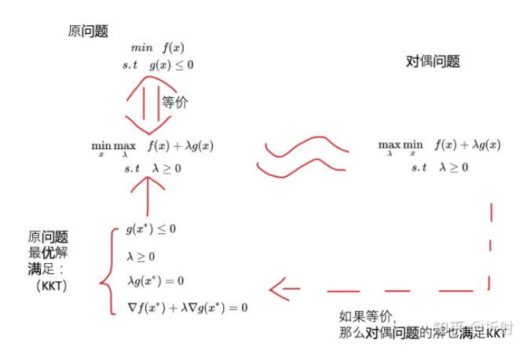

[TOC]

# SVM

## 拉格朗日乘子法

$$
\begin{align*}
&\min\,\, f(x) \\

&s.t.\quad
\begin{cases}
h(x) = 0  \\
f(x) \le 0
\end{cases}

\end{align*}
$$

那么等价于
$$
\begin{align*}
&\min_x \max_{\lambda} \,\, f(x) + \mu h(x) + \lambda f(x) \\

&s.t.\quad \lambda \ge 0
\end{align*}
$$
因为，对于不等式约束违反约束时，$f(x) > 0$，那么里面$\max_{\lambda}$
$$
max_{\lambda}  \lambda f(x) = +\infty
$$
优化时，会使得函数变得无穷大。这就迫使外面$\min_{x}$优化时，不会去违反约束$g(x) \le 0$，因为违反约束所带来的函数$f(x)$减少的增益是少于$\lambda f(x)$增大的惩罚的。

因此，从这个角度可以理解，为什么上面来个问题是等价的。

## KKT 条件

首先，最优解需要满足下面的两个基本条件
$$
g(x*) \le 0 \\
$$

$$
\lambda \ge 0
$$

也要满足下面的两个条件
$$
\lambda g(x*) =0
$$

$$
\nabla f(x*) + \lambda \nabla g(x*) = 0
$$

## 总结

## 参考

拉格朗日乘子法，KKT条件，对偶问题 - 折射的文章 - 知乎
https://zhuanlan.zhihu.com/p/46944722