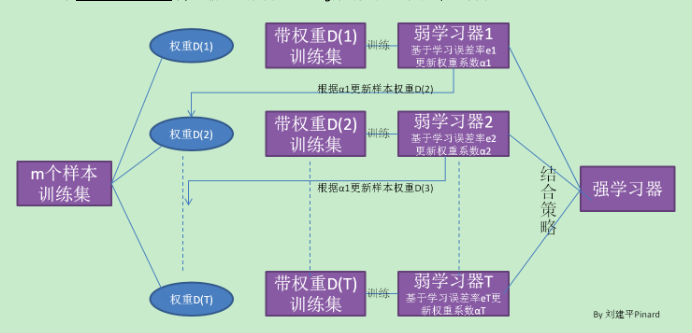
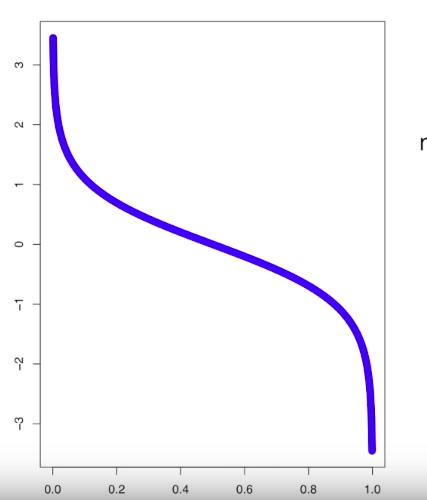

[TOC]

# AdaBoost

## AdaBoost分类

Adaboost有三个属性：

1. Adaboost结合了很多弱分类器（决策树），并且大多数是树桩，为什么？；
2. 这些弱分类器结合时权重是不同的，不同分类器的权重是如何计算的？
3. 新的弱分类器的生成由之前以及得到的弱分分类器所造成的误差决定的，这是因为Adaboost对每个样本有一个权重，若干一个样本被分错了就会增大权重，反之被分对了就会减小权重，如何计算样本的权重，如何生成新的分类器？

### AdaBoost二分类

假设训练集为：
$$
D = \{(x_1, y_1), (x_2, y_2), \cdots, (x_m, y_m)\}
$$
训练集在第$k$个分类器下所使用的样本权重为：
$$
W(k) = \{w_{k1}, w_{k2}, \cdots, w_{km}\}; \ \ w_{1i} = \frac{1}{m}, i = 1, 2, \cdots, m
$$
初始时，每个样本的权重都是相同的，都是$\frac{1}{m}$。

对于二分类分类器的误差率就是:
$$
\frac{分对的样本数}{总样本数}
$$
但是这里的每个样本都是具有权重的，所以对于第k个分类器的的__加权误差率__就是：
$$
\varepsilon_k = \sum_{i=1}^{m} w_{ki} I(F_k(x_i) \ne y_i)
$$

* $F_k$为第k个弱分类器；
* $I(\cdot)$为指示函数；

加权误差率有了，那么第k个分类器的权重自然是由该分类器的误差计算得到的：
$$
\alpha_k = \frac{1}{2} \log \frac{1 - \varepsilon_{k}}{\varepsilon_k}
$$
一般来说，生成分类器时，要求误差$\varepsilon_k<=0.5$，所以$\alpha_k \ge 0$。

那么样本的权重$W$该如何进行更新呢？第k个分类器的样本权重为$W(k) = \{w_{k1}, w_{k2}, \cdots, w_{km}\}$，那么更新之后就会得到第k+1个分类器所使用的样本的权重：
$$
w_{k+1,i} = \frac{w_{ki}}{Z_k} \exp(-\alpha_ky_i F_k(x_i))
$$
$y_i F_k(x_i) \in \{-1, +1\}$，$-1$表示分类错误，$+1$表示分类正确。

* 若分类错误，那么$\exp(-\alpha_ky_i F_k(x_i)) = \exp(\alpha_k)  \ge 1$，从而$w_{ki} \exp(-\alpha_ky_i F_k(x_i))$导致权重__变大__。
* 若分类正确，那么$\exp(-\alpha_ky_i F_k(x_i)) = \exp(-\alpha_k) \le 1$，从而$w_{ki} \exp(-\alpha_ky_i F_k(x_i))$导致权重__变小__。

> 也即这次正确分类正确的样本，权重变小；错误分类的样本，权重变大。

其中$Z_k$为归一化系数：
$$
Z_k = \sum_{i=1}^{m} w_{ki} \exp(-\alpha y_i F_k(x_i))
$$

最后，在经过若干轮的迭代之后，得到K个分类器，在预测时，其结合的方式如下：
$$
f(x) = sign(\sum_{k=1}^{K} \alpha_kF_k(x))
$$
每个分类器$F_k (x) \in \{-1, 1\}$，权重$\alpha_k$可以认为第k个分类器在分类为+1或者-1上有多少的置信度，把K个分类器的置信度加起来，如果为>0，那么为正类；否则为负类。

其分类器的权重

### AdaBoost多分类

## AdaBoost回归

## 参考

[集成学习之Adaboost算法原理小结](https://www.cnblogs.com/pinard/p/6133937.html)

[Adaboost方法究竟是如何选择训练样本？](https://www.zhihu.com/question/57627370#opennewwindow)

[AdaBoost, Clearly Explained, youtube](https://www.youtube.com/watch?v=LsK-xG1cLYA)