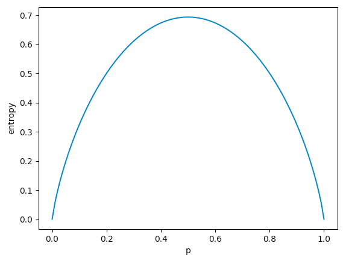
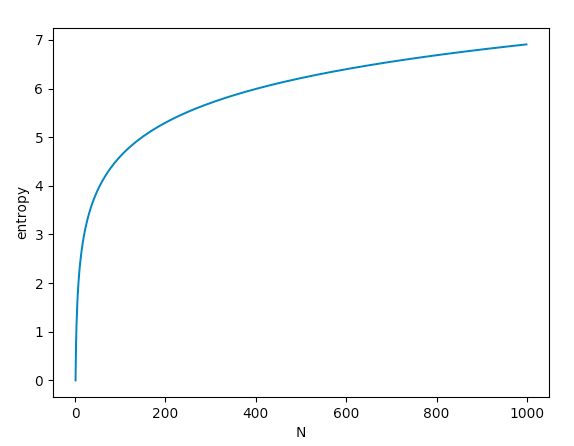

[TOC]

# Decision Tree

## 熵

信息熵，联合熵，条件熵，互信息，KL散度

### 信息熵

$$
H(X) = \sum _i^N p(x_i) \log \frac{1}{p(x_i)} = -\sum_i^N p(x_i) \log p(x_i)
$$

信息熵有两个性质：

* 越接近均匀分布，信息熵越大。下图是__二项分布__的信息熵$H(X) = -[p \cdot \log p + (1-p) \cdot  \log (1-p) ]$，当$p$发生变化时算出来的信息熵的图，可以发现$p = (1-p)$时，信息熵最大，也就是越接近均匀分布，信息熵越大。__这个结论是可以推广到多项分布的，可惜我不会推__。



* $p_i$为均匀分布时，$N$越大，信息熵越大。下图是多项分布（均匀分布）的信息熵$H(X) = -\sum_i^N p(x_i) \log p(x_i)$，当$N$发生变化时算出来的信息熵的图，其中$X$为均匀分布，概率都是$p(x_i) = \frac{1}{N}$，可以发现随着$N$的增大，信息熵也随之增大。



### 联合熵

联合熵也即两个随机变量联合分布的信息熵，仿照信息熵的定义就能写出其定义式来：
$$
H(X, Y) = -\sum_i^N \sum_j^M p(x_i, y_j) \log p(x_i, y_j)
$$


### 条件熵

条件熵的定义如下，至于为什么这样定义，推导完就知道了。
$$
H(Y | X) = H(X, Y) - H(X)
$$

$$
\begin{align}
 \nonumber H(Y | X) &= H(X, Y) - H(X)\\
 \nonumber & = -\sum_i^N\sum_j^M p(x_i, y_j) \log p(x_i, y_j) + \sum_i^N p(x_i) \log p(x_i) \\
 \nonumber & = -\sum_i^N\sum_j^M p(x_i, y_j) \log p(x_i, y_j) + \sum_i^N \left(\sum_j^M p(x_i, y_j)\right) \log p(x_i) \\
 \nonumber & = -\sum_i^N\sum_j^M p(x_i, y_j) \log p(x_i, y_j) + \sum_i^N \sum_j^M p(x_i, y_j) \log p(x_i) \\
 \nonumber & = -\sum_i^N\sum_j^M p(x_i, y_j) \log \frac{p(x_i, y_j)}{p(x_i)} \\
 \nonumber &= -\sum_i^N\sum_j^M p(x_i, y_j) \log p(y_j | x_i)
\end{align}
$$
所以有:
$$
H(Y|X) = -\sum_i^N\sum_j^M p(x_i, y_j) \log p(y_j | x_i)
$$
可以发现，其中的$p(x_i, y_j)$和$\log p(y_j | x_i)$很不协调，如果让我们来定义条件熵，我们可能定义成下面这样：
$$
H(Y|X) = -\sum_i^N\sum_j^M p( y_j | x_i ) \log p(y_j | x_i)
$$
这样子，$\log$前后都是条件概率，看成很美好，但是其实是有问题的。我们将条件熵的定义继续进行推导：
$$
\begin{align}
 \nonumber H(Y|X) &= -\sum_i^N\sum_j^M p(x_i, y_j) \log p(y_j | x_i) \\
 \nonumber &= -\sum_i^N\sum_j^M p(x_i) p(y_j| x_i) \log p(y_j | x_i) \\
 \nonumber &= -\sum_i^N p(x_i) \sum_j^M  p(y_j| x_i) \log p(y_j | x_i) \\ 
 \nonumber &= \sum_i^N p(x_i) H(Y|X = x_i) \\ 
\end{align}
$$
其中$H(Y | X = x_i)$是在随机变量$X$取特定值$x_i$下，随机变量$Y$的条件熵，但是随机变量$X$有多个取值$x_i$，并且每个取值的概率是$p(x_i)$。在随机变量$X$取值不同时，得到的随机变量$Y$的信息熵也不同，所以要对这些条件熵$H(Y | X = x_i)$取个期望，从而得到下面的等式:
$$
H(Y | X) =  \sum_i^N p(x_i) H(Y|X = x_i) \\
$$
所以可以知道，条件熵其实也是一个期望。


### KL散度-相对熵-交叉熵

衡量两个概率分布的相对距离，
$$
\begin{align}
\nonumber KL(P(X)||Q(X)) &= \sum_i^N p(x_i) \cdot \log \frac{p(x_i)}{q(x_i)} \\
\nonumber  &= \sum_i^N p(x_i)(\log p(x_i) - \log q(x_i)) \\
\nonumber  &= \sum_i^N p(x_i) \log p(x_i)  - p(x_i) \log q(x_i) \\
\nonumber  &= \sum_i^N -(-p(x_i) \log p(x_i) + p(x_i) \log q(x_i)) \\
\nonumber  &= H(P) + \sum_i^N -p(x_i) \log q(x_i) \\
\end{align}
$$
其中$\sum_i^N -p(x_i) \log q(x_i)$就是__交叉熵__。


$KL(p || q) $ 和$KL(q||p)$是不同的：

* $KL(p|q)$，其中$p$是真实分布，$q$是预测分布。
* $KL(q|p)$，其中$q$是真实分布，$p$是预测分布。


__KL散度非负性证明__:
$$
\begin{align}
\nonumber KL(P || Q) & = \sum_i^N p(x_i) \log\frac{p(x_i)}{q(x_i)} \\
\nonumber &= \sum_i^N p(x_i) (-\log \frac{q(x_i)}{p(x_i)}) \\
\nonumber &= E_{p(X)} \left[ -\log \frac{q(x_i)}{p(x_i)}\right] \\
\nonumber &\ge -\log E_{p(X)} \left(\frac{q(x_i)}{p(x_i)}\right) \\
\nonumber &= -\log \sum_i^N p(x_i) \frac{q(x_i)}{p(x_i)} \\
\nonumber &= -\log \sum_i^N q(x_i) \\
\nonumber &= -\log 1 \\
\nonumber &= 0
\end{align}
$$
从而有:
$$
KL(P || Q) \ge 0
$$
所以KL散度的值是非负的，从而可以推导交叉熵的值也是非负的。


### 互信息

KL散度能够衡量两个分布之间的相对距离，所以可以通过衡量分布$P(X, Y)$和$P(X)P(Y)$之间的距离，从而给出$X$和$Y$之间的互信息。如果$X$和$Y$之间独立，也就没有互信息；反之，则有。
$$
\begin{align}
\nonumber KL(P(X, Y) || P(X)P(Y)) &= \sum_i^N \sum_j^M p(x_i, y_j) \log \frac{p(x_i, y_j)}{p(x_i)p(y_j)} \\
\end{align}
$$


所以：

* 若$X$和$Y$独立，那么有$\log \frac{p(x, y)}{p(x)p(y)} = \log 1 = 0$，从而互信息为0。
* 若$X$和$Y$不独立，那么有由于KL散度大于0，所以互信息大于0。


或者可以从熵和条件熵推导得到互信息：
$$
I(X, Y) = H(Y) - H(Y|X)
$$


整理之后就可以得到下面的等式：
$$
H(Y | X) = H(X, Y) - H(X)
$$

$$
H(Y | X) = H(Y) - I(X, Y)
$$

$$
I(X, Y) = H(X) + H(Y) - H(X, Y)
$$

并且下面的不等式是成立的：

因为有$H(Y | X) = H(Y) - I(X, Y)$，所以$H(Y|X) \le H(Y)$。

因为有$H(X | Y) = H(X) - I(X, Y)$，所以$H(X|Y) \le H(X)$。

~~ID3就是根据该公式来决定如何划分树。~~

## ID3

ID3使用信息增益来划分决策树，

假设有$M$个数据$x_1, x_2, \cdots, x_M$，每个数据都有一个类别$y_1, y_2, \cdots, y_M \in [0, K]$，$K$为类别个数，并且每个数据都有$N$个特征$f_1, f_2, \cdots, f_N$。


构建决策树的过程就是让熵（__条件熵__）不断减少的过程。


初始时，决策树的根结点有$M$个数据，其信息熵为
$$
H(D) = -\sum_{k=1}^K p_k \log p_k
$$

> 注意，其信息熵是按照类别计算的
>
> 其中$p_i$为该结点的$M$个数据中，类别为$i$的概率。


ID3算法就是在$N$的特征中挑选中一个信息增益$H(D) - H(D | f_i)$最大的特征来对树进行划分。假设第一个特征$f_1$的信息增益__最大__，并且其取值为1，2，3。那么此次划分就是划分成三棵子树，假设分别有$M_1, M_2, M_3$个数据分别落入到三棵子树（$M_1 + M_2 + M_3 = M$），那么有$p(f_1 = 1) = \frac{M_1}{M}$，$p(f_1 = 2) = \frac{M_2}{M}$，$p(f_1 = 3) = \frac{M_3}{M}$，从而子树的熵为：
$$
H(D | f_1) = p(f_1 = 1) H(D|f_1 = 1) + p(f_1 = 2)H(D|f_1 =2) + p(f_1 = 3) H(D|f_1 = 3)
$$


$H(D) - H(D | f_i) = I(D, f_i)$，由于互信息是大于等于0的（note，此处的互信息就不要从KL散度的角度来理解了），所以子树的熵$H(D | f_i)$一定是下降的。而在构建决策树的过程中，每次都贪心地选择信息增益$H(D) - H(D | f_i)$最大的特征$f_i$来对树进行划分，因为这样会使得每次熵下降最快（局部最快不是整体最快)。


但是ID3使用的划分标准其实是存在问题的，假设数据中有一列特征是序号，那个每个数据的序号都是唯一1。假设特征$f_1 \in [1, M]$就是序号特征，那么根据该特征划分子树之后，子树的熵为：
$$
\begin{align}
\nonumber H(D|f_1) &= \sum_{i=1}^{M} p(f_1 = i) H(D| f_1 = i) \\
\nonumber &= \sum_{i=1}^{M} \frac{1}{M} (1 \log 1) \\
\nonumber &= 0
\end{align}
$$
直接一步到为，使得树的熵降为0，但是这也的划分是没有意义的，因为其不存在泛化性。并且，该特征的信息熵为：
$$
\begin{align}
\nonumber H(f_1) &= - \sum_{i=1}^M p(f_1 = i) \log p(f_1 = i) \\
&= \sum_{i=1}^M \frac{1}{M} \log \frac{1}{M}
\end{align}
$$
该特征的信息熵是很大的。

通过这个分析的目的是说明，利用信息熵大的特征（取值个数多的特征信息熵大）对树的划分是不利的，所以要避免使用信息熵大的特征对树进行划分，而ID3算法又恰恰会使用信息熵大的特征对树进行划分，所以C4.5对其进行了改进，使用信息增益率来划分决策树，


> 如果一个特征的取值很多，如果数据和类别和这个特征的相关性不大，但是由于这个特征会划分很多子树，从而获得很大的信息增益，从而使得ID3算法选择这个特征值。

## C4.5

信息增益为:
$$
H(D) - H(D | f_i)
$$


信息增益率为:
$$
\frac{H(D) - H(D | f_i)}{H(f_i)}
$$

​      **信息增益比本质： 是在信息增益的基础之上乘上一个惩罚参数。特征个数较多时，惩罚参数较大；特征个数较少时，惩罚参数较小。**

**缺点**：信息增益比偏向取值较少的特征   

**原因：**  当特征取值较少时H(f_i)的值较小，因此其倒数较大，因而信息增益比较大。因而偏向取值较少的特征。

**使用信息增益比：基于以上缺点，****并不是直接选择信息增益率最大的特征，而是现在候选特征中找出信息增益高于平均水平的特征，然后在这些特征中再选择信息增益率最高的特征**


## CART

分类与回归树的英文是*Classfication And Regression Tree*，缩写为CART。CART即能处理分类问题，又能处理回归问题。

- 如果待预测分类是离散型数据，则CART生成分类决策树。其划分准则为最小化Gini系数。
- 如果待预测分类是连续性数据，则CART生成回归决策树。其划分准则为最小化均方误差。


### CART分类树

CART使用Gini系数来对决策树的结点进行划分
$$
\begin{align}
\nonumber Gini(p) &= \sum_{k=1}^{K}p_k(1- p_k)  \\
\nonumber &=  \sum_{k-1}^{K}p_k - p_k^2 \\
\nonumber &=  \sum_{k-1}^{K}p_k - \sum_{k-1}^{K}p_k^2 \\
\nonumber &=  1 - \sum_{k-1}^{K}p_k^2 \\
\end{align}
$$
所以有:
$$
Gini(p) = \sum_{k=1}^{K}p_k(1- p_k)  =  1 - \sum_{k-1}^{K}p_k^2 \\
$$

> 需要注意的是，使用ID3和C4.5策略划分出来的决策树是多叉树，因为其根据特征划分时，特征有多少个取值，就划分多少个子结点。而使用CART划分决策树时，其生成的决策树是__二叉树__。也就说，使用CART时，不仅需要决定使用哪个特征进行划分，还要决定使用该特征的哪个值进行划分。

如果要计算一个数据集D的Gini系数，如下:
$$
Gini(D) = 1 - \sum_{k=1}^{K}\left( \frac{|C_k|}{|D|}\right)^2
$$
其中$k$表示某个类别,$K$表示共多少种类别，$C_k$表示$D$中由类别$k$构成的数据集合，绝对值符号表示取数量。

Gini系数的本质是度量一个集合的“不纯度(impurity)”。一个集合越不纯，也就是越杂乱，其Gini系数越大；如果越纯，例如集合里只有一个类别，那么很容易知道Gini系数等于0。当然，度量不纯度的方程(impurity function)有很多，CART选择了Gini系数。一个集合$D$纯度越高，那么$\sum_{k=1}^{K} \left( \frac{|C_k|}{|D|}\right)^2$越接近1，从而使用Gini系数越接近0.


若CART使用特征A的某一取值a将决策树某个叶子结点的数据集合$D$划分成$D_1$和$D_2$。切分之后的两个子数据集合，可以用加权Gini指数来衡量整个结果的不纯度。
$$
Gini(D, A=a) = \frac{|D_1|}{|D|} Gini(D_1) + \frac{|D_2|}{|D|}Gini(D_2)
$$
构造决策树时要做的就是寻找A和a，从而__最小化Gini系数__：
$$
\mathop{\arg\min}_{A, a} Gini(D, A = a)
$$


或者是__最大化Gini系数增益__
$$
\mathop{\arg\min}_{A, a} Gini(D) - Gini(D, A = a)
$$
只不过由于此时$Gini(D)$是定值，所以直接最小化Gini系数就好了（对于ID3而言，最大化信息增益等价于最小化经验条件熵）。


### CART回归树

假设我们将数据集合$D$划分好左右子树$D_1$和$D_2$，那么对于左子树的数据集合$D_1$，对于该集合中的每个样本，其预测值都使用一个相同的值；同理，右子树也是。也就是说，使用决策树做回归时，每个结点只会输出一个预测值。

那么选哪个值作为预测值呢？一般回归问题都会使用均方误差来衡量模型的效果，所以每个结点使用一个能够最小化该结点均方误差的值作为预测值，也即如下
$$
\mathop{\arg\min}_{\hat{y}} \frac{1}{|D_1|}\sum_{i=1}^{|D_1|} (y_i - \hat{y})^2
$$
对其求导，让其导数为0 ，得到：
$$
\frac{2}{|D_1|}\sum_{i=1}^{|D_1|} y_i = 0
$$


## 评价指标

$$
C(T) = \sum_{t = 1}^{|T|} N_t H(t)
$$

* $|T|$表示叶子结点的数量;
* $N_t$表示第$t$个叶子结点中样本的数量；
* $H(t)$表示该叶子结点的经验熵；

可以对该式子继续进行推导：
$$
\begin{align}
\nonumber C(T) &= \sum_{t = 1}^{|T|} N_t H(t) \\
\nonumber &= -\sum_{t=1}^{|T|} \sum_{k=1}^{K} N_{t} \frac{N_{tk}}{N_t} \log \frac{N_{tk}}{N_t}\\
\nonumber &= -\sum_{t=1}^{|T|} \sum_{k=1}^{K} N_{tk}  \log \frac{N_{tk}}{N_t}\\ 
\nonumber &= -\log \left( \prod_{t=1}^{|T|} \prod_{k=1}^{K}   \left( \frac{N_{tk}}{N_t} \right)^{N_{tk}} \right) \\ 
\end{align}
$$


可以看出这很像是负对数似然函数的形式，所以可以将其转为似然函数的的样子，也即最大化下面的式子：
$$
\prod_{t=1}^{|T|} \prod_{k=1}^{K}   \left( \frac{N_{tk}}{N_t} \right)^{N_{tk}}
$$
所以，可以理解为:

* 先是叶子结点内部进行极大似然，得到$\prod_{k=1}^{K}   \left( \frac{N_{tk}}{N_t} \right)^{N_{tk}}$
* 然后是叶子结点之间进行极大似然，得到$\prod_{t=1}^{|T|} \prod_{k=1}^{K}   \left( \frac{N_{tk}}{N_t} \right)^{N_{tk}}$。

我理解为这两个极大似然约束不同的方面：

* 叶子结点内部进行极大似然，要求叶子结点越纯越好
* 叶子结点之间进行极大似然，要求叶子结点越少越好，因为叶子结点在不是100%纯的情况下，叶子结点越多，累乘之后就越小。


## 决策树的过拟合

那么怎么知道决策树构建到第几层时停止呢？ 这就需要剪枝了，

或者是根据在验证集上的精度来进行减枝。

* 减枝
  * 预剪枝（树的最大高度，每个叶结点包含的最少样本个数，每个叶结点的最小熵值）
  * 后剪枝
* 随机森林


#### 预剪枝

#### 后剪枝


## 参考

[机器学习系列课程之9 决策树和随机森林](https://www.youtube.com/watch?v=WHN03KVgl44&list=PL6W3lurecOfyq3PucJuBNo5IWdH0FaTdo&index=9)

[决策树--信息增益，信息增益比，Geni指数的理解](https://www.cnblogs.com/muzixi/p/6566803.html)

[CART分类树为什么用gini系数最小进行分裂而不是gini系数下降最大? - 高昙鸢的回答 - 知乎](https://www.zhihu.com/question/326117278/answer/698129020)

[机器学习之分类与回归树(CART) - 谓之小一的文章 - 知乎](https://zhuanlan.zhihu.com/p/36108972)

[CART算法中某一特征被使用后还能被重复使用吗？ - Evan的回答 - 知乎](https://www.zhihu.com/question/51012842/answer/257838996)

[关于决策树损失函数来源的理解与推导](https://blog.csdn.net/wzk1996/article/details/81941572)


## Appendix

```python
# -*- coding: utf-8 -*-
import math
import matplotlib.pyplot as plt
import numpy as np


def get_entropy(n):
    '''
    计算均匀分布的信息熵， 每个点的概率为1/n
    情况越多，且每个情况的概率都是相等的，那么这个系统就越无需、复杂，
    因为其处于任意一个情况都是可能的
    '''
    p = 1.0 / n
    H = 0.0
    for i in range(n):
        H += p * math.log(p)
    H = -H

    return H


def get_entorpy2(p):
    H = p * math.log(p) + (1 - p) * math.log(1 - p)
    H = -H
    return H


def draw1():
    n = 1000
    xs = [i for i in range(1, n)]
    ys = []

    for x in xs:
        ys.append(get_entropy(x))

    plt.plot(xs, ys)
    plt.xlabel('N')
    plt.ylabel('entropy')
    plt.show()

def draw2():
    eps = 1e-4
    xs = np.linspace(0 + eps, 1 - eps, 100) 
    ys = []
    for x in xs:
        ys.append(get_entorpy2(x))
    plt.plot(xs, ys)
    plt.xlabel('p')
    plt.ylabel('entropy')
    plt.show()

if __name__ == '__main__':
    draw1()
    draw2()

```


