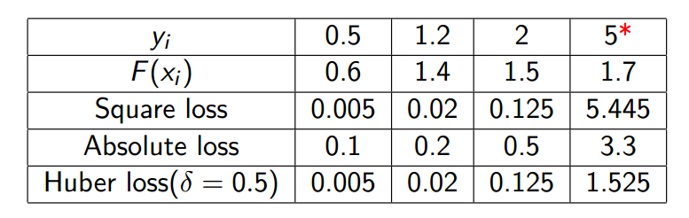

[TOC]

# GBDT

理解GBDT的步骤：

1. 拟合残差
2. 拟合残差实际上是拟合平方损失的负梯度
3. 从而推广到拟合负梯度就行，从而推广到使其可以使用于任意损失函数

## 拟合残差

对于回归问题，假设我们已经有了一个模型$F$，在不能够更改模型$F$的情况下，如何使得模型$F$表现更好呢？我们可以集成一个新的模型$h$到$F$，所以我们的预测值变成$F(x) + h(x)$，从而提高模型的性能。也就是说，我们想要做的是：
$$
F(x_1) + h(x_1) = y_1 \\
F(x_2) + h(x_2) = y_2 \\
\cdots \\
F(x_m) + h(x_m) = y_m \\
$$
也即等价于我们需要拟合出一个新的函数$h(x)$：
$$
\begin{align}
\nonumber h(x_1) &= y_1 - F(x_1) \\
h(x_2) &= y_2 - F(x_2) \\
&\cdots \\
h(x_m) &= y_m - F(x_m) \\
\end{align}
$$
也即等价于用下面的数据再去拟合一个新的函数$h(x)$
$$
\{(x_1, y_1 - F(x_1)),  (x_2, y_2 - F(x_2)),  \cdots, (x_m, y_m - F(x_m)), \}
$$

$y_i - F(x_i)$是残差，也即当前模型做得不够好的地方。我们让模型$h$去拟合模型$F$不好的地方，从而使得$F + h$比$F$要好。如果$F+h$做的仍旧不够好，我们可以继续去拟合残差，（这样不会过拟合吗？）

## 拟合残差实际上是拟合平方损失的负梯度

那么如何让残差和平方损失的负梯度联系起来的？

由于我们的回归问题的损失函数是平方损失，所以有：
$$
L(y, F(x)) = \frac{1}{2}(y - F(x))^2
$$
那么整体的损失为：
$$
J = \sum_{i=1}^m L(y_i, F(x_i))
$$
由于我们已经有了模型$F$，所以$F(x_1), F(x_2), \cdots, F(x_m)$都是数字，从而可以把$F(x_i)$看做是参数?，并且进行求导：
$$
\frac{\partial J}{ \partial F(x_i))} = \frac{\partial \sum_{i=1}^m L(y_i, F(x_i))}{\partial F(x_i)} = \frac{\partial L(y_i, F(x_i))}{\partial F(x_i)} = \frac{\partial \frac{1}{2}(y - F(x))^2} {\partial F(x_i)} = F(x_i) - y_i
$$
> 或者直接就认为是一个函数（可以优化的东西），而损失函数是函数的函数（泛函），而损失函数对$F(x_i)$求导表示函数$F$在数据点$x_i$这点处的函数值该如何变化才能够降低损失（沿着负梯度方向更新），所以该$x_i$这点处的函数值应该变成$F(x_i) + (y_i - F(x_i))$会使得损失函数下降。

所以说残差$y_i - F(x_i)$就是负梯度：
$$
y_i - F(x_i) = - \frac{\partial J}{\partial F(x_i)}
$$

所以拟合残差就是拟合平方损失的负梯度：
$$
F(x_i) := F(x_i)  + h(x_i) \\
F(x_i) := F(x_i)  + y_i - F(x_i) \\
F(x_i) := F(x_i)  -1 \frac{\partial J}{\partial F(x_i)} \\
$$
所以对于损失函数是平方损失的情况下有：

> residual <=> negative gradient
>
> fit h to residual  <=> fit h to negative gradient
>
> update F based on residual <=> update F based on negative gradient

__所以拟合残差本质上是拟合负梯度，只不过在损失函数是平方损失时，负梯度等价于残差。__接下来便可以将注意力集中到__拟合负梯度上__，因为这种想法能够让GBDT适用于更多损失函数。

如果使用平方损失函数，那么GBDT算法的流程是这样子的：

1. 第一CART棵为$F(x) =\frac{1}{m} \sum_{i=1}^m y _i$；
2. 计算每个数据$(x_i, y_i)$在已有树组合之后的模型上的负梯度，$-g(x_i) = -\frac{\partial L(y_i, F(x_i))}{\partial F(x_i)} = y_i - F(x_i)$；
3. 在新的数据$\{(x_i, -g(x_i))\}$上拟合出新的CART树$h$，从而得到新的组合模型$F : = F + \rho h, \ \rho = 1$；
4. 重复第2，3步直到收敛。

__为什么我们要考虑请其它的损失函数__

回归问题使用平方损失就好了，为什么还要考虑其它的损失函数呢。意思就是直接拟合残差挺好理解的，为什么要直到其本质上是拟合损失函数的梯度呢？因为平方损失对噪声太敏感了，所以需要使用对噪声更不敏感的绝对损失函数或者是Huber损失函数。

那么对其它损失函数而言，GBDT的算法流程仍旧保持不变，仍旧是不断用新的CART树去拟合负梯度。只不过对于不同的损失函数而言，其负梯度是不同的：

__Absolute loss__:
$$
L(y, F) = | y - F|
$$
其负梯度为：
$$
-g(x_i) = -\frac{\partial L(y_i, F(x_i))}{F(x_i)} = sign(y_i - F(x_i))
$$
__Huber loss__：
$$
L(y, F) = \begin{cases} 
\frac{1}{2}(y - F)^2 & ,|y - F| \le \delta \\
\delta \cdot(|y-F| - \delta/2) & ,|y - F| > \delta
\end{cases}
$$

$$
-g(x_i) = \begin{cases} 
y_i - F(x_i) & ,|y_i - F(x_i)| \le \delta \\
\delta \cdot sign(y_i - F(x_i)) & ,|y_i - F(x_i)| > \delta
\end{cases}
$$

### 总结

GBDT是一个加法模型：
$$
F_T = \sum_t^T \rho_t h_t
$$
在已有模型$F_{T-1}$的情况下，使用模型$F_{T-1}$，然后计算得到负梯度:
$$
-g(x_i) = -\frac{\partial L}{\partial F_{T-1}(x_i)}
$$
那么在新的数据集$\{(x_i, -g(x_i))\}$上去拟合新的模型$h_T$，那么得到新的加法模型：
$$
F_T = F_{T-1} + \rho_T h_T
$$

类比于参数在负梯度方向上进行更新后得到新的梯度会使得损失值下降。

GBDT的模型$F_{T-1}$在负梯度方向上拟合出新的模型$h_T$后，$F_{T-1} + \rho_T h_T$意味着模型$F_{T-1}$也在负梯度方向上进行更新，从而使得损失值下降。

也就是说：

* 对于参数优化问题，梯度下降是在参数空间优化的过程；
* 对于函数优化问题，梯度下降是在函数空间优化的过程。

> 注意：
>
> 上面的推导都是取学习率为1，实际上不是，学习率如何选择，参考：
>
> How to choose a proper learning rate for each gradient boosting algorithm. See [Friedman, 2001]

## GBDT处理分类任务

GBDT将分类问题转为回归问题进行处理，GBDT的基模型是CART__回归树__。

[ log损失GBDT的多分类算法描述](https://blog.csdn.net/qq_24519677/article/details/82020863)

## 参考

[A Gentle Introduction to Gradient Boosting](http://www.ccs.neu.edu/home/vip/teach/MLcourse/4_boosting/slides/gradient_boosting.pdf)

[GBDT算法原理深入解析](https://www.zybuluo.com/yxd/note/611571)

[gbdt的残差为什么用负梯度代替？ - 奥奥奥奥噢利的回答 - 知乎](https://www.zhihu.com/question/63560633/answer/581670747)

[GBDT的python源码实现](https://zhuanlan.zhihu.com/p/32181306)

[GBDT code](https://github.com/RRdmlearning/Machine-Learning-From-Scratch/tree/master/gradient_boosting_decision_tree)

