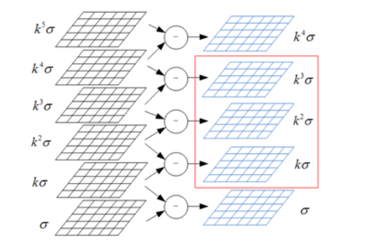
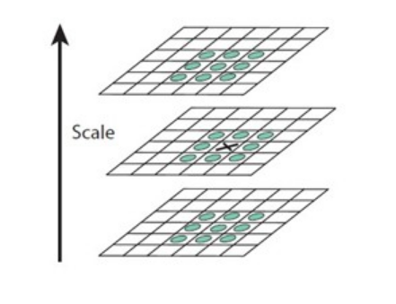
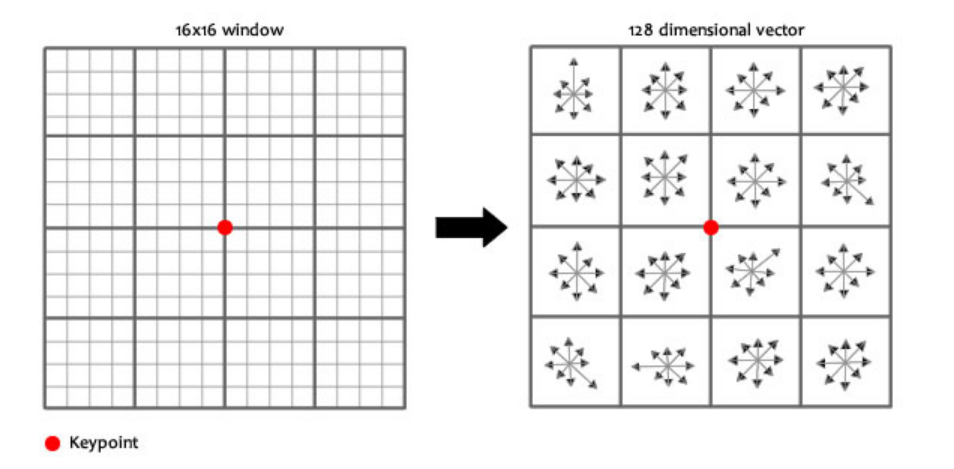

[TOC]

## SIFT


1. [构建高斯金字塔]([SIFT定位算法关键步骤的说明](https://www.cnblogs.com/ronny/p/4028776.html))
2. 构建DoG金字塔
3. [检测尺度空间极值（位置+尺度）](https://www.cnblogs.com/JiePro/p/sift_2.html)
   - 空间极值检测
   - 亚像素插值
   - 删除不稳定的特征点
   - 计算scale和size
4. [计算方向](https://www.cnblogs.com/JiePro/p/sift_3.html)
   - 统计梯度方向直方图
   - 取直方图的极值方向作为特征描述子的方向，并对方向做[抛物线插值](https://blog.csdn.net/q_z_r_s/article/details/82705653)
5. 计算描述子


一些需要注意的地方：

* 如果图像a被降采样2倍得到了图像b，那么图像b相对于原图像来说是模糊了，因为将图像b上采样到和图像a一样大，那么相比于原图来说，会变得模糊。
* 


### 构建高斯金字塔

$G(x, y, \sigma) = \frac{1}{2 \pi \sigma^2} exp(-\frac{(x^2 + y^2)}{ 2 \sigma^2})$表示高斯卷积核。

$L(x, y, \sigma)$表示一个高斯滤波器和原图像卷积而生成的图像，即$L(x, y, \sigma) = G(x, y, \sigma)  \otimes  I(x, y) $。

$D(x, y, \sigma)$表示高斯差分，$D(x, y, \sigma)  = (G(x, y, k\sigma) - G(x, y, \sigma)) \otimes I(x, y) = L(x, y, k \sigma) - L(x, y, \sigma)$。


SIFT是在DoG金字塔上每一层的**每一层**查找极值的，若每层要找S张图像上查找极值，那么DoG金字塔的每层需要$S+2$个**高斯差分**图像，那么就要求高斯金字塔每层需要$S+3$个**高斯**图像。 OpenCV的SIFT算法默认$S=3$。


下面是金字塔某一层的示意图：

每层在$S=3$张DoG图像上寻找极值，那么每层需要$S+2 = 5$张DoG图像，那么也就要求高斯金字塔的每层有$S+3=6$张高斯图像。




#### 尺度空间的连续性

构建高斯金字塔的目的是为了进一步构建DoG金字塔，那么如何构建高斯金字塔呢。从上面的讨论中，我们确定了高斯金字塔的每层有$S+3 = 6$（默认S=3）张图像，那么有下面几个问题：

* 高斯金字塔有多少层
* 高斯金字塔的每层，以及每层中的每个图像应该有多大$\sigma$的高斯模糊去进行模糊操作。


问题1：高斯金字塔有多少层 -- 由图像的分辨率决定的
$$
nOctaves = \lfloor \frac{log(min(rows, cols))}{ log(2.)} - 2 \rfloor - firstOctave
$$


```c++
 int nOctaves =  cvRound(std::log( (double)std::min( base.cols, base.rows ) ) / std::log(2.) - 2) - firstOctave;

```


问题2：如何确定图像的模糊参数 -- 

我们希望在连续的尺度空间上进行极值的检测，但是实际上连续是不可能的，那么只有等间隔采样了。


对于高斯金字塔第0层（组）的图像，其尺度（高斯模糊的参数）为：
$$
\sigma_0 \rightarrow 2^{1/3} \sigma_0 \rightarrow 2^{2/3} \sigma_0 \rightarrow 2^{3/3} \sigma_0 \rightarrow 2^{4/3} \sigma_0 \rightarrow 2^{5/3} \sigma_0
$$
第1层（组）的图像，其尺度（高斯模糊的参数）为：
$$
2* \sigma_0 \rightarrow 2 * 2^{1/3} \sigma_0 \rightarrow 2 *  2^{2/3} \sigma_0 \rightarrow 2 *  2^{3/3} \sigma_0 \rightarrow 2 *  2^{4/3} \sigma_0 \rightarrow 2 *  2^{5/3} \sigma_0
$$
第2层（组）的图像，其尺度（高斯模糊的参数）为：
$$
2 * 2* \sigma_0 \rightarrow 2*  2 * 2^{1/3} \sigma_0 \rightarrow 2*  2 *  2^{2/3} \sigma_0 \rightarrow 2*  2 *  2^{3/3} \sigma_0 \rightarrow 2*  2 *  2^{4/3} \sigma_0 \rightarrow 2*  2 *  2^{5/3} \sigma_0
$$
以此类推...


我们只分析前2组便可以看出，第1组的第0层图像恰好与第0组的倒数第三幅图像一致，尺度都为$2\sigma_0$，所以我们不需要再根据原图来重新卷积生成每组的第0张图像，只需采用上一层的倒数第3张来降采样即可。


继续分析，DoG金字塔第0层的尺度为：
$$
\sigma_0 \rightarrow 2^{1/3} \sigma_0 \rightarrow 2^{2/3} \sigma_0 \rightarrow 2^{3/3} \sigma_0 \rightarrow 2^{4/3} \sigma_0
$$
DoG金字塔第1层的尺度为：
$$
2* \sigma_0 \rightarrow 2 * 2^{1/3} \sigma_0 \rightarrow 2 *  2^{2/3} \sigma_0 \rightarrow 2 *  2^{3/3} \sigma_0 \rightarrow 2 *  2^{4/3} \sigma_0
$$


把它们中间的三项（检测极端值点所在的尺度）取出来拼在一起，就得到了下面的尺度：
$$
 2^{1/3} \sigma_0 \rightarrow 2^{2/3} \sigma_0 \rightarrow 2^{3/3} \sigma_0
$$

$$
2 * 2^{1/3} \sigma_0 \rightarrow 2 *  2^{2/3} \sigma_0 \rightarrow 2 *  2^{3/3} \sigma_0 
$$

尺度正好是连续的，或者说尺度正好是等间隔的，间隔为$k = 2^{\frac{1}{3}} = 2^{\frac{1}{S}}$。


### 构建DoG金字塔

对高斯金字塔的每一层内部，相邻两张图像相减后，就得到了DoG金字塔。


### 检测尺度空间极值


####　空间极值检测

在DoG金字塔上进行空间极值检测。



#### 亚像素插值

上面的极值点的搜索是在离散空间中进行的，检测到的极值点并不是真正意义上的极值点

$D(x, y, \sigma)$是我们要检测极值点的函数，但是我们只得了其离散的表示，检测到的极值点也是离散的，为了得到更加精确的极值点，有必要对齐进行插值。

对$D(x, y, \sigma)$在我们所检测到的极值点（离散的）处进行泰勒二阶展开（记$X = (x, y, \sigma$）)，从而得到：
$$
D(X) = D + \frac{\partial D^T}{\partial X} X + \frac{1}{2} X^T \frac{\partial^2 D}{\partial X^2} X
$$
对$D(X)$进行求导，并让其导数为０，从而得到了：
$$
X = - \frac{\partial^2 D^{-1}}{\partial X^2} \frac{\partial D}{\partial X}
$$
将上面的增量和原来的坐标相加就得到了插值后的极值点，至于极值点的值，则将极值点带入到D(X)的泰勒二阶展开中，从而得到新极值点所对对应的极值为：
$$
...
$$
可以将上述过程重复迭代多次，从而得到更加精确的极值点，一般迭代５次。


#### 删除不稳定的特征点

有两个策略来删除不稳定的特征点，一种是DoG极值比较小的特征点，论文中删除$|D| < 0.03$的点，而OpenCV中则删除$|D| < 0.04$的特征点。


另外一个策略则是删除位于边缘上的点，该策略和Harris角点的策略差不多。通过曲率（周围像素变化的快慢），从而判断该特征点位于：

* 角点
* 边缘
* 平坦区域

从而删除不稳定的特征点。


#### 计算scale和size

如果特征点位于DoG金字塔的第o层:

* 那么$scale = (1 << o)$，scale的含义表示降采样了几倍，scale的作用是来计算特征点的坐标的。例如在第o层检测到的特征点的坐标为$(x, y)$，那么其在原图中对应的坐标则为$(scale * x, scale * y)$。

* 而size的作用则是决定在特征点周围多大的区域内计算方向和描述子；OpenCV中特征点的size为特征点所在图像的尺度 * 2。

```c++
kpt.size = sigma*powf(2.f, (layer + xi) / nOctaveLayers)*(1 << octv)*2;

/*
octv表示第几层
nOctaveLayers : 也即前面所说的S
layer		  : layer in [0, S-1]
xi			  : 插值会后，layer的增量
*/
```


### 计算方向

特征点计算方向和计算描述子时，需要取特征点周围的信息（patch）进行统计，从而得出结果。该path可以在原始图像上取，也可以在检测到该特征点的图像上取，OpenCV中SIFT的实现是后者。


- 统计梯度方向直方图
- 取直方图的极值方向作为特征描述子的方向，并对方向做[抛物线插值](https://blog.csdn.net/q_z_r_s/article/details/82705653)

#### 

取特征点周围多大范围的信息来统计梯度方向，从而得到特征点的方向呢？

* 首先根据特征点的size，计算得到检测到该特征点的图像的尺度

```c++
scl_octv = sigma*powf(2.f, (layer + xi) / nOctaveLayers)
```

* 然后使用$sigma = 1.5 * scl\_octv$的高斯权重对周围的梯度信息的重要性进行加权
* 取的是$radius = 3 * 1.5 * scl\_octv$大小的patch来统计梯度信息。


统计方向的流程如下：

1. 将360度分成36个bin，每10度一个bin；
2. 遍历patch内的每个像素，计算其梯度的方向和梯度的幅值（大小）；
3. 根据梯度的方向决定该累计哪个bin的值，增加量为**梯度幅值 * 高斯权重**

> 这一步中的高斯权重使得SIFT具有了一定的仿射不变性。
>
> 如果某个点及其周围的像素发生了仿射变化，那么可以发现，距离该点近的点受到的影响小，远的受到的影响则大。
>
> 那高斯权重近小远大的加权方式，正好可以给影响大的点小的权重，从而有了一定的仿射不变性。


决定特征点方向的流程如下：

1. 遍历所有的bin，得到bin中统计量的最大值omax；
2. 再次遍历所有的bin，若某个bin的统计值 >= omax * 0.8，那么该bin的方向可以作为特征点的方向。由于每个bin代表了10度，这样得到的方向是很粗糙的，所以需要对方向进行抛物线插值从而得到更加精确的方向。

### 计算描述子

方向不变性完成后，开始计算特征描述符了。描述符计算过程同样基于梯度方向直方图，只是这次直方图的槽是以45°划分的（因此每个直方图只有8个槽），而不是10°。并且其统计的访问也发生了变化，变得更大了。


将关键点划分为d*d(Lowe建议d = 4)个子区域，单独为每个子区间统计梯度方向的信息，由于每个区域的直方图只划分成了8个bin，所以每个区域的特征描述子的长度为8，而将4 x 4 = 16个子区域的特征描述子都拼接起来，就得到了最后128维的特征描述子。




统计时，为每个子区域分配边长为3 * scl_octv的矩阵进行统计，考虑实际计算用双线性插值，以及旋转，所以放大$\sqrt{2}$倍，由于是有d x d个区域，所以还要乘以$\frac{d + 1}{2}$。

所以其实际统计的范围为：
$$
radius =  \lfloor \frac{3 *  scl\_octv \  *  \sqrt{2} * (d + 1)}{2} \rfloor
$$


### 一些讨论

**为什么计算方向和计算描述子时，bin的数量不一样**

* 计算方向时，需要计算准确的方向，所以bin必定不能划分得太少，否则计算出来的方向就会不准。而不能划分得太多，划分得太多太细，那么方向就容易受到噪声的影响，本来影响应该落在这个bin，影响之后而跑到相邻的一个或者两个bin去了。
* 计算描述子时，划分较少的bin，应该是为了对噪声比较鲁棒，那么梯度方向受到噪声的影响，太还是会落在有一个bin中。


## 参考

[1. SIFT算法中一些符号的说明](https://www.cnblogs.com/ronny/p/4028776.html)

[SIFT算法特征描述子构建---特征描述子构建原理及代码](https://blog.csdn.net/qq_35608277/article/details/80727370)