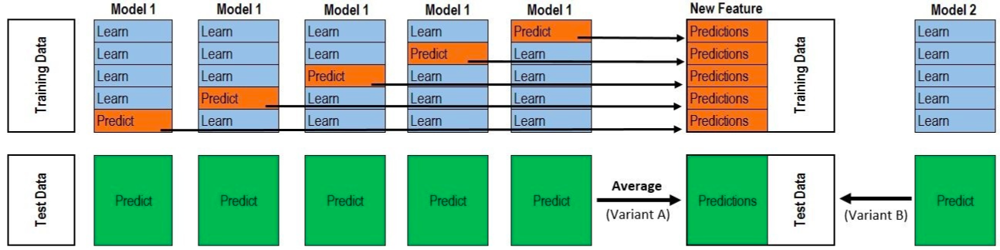

## 自我介绍

**大学**：

我大学是在福建农林大学读的，软件工程专业的，前端后台，苹果安卓开发都接触过一些，那时候懂的东西比较杂，但是优点就是懂得多了，解决问题的能力比别人强。大学的时候主要是参加一些ACM竞赛，ACM竞赛我差不多参加了三年，也拿了蓝桥杯全国一等奖，ACM省赛金奖，ACM区域赛银奖，还有就是ACM中国区总决赛铜奖。后来竞赛加了不少分，我是我们专业唯一一个保研的，保送到了东北大学。

**研究生**：

研究生期间，我主要的研究方向是计算机视觉。研一的时候的研究方向是三维重建，也做了一些相同的项目，并且现有的三维重建的算法都是基于几何的传统的方法，然后我用深度学习来替换其中的特征匹配模块，提高匹配的效果，从而提高三维重建的效果。

接下来研二的时候就研究了语义分割和神经网络的对抗攻击和防御，期间参加了阿里天池和IJCAI联合举办的关于分类的攻击和防御的比赛，三个赛道分别获得了第3名，第8名和第9名的名次，这是我们第一次参加深度学习方面的竞赛，取得了不错的成绩。而且通过比赛，能够学到挺多东西的。

然后现在正在参加阿里的人脸识别对抗比赛，我觉得这个比赛挺有意义的，因为这个比赛涉及了人脸支付的安全性。

## 个人技能

机器学习

深度学习

sift

1. 构建高斯金字塔
2. 构建DoG金字塔
3. 检测尺度空间极值（位置+尺度）
   * 空间极值检测
   * 亚像素插值
   * 删除不稳定的特征点
   * 计算scale和size
4. 计算方向
   * 统计梯度方向直方图
   * 取直方图的极值方向作为特征描述子的方向，并对方向做抛物线插值
5. 计算描述子

1. k-means 中的k如何确定

## 项目

2018.09-2019.01 基于深度学习的特征描述子
• 项目简介：分布式三维重建项目中特征提取模块的实现及其优化。
• 个人任务：负责实现利用传统的 SIFT 算法实现特征提取模块，并利用基于深度学习的特征描述子替换 SIFT 中手工设计的特征描述子，从而提高匹配的性能。
• 创新点： 主要 follow 了 L2-Net 这篇论文， 将其从 Siamese Net 改成 Triplet Net， 并将其 loss 改成 triplet loss。
• 性能提高： 将 SIFT 算法中的特征描述子替换成基于深度学习的特征描述子， 相对于 SIFT算法将匹配点的 FPR95 从 26%降低到 3%； 相对于 L2Net 将匹配点的 FPR95 从 6%降低到 3%；并提高重建完整度 10%。

2018.03-2018.06 稀疏重建
• 项目简介：分布式三维重建项目中稀疏重建部分的实现
• 个人任务： 主要是复现论文中 state-of-the-art 的稀疏重建算法，并将其集成到整个三维重建框架中。

三维重建中的语义分割

## 比赛

这个比赛是阿里天池的一个比赛，它有三个赛道，分为无目标攻击赛道、有目标攻击赛道和防御赛道。

无目标攻击赛道：在原始图像中加入一些微小的扰动，使得分类网络对图像分类错误。

有目标攻击赛道：在原始图像中加入一些微小的扰动，使得分类网络将对抗样本分到特定的错误的类。

防御赛道：就是使用一些方法，使得分类网络能够正确分类对抗图像。

防御赛道所使用到的一些技术：

特征图降噪声，对抗训练，stacking技巧，预测时增强的trick。

**对抗训练**

对原始图像使用FGSM算法进行攻击，生成对抗样本。然后将对抗样本加入到数据集中，接下来使用该数据集来训练分类模型，能够提高分类模型处理对抗样本的能力。

**自编码降噪：**

我们发现，干净样本和对抗样本在通过分类网络后，由于误差的逐层累计，从而导致两者的 特征图差异大，从而导致对抗样本的分类错误。所以，我们设计了一个去噪自编码网络，将其接在分类网络的前面。我们不训练已有的分类网络，而是固定住其参数。

让干净样本和对抗样本同时经过去噪自编码，然后再输出到分类网络中，然后得到logit输出，我们期望两者的logit越接近越好，因为干净样本和对于样本是属于同一类，只不过加入了小扰动而言。通过logit的监督信息，从而监督去噪自编码进行学习。

**模型融合的技巧：stacking**

假设我们的训练集大小为n，测试集大小为m，我们想要stacking k个模型。

首先，使用5-fold交叉验证对训练集进行划分，每份的大小为n/5。由于分成了5份，所以每次我们可以用其中的4份来训练，剩下的一份来验证。对于一个模型，跑完5折交叉验证之后，其输出结果为nx1（可不可以是nxclasses呢？）。对于k个模型都进行这样的操作，那么最后得到的新特征的维度为nxk或者是(nxkxclasses)。我们可以用新的模型在该数据集上训练，从而得到新的模型。

那么如何得到新的测试数据集呢？

对于1个模型，每次fold训练时，都会得到一个模型，然后用该模型在预测集上预测。由于有5fold次训练，所以就会对一份测试集预测了5次，我们求这五次预测求和取平均，从而得到测试集的特征m x 1。对于k个模型都这么做，从而得到测试集的特征m x k

使用新的训练集，我们可以训练出多个模型，然后再对这些模型进行简单的融合。

Xgboost + CNN

Kaggle机器学习之模型融合（stacking）心得 - 龙哥的文章 - 知乎
https://zhuanlan.zhihu.com/p/26890738

**trick**

10次crop预测取平均。

## 论文

• Xiaoyang Wang, Zheng Zhao, ZhengMao Gong. AAAC2019 : Generating Transferable Adversarial Examples. IJCAI Workshop, 2019.
• ZhengMao Gong*, Xiaoyang Wang*, Zheng Zhao. AAAC2019 : Decreasing Adversarial Perturbations Through Mapping Function Transforms. IJCAI Workshop, 2019.