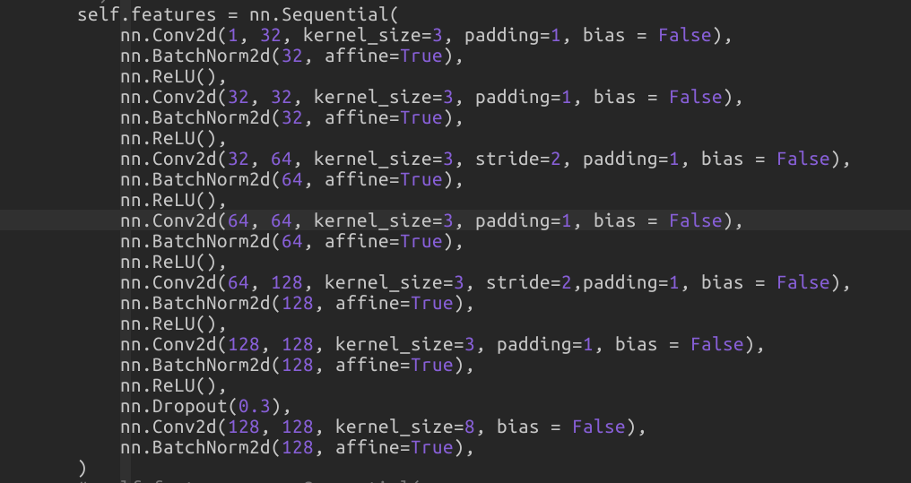

[TOC]


## Motivation

尺度不变性

旋转不变性

光照不变性

仿射不变性


## 数据集的准备

因为我之前实现了三维重建的程序，因此我们数据集的生成利用了我之前实现的三维重建的程序。三维重建之后，能够得到3D点云，并且知道哪张图像的2D特征点看到了该3D点。对于看到了相同3D点的2D特征点，可以认为其是匹配点，也即物理世界中一个3D点在不同图像中的投影点。所以，我先生成一个list文件，将匹配点的索引存在一行中。然后，接着根据这些索引，找到相应的图像及其特征点，然后根据特征点的尺度和角度，在特征点的周围提取patch，然后根据角度进行旋转，最后resize到32x32大小。


那么为什么选择32x32大小呢？开源的数据集是选择缩放到32x32大小。我统计了一下我数据集中尺度大小的分布，发现其尺度主要集中在20多到30多之间，所以我选择resize到32x32大小。


最终，选取出50万个左右个3D点，250万左右个patch。patch大小为32 x 32，每张图像32 x 32 = 1024个patch，每张图像的大小为1024 x 1024。最后总共有2500多张图像，每张图像1M，所以共2.5个G左右的数据集。


灰度图是2.5个G，那么彩色图呢。彩色图，每张图像2.5M左右，所以彩色数据集是6个多G大小， 也就是灰度图数据集的2点多倍。


## 数据增强

尺度不变性－－随机高斯模糊

旋转不变性－－随机旋转

光照不变性－－Color Jittering，对颜色的数据增强：图像亮度、饱和度、对比度变化

仿射不变性－－仿射变换


## 网络结构的设计



网络结构和L2Net一致，都是7层神经网络，并且最后一层没有激活函数。有试验过将修改网络结构，其中一个修改就是将网络结构改成3到4层，然后发现精度并没有下降。说明对于学习特征描述子来说，这么个简单的网络已经足够了。所以，我就继续沿用了L2Net的网络结构。


## Loss的设计

输入的结构为：

```python
一个batch的大小为n,同一行的两个图像对的匹配的，不同行的任意两个图像对都是不匹配的
[
    (a1, p1),
    (a2, p2),
    (a3, p3),
    ...
    (an, bn),
]

计算得到距离矩阵
[
    [ dist(a1, p1), dist(a1, p2), dist(a1, p3), ..., dist(a1, pn) ],
    [ dist(a2, p1), dist(a2, p2), dist(a2, p3), ..., dist(a2, pn) ],
    [ dist(a3, p1), dist(a3, p2), dist(a3, p3), ..., dist(a3, pn) ],
    ...
    [ dist(an, p1), dist(an, p2), dist(an, p3), ..., dist(an, pn) ],
]


```


L2Net使用的softmax损失，也就说使得对角线上的损失尽量小（匹配对），非对角线上的元素尽量大（非匹配对）。

但是，这个问题其实是一个正负样本不均衡的问题。对于batch大小为n的输入，其计算得到出来的距离矩阵，只有n个正样本；而剩余的n^2 - n个都负样本。L2Net并没有处理这个问题，只是单纯只用softmax损失来最小化正样本，最大化负样本。因此，batch越大，正负样本越不均衡，因此这样的学习并不是高效的。


> 那么为什么把batch size调小呢？
>
> 这并不能根本上解决问题，因为我们训练的是最小化匹配对的距离，最大化非匹配对的距离。
>
> 数据集中匹配对和非匹配对的数量都是固定的，而batch size的大小只是决定这个batch能够访问到多大的匹配对和非匹配对。


所以，我对其进行了改进，在loss中加入了hard mining。使其能够更加高效地进行学习。具体的loss为，最小化对角线，然后在每一行中挑选出loss最小的非匹配对，然后最大化这个loss。


> 需要进一步了解正负样本不均衡所造成的影响。

### 正负样本不均衡

**过采样：**从少数类样本中随机重复有放回的抽取样本以得到更多样本。

**缺点**： 对少数类样本多次复制，扩大了数据规模，增加了模型复杂度，容易过拟合。


**欠采样：**从多数类样本中随机的有放回（或无放回）选取较少的样本。

**缺点：**丢弃一部分样本，可能会损失部分有用信息，造成模型只学到整体模式的一部分。

***Easy Ensemble算法***
每次从多数类随机抽取一个子集，和少数类训练一个分类器；重复若干次，得到多个分类器，最终的结果是多个分类器的融合


**Weighted loss：**对多数类的样本得到的loss施加一个小权重，对少数类的样本得到的loss施加一个大权重


## 训练设置

batch size 为 1024或者512。大的batch size对triplet loss是有利的。

优化器使用SGD，学习率随着迭代次数的增加而线性减小。

测试的时候，每秒跑4次迭代，每次迭代1024个batch_size， 也就是每秒跑4096个patch，由于每张图像196个patch，所以每秒20多张图像左右。


hardnet是16w个3D点，生成了5百万个triplet，训练一个epoch20多分钟。


实际场景测试时，因为我们的图像比较大，每个图像5000到1万个特征点，那么每张图像需要1到2s来计算描述子。


学习率的调整方案：

优化器使用的是SGD， 首先确定初始化的学习率， 然后我发现，学习率可以设为10这么大， 并且收敛得很快。 之所以学习率可以设置得比较大， 我分析是因为我用了BN，更主要的是我的网络比较浅，只有几层。


然后接下来的调整使用了两种方案，  一种就是不断迭代，等loss不下降了然后将学习率除以10，另外一种就是poly学习率调整。  后者比前者要好一些，


## 获得的提升


### 收敛速度的提升

如果是使用L2Net，那么需要30多个epoch才能够收敛。　如果改成我刚才说的那个loss，那么只需要迭代2-3个epoch就能够收敛了，　也就是达到了FPR95 = 3%的效果。

并且，每个epoch需要40分钟左右。所以将总的迭代时间从20个小时缩小到2个小时左右，这是个很大的提升。


### FPR95的降低

相对于SIFI算法，将匹配点的FPR95从26%降低到3%；相对于L2Net将匹配点的FPR95从6%降低到3%；并提高重建完整度10%。


加了一些数据增强，将FPR95%从3%降低到了2%


**FPR95的定义**

recall=95%时，FPR = FP / (FP + TN)是多大。

**如何理解FPR95**

表示当前被错误分到正样本类别中真实的负样本所占所有负样本总数的比例；

**如何计算FPR95**

```python
def ErrorRateAt95Recall(labels, scores):
    distances = 1.0 / (scores + 1e-8)
    recall_point = 0.95
    labels = labels[np.argsort(distances)]
    # Sliding threshold: get first index where recall >= recall_point. 
    # This is the index where the number of elements with label==1 below the threshold reaches a fraction of 
    # 'recall_point' of the total number of elements with label==1. 
    # (np.argmax returns the first occurrence of a '1' in a bool array). 
    threshold_index = np.argmax(np.cumsum(labels) >= recall_point * np.sum(labels))

    FP = np.sum(labels[:threshold_index] == 0) # Below threshold (i.e., labelled positive), but should be negative
    TN = np.sum(labels[threshold_index:] == 0) # Above threshold (i.e., labelled negative), and should be negative
    return float(FP) / float(FP + TN)

```


TPR：在所有实际为阳性的样本中，被正确地判断为阳性之比率。TPR=TP/(TP+FN)

FPR：在所有实际为阴性的样本中，被错误地判断为阳性之比率。FPR=FP/(FP+TN)

放在具体领域来理解上述两个指标。如在医学诊断中，判断有病的样本。那么尽量把有病的揪出来是主要任务，也就是第一个指标TPR，要越高越好。而把没病的样本误诊为有病的，也就是第二个指标FPR，要越低越好。不难发现，这两个指标之间是相互制约的。如果某个医生对于有病的症状比较敏感，稍微的小症状都判断为有病，那么他的第一个指标应该会很高，但是第二个指标也就相应地变高。最极端的情况下，他把所有的样本都看做有病，那么第一个指标达到1，第二个指标也为1。