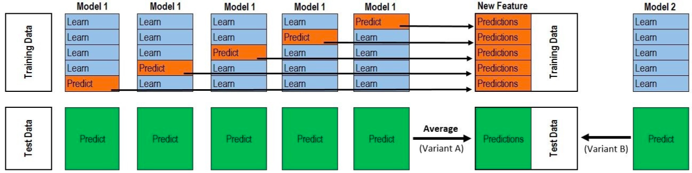

[TOC]

## 比赛

这个比赛是阿里天池的一个比赛，它有三个赛道，分为无目标攻击赛道、有目标攻击赛道和防御赛道。

无目标攻击赛道：在原始图像中加入一些微小的扰动，使得分类网络对图像分类错误。

有目标攻击赛道：在原始图像中加入一些微小的扰动，使得分类网络将对抗样本分到特定的错误的类。

防御赛道：就是使用一些方法，使得分类网络能够正确分类对抗图像。

### 防御赛道

应该这样子介绍防御赛道：

#### 初赛

初赛时， 初赛测策略比较简单，我们只是用了一些现有的模型， 防御手段使用了对抗图像进行对抗训练，然后做了一些模型集成， 然后就排名十几， 然后进了复赛。

#### 复赛

然后初赛和复赛之间是隔着一段时间的， 然后我利用这段时间重新训练了一下模型， 只不过这次的训练多加了一些数据增强的策略（都加了哪些？），其中比较重要的一个就是随机高斯模糊。复赛开始时，我将初赛的模型和，还有加了数据增强重新训练的模型提交上去。然后发现，初赛的模型只得了13多分，而重新训练的是15多分。

然后经过一段时间的测试， 发现是随机的高斯模糊起到了作用。然后就想了，既然高斯模糊这么有用，那么是不是不随机，而是对每张图像都进行高斯模糊呢，然后发现确实有用（16多分）。然后又想了，那么能不能对每张图像进行随机尺度的高斯模糊呢，因为不同的图像以及不同的攻击噪声可能需要不同尺度的高斯模糊去降噪，然后发现确实也有用（17多分）。之后就做了一些模型集成，得到了18分。 然后就陷入了瓶颈，分数无法得到提升了。

之后做了一些分析，发现使用高斯模糊其实是有问题的。因为高斯模糊虽然能够降噪，但是却也是会模糊图像的特征，并且数据集中又存在一些相似的类，比如说女装，数据集中就有好多种女装，如果使用高斯模糊，把特征模糊了，就容易把其中的一个女装类分到另外一个女装类。所以，我就想着不能够再继续使用这种方案了，因为这种方案不可避免的，会将一些类给分错。

接着就继续分析了一下，为什么高斯模糊会有效。然后发现，高斯模糊其实是起到了降低扰动的作用，并且降得非常多。我们有原始图像和对抗图像，假设他们之间的扰动是二十多.如果只使用高斯模糊对对抗样本进行降噪，那么它们之间的扰动变成15左右。但是如果同时对原始图像和对抗图像都使用高斯模糊，那么就能够将它们之间的扰动变成10以下。因为，扰动变小了，所以使得模型更好学习。

因此，我想出来的办法就是通过神经网络来学出来一个降噪器来取代高斯模糊。降噪器就是使用自编码降噪器。通过在原来的分类网络模型之前，加入一个自编码器。让这个自编码器去学习如何降噪。那么该如何设计loss进行学习呢？一种就是让重建损失越小越好。另一种则是让原始图像和对抗样本的logit越相似越好。我选择的是后者， 具体是这么做的：

将原始图像经过分类网络，得到logits。将对抗图像经过自编码器，然后再经过分类网络，得到logits，我期望对抗图像和logits和原始样本的logits越相似越好，这样子就能够将对抗图像分类正确了。（那么这样子自编码得到的图像是什么样子的，因为并没有重建损失）。最后的方案+模型集成得到了19.5分的成绩， 获得了第9名。

防御赛道所使用到的一些技术：

特征图降噪声，对抗训练，stacking技巧，预测时增强的trick。

**对抗训练**

对原始图像使用FGSM算法进行攻击，生成对抗样本。然后将对抗样本加入到数据集中，接下来使用该数据集来训练分类模型，能够提高分类模型处理对抗样本的能力。

**自编码降噪：**

我们发现，干净样本和对抗样本在通过分类网络后，由于误差的逐层累计，从而导致两者的 特征图差异大，从而导致对抗样本的分类错误。所以，我们设计了一个去噪自编码网络，将其接在分类网络的前面。我们不训练已有的分类网络，而是固定住其参数。

让干净样本和对抗样本同时经过去噪自编码，然后再输出到分类网络中，然后得到logit输出，我们期望两者的logit越接近越好，因为干净样本和对于样本是属于同一类，只不过加入了小扰动而言。通过logit的监督信息，从而监督去噪自编码进行学习。

**模型融合的技巧：stacking**

假设我们的训练集大小为n，测试集大小为m，我们想要stacking k个模型。

首先，使用5-fold交叉验证对训练集进行划分，每份的大小为n/5。由于分成了5份，所以每次我们可以用其中的4份来训练，剩下的一份来验证。对于一个模型，跑完5折交叉验证之后，其输出结果为nx1（可不可以是nxclasses呢？）。对于k个模型都进行这样的操作，那么最后得到的新特征的维度为nxk或者是(nxkxclasses)。我们可以用新的模型在该数据集上训练，从而得到新的模型。

那么如何得到新的测试数据集呢？

对于1个模型，每次fold训练时，都会得到一个模型，然后用该模型在预测集上预测。由于有5fold次训练，所以就会对一份测试集预测了5次，我们求这五次预测求和取平均，从而得到测试集的特征m x 1。对于k个模型都这么做，从而得到测试集的特征m x k

使用新的训练集，我们可以训练出多个模型，然后再对这些模型进行简单的融合。

Xgboost + CNN

Kaggle机器学习之模型融合（stacking）心得 - 龙哥的文章 - 知乎
https://zhuanlan.zhihu.com/p/26890738

**trick**

10次crop预测取平均。

### 攻击赛道

input_diversity

对攻击图像进行高斯模糊

对梯度进行归一化

对